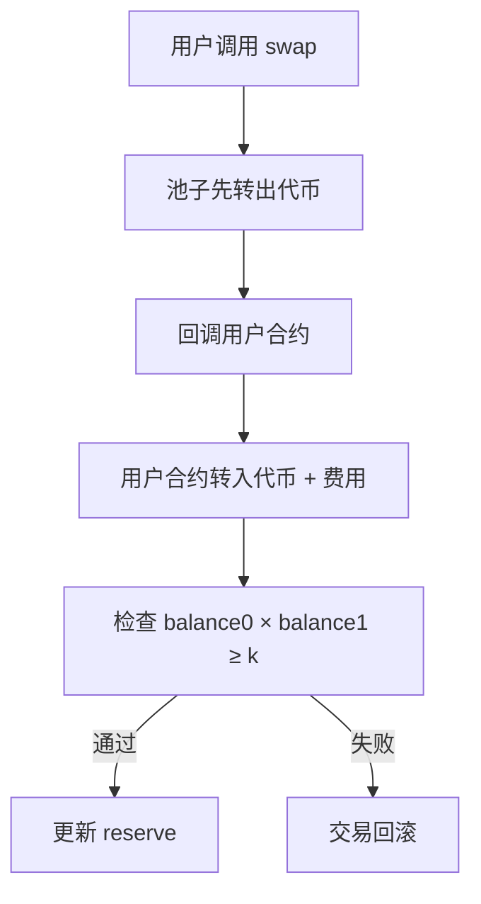

# Uniswap V2 核心概念

> **定位**: 学习 AMM 的基础，理解去中心化交易所的核心原理

---

## 🎯 一句话理解

**"两个代币放在池子里，乘积保持不变，你想拿走多少 A，就要放入足够的 B"**

---

## 📐 核心公式

### 恒定乘积模型

```
reserve0 × reserve1 = k
```

**例子**:
- 池子: 100 ETH + 200,000 USDC
- k = 100 × 200,000 = 20,000,000
- 如果你想取出 10 ETH，池子还剩 90 ETH
- 那 USDC 必须变成: 20,000,000 ÷ 90 = 222,222 USDC
- 所以你要放入: 222,222 - 200,000 = 22,222 USDC

**关键认知**:
- ✅ k **不是严格恒定**的（每次交易会增加 0.3%）
- ✅ 价格由 **池子余额比例** 决定
- ✅ 大额交易会导致 **价格滑点**

---

## 💰 交易流程

### Swap 工作原理



**反直觉设计**:
1. 池子 **先给你代币**，不检查你有没有转回来
2. 通过 **回调函数** 让你转回代币
3. 最后检查 `balance0 × balance1 ≥ k`（包含 0.3% 费用）

**为什么这样设计?**
- 支持 **闪电贷**: 你可以在回调里做任何事，只要最后还钱
- 简化逻辑: 不需要预先计算精确的输入量

---

## 📊 价格与滑点

### 即时价格计算

```
price_token0 = reserve1 / reserve0
price_token1 = reserve0 / reserve1
```

**例子**:
- 100 ETH + 200,000 USDC
- ETH 价格 = 200,000 / 100 = 2,000 USDC
- USDC 价格 = 100 / 200,000 = 0.0005 ETH

### 滑点（Slippage）

**定义**: 实际成交价与预期价格的偏差

**例子**:
```
预期: 用 1 ETH 换 2000 USDC（价格 2000）
实际: 用 1 ETH 换 1980 USDC（价格 1980）
滑点: (2000 - 1980) / 2000 = 1%
```

**滑点保护**:
- 设置 `amountOutMinimum` 参数
- 如果实际输出 < 最小值，交易回滚
- 防止 MEV 攻击（抢跑、三明治攻击）

---

## 💎 流动性提供

### 添加流动性

**公式**:
```
liquidity = sqrt(amount0 × amount1)
```

**步骤**:
1. 按当前比例提供两种代币
2. 获得 **LP Token**（代表你的份额）
3. LP Token 可随时兑换回底层代币

**例子**:
- 池子: 100 ETH + 200,000 USDC（k = 20,000,000）
- 你添加: 10 ETH + 20,000 USDC
- 你获得: 10% 的 LP Token
- 未来手续费: 按 10% 比例分配

### 移除流动性

- 销毁 LP Token
- 按比例取回当前池子里的两种代币
- **注意**: 代币数量可能变化（无常损失）

---

## ⚠️ 无常损失（Impermanent Loss）

### 什么是无常损失？

**定义**: 提供流动性 vs 简单持有的收益差

**例子**:
```
初始: ETH = 2000 USDC
你提供: 1 ETH + 2000 USDC（总价值 4000）

情况 A: ETH 涨到 4000 USDC
- 池子自动调整: 0.707 ETH + 2828 USDC
- 你的价值: 0.707 × 4000 + 2828 = 5656 USDC
- 如果持有: 1 × 4000 + 2000 = 6000 USDC
- 无常损失: 6000 - 5656 = 344 USDC（5.7%）
```

**关键认知**:
- ✅ 价格波动越大，无常损失越大
- ✅ 手续费可以 **抵消** 无常损失
- ✅ 只有 **取出流动性时** 才会真正实现损失
- ✅ 价格回到原点，损失消失（所以叫"无常"）

---

## 🔮 预言机（TWAP）

### 时间加权平均价格

**问题**: 链上价格容易被操纵（大额交易瞬间改变价格）

**解决**: TWAP（Time-Weighted Average Price）

**原理**:
- 记录每次更新时的 **累计价格**
- 计算两个时间点的 **差值 / 时间差**
- 得到时间段内的 **平均价格**

**代码示例**:
```solidity
// 获取 1 小时内的平均价格
uint32 time0 = block.timestamp - 3600;
uint32 time1 = block.timestamp;

uint256 price0 = pair.price0CumulativeLast(time0);
uint256 price1 = pair.price0CumulativeLast(time1);

uint256 twap = (price1 - price0) / (time1 - time0);
```

**用途**:
- 其他协议借用价格（如借贷协议）
- 抗操纵，适合链上金融

---

## 🛠️ 开发者必知

### 核心合约

| 合约 | 作用 |
|------|------|
| **Factory** | 创建交易对（Pair） |
| **Pair** | 实际的交易池（swap、添加流动性） |
| **Router** | 用户交互入口（多跳交易、路由） |

### 常用函数

```solidity
// 1. 添加流动性
router.addLiquidity(
    tokenA,
    tokenB,
    amountADesired,
    amountBDesired,
    amountAMin,
    amountBMin,
    to,
    deadline
);

// 2. 代币交换
router.swapExactTokensForTokens(
    amountIn,
    amountOutMin,
    path,  // [tokenA, tokenB, tokenC]
    to,
    deadline
);

// 3. 移除流动性
router.removeLiquidity(
    tokenA,
    tokenB,
    liquidity,
    amountAMin,
    amountBMin,
    to,
    deadline
);
```

### Gas 优化技巧

1. **预授权（Approve）**: 提前授权 Router 使用代币
2. **批量操作**: 使用 `swapExactTokensForTokensSupportingFeeOnTransferTokens`
3. **避免多跳**: 直连交易对 Gas 最低

---

## 📚 实战练习

### 练习 1: 计算交易输出

**题目**: 
- 池子: 100 ETH + 200,000 USDC
- 手续费: 0.3%
- 你输入: 10 ETH
- 你能得到多少 USDC？

**解答**:
```
1. 扣除手续费: 10 × (1 - 0.003) = 9.97 ETH
2. 新 ETH 储备: 100 + 9.97 = 109.97 ETH
3. 新 USDC 储备: k / 新ETH = 20,000,000 / 109.97 = 181,866 USDC
4. 输出 USDC: 200,000 - 181,866 = 18,134 USDC
5. 实际价格: 18,134 / 10 = 1,813.4 USDC/ETH（滑点 ~9.3%）
```

### 练习 2: 闪电贷

**场景**: 借 1000 USDC，套利后归还

**流程**:
1. 调用 `swap(0, 1000, address(this), "0x...")`
2. 池子给你 1000 USDC
3. 回调 `uniswapV2Call()`
4. 在另一个池子用 USDC 买 ETH
5. 在第三个池子用 ETH 换回 USDC
6. 归还 1000 USDC + 3 USDC 费用
7. 利润留下

---

## 🎯 V2 优缺点总结

### ✅ 优点
- 简单易懂，适合学习 AMM 基础
- 支持闪电贷，功能强大
- TWAP 预言机，抗操纵
- 生态成熟，工具完善

### ❌ 缺点
- **资金效率低**: 流动性分布在 0 → ∞，大部分闲置
- **无常损失大**: 全范围流动性，价格波动影响大
- **Gas 较高**: 每次交互都需要更新储备
- **功能固定**: 无法自定义手续费或逻辑

---

## 📖 推荐学习资源

1. **[Uniswap V2 核心文档](https://docs.uniswap.org/contracts/v2/overview)**
2. **[登链社区 V2 专栏](https://learnblockchain.cn/column/118)**
3. **[RareSkills V2 Puzzles](https://github.com/RareSkills/uniswap-v2-puzzles)**（实战练习）

---

**下一步**: 掌握 V2 后，进入 `../v3/01-V3核心概念.md` 学习集中流动性！🚀
