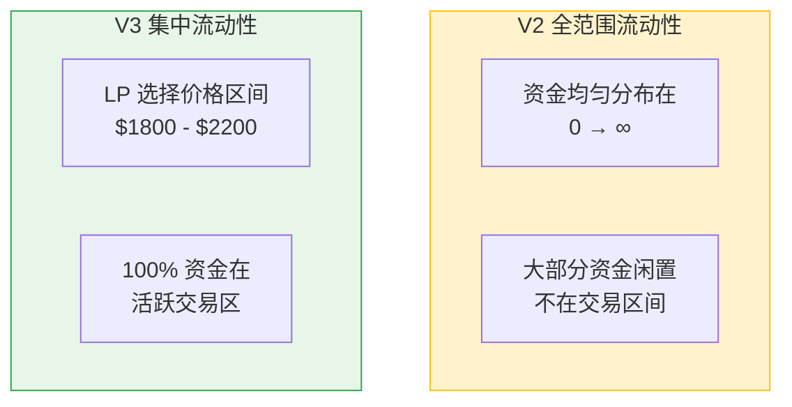
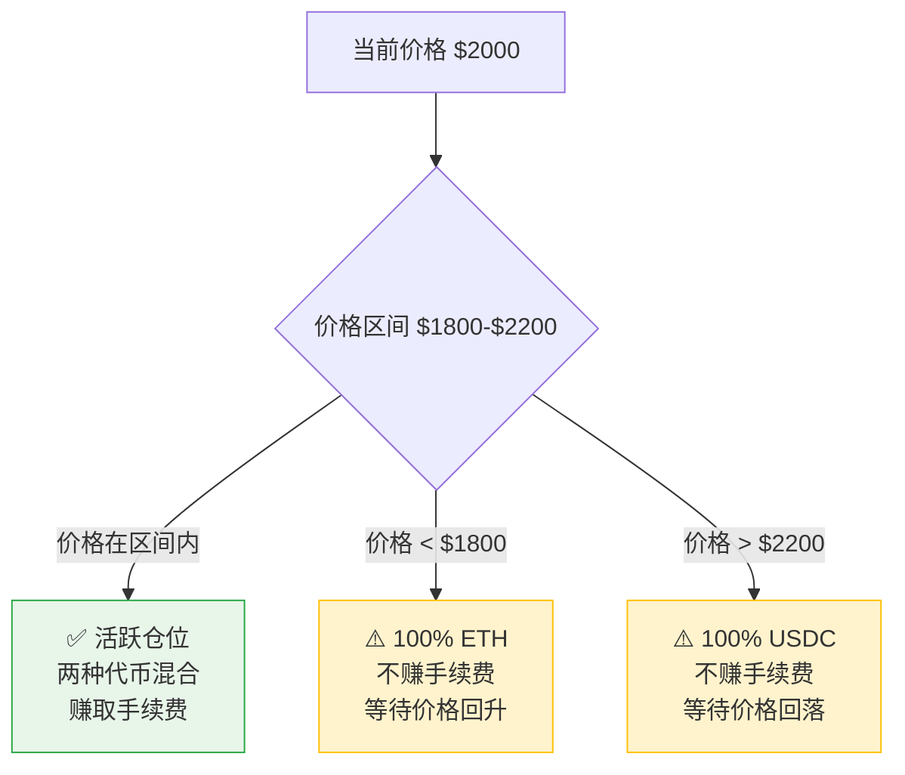
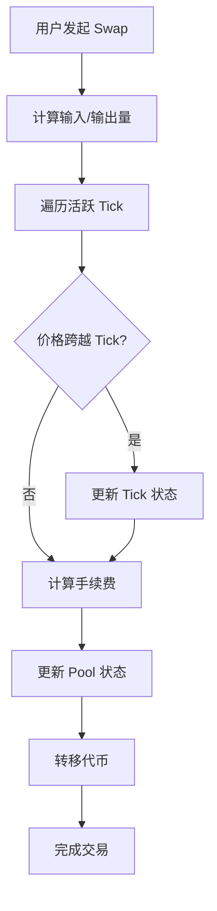

# Uniswap V3 核心概念

> **定位**: 生产环境主流，理解集中流动性和高效资金利用

---

## 🎯 一句话理解

**"把资金集中在你最看好的价格区间，不再浪费在 0 到无穷大"**

---

## 📐 核心创新：集中流动性

### V2 vs V3 对比



**关键差异**:
- **V2**: 1000 USDC 流动性 → 实际只有 1% 在用的上
- **V3**: 1000 USDC 流动性 → 100% 都在用的上
- **资金效率提升**: 最高可达 **4000 倍**！

---

## 🎚️ Tick 系统

### 什么是 Tick？

**定义**: 将价格区间离散化为一个个"刻度"

**例子**:
```
当前 ETH 价格: $2000
Tick 间距: 60（对应 ~0.3% 手续费等级）

Tick -200: $1800
Tick -100: $1900
Tick 0:    $2000 ← 当前价格
Tick 100:  $2100
Tick 200:  $2200
```

### 选择 Tick 间距

| 手续费等级 | Tick 间距 | 适用场景 |
|-----------|----------|---------|
| **0.05%** | 10 | 稳定币对（USDC/USDT） |
| **0.3%** | 60 | 主流币对（ETH/USDC） |
| **1%** | 200 | 长尾代币 |

**规则**: 手续费越低，Tick 越密集，价格精度越高

---

## 💰 流动性区间

### 添加流动性

**V3 新参数**:
```solidity
mint(
    address recipient,      // 接收者
    int24 tickLower,        // 价格下界
    int24 tickUpper,        // 价格上界
    uint128 amount,         // 流动性数量
    bytes data              // 额外数据
)
```

**例子**:
```
ETH/USDC 池子，当前价格 $2000
你选择区间: $1800 - $2200（Tick -100 到 +100）

情况 A: 价格在 $1800-$2200 之间
→ 你的流动性 **活跃**，赚取手续费

情况 B: 价格跌破 $1800
→ 你的仓位 **100% 变成 ETH**，不再赚手续费

情况 C: 价格涨破 $2200
→ 你的仓位 **100% 变成 USDC**，不再赚手续费
```

### 三种仓位状态



---

## 🧮 数学表示

### sqrtPriceX96

**问题**: Solidity 不支持浮点数，如何表示价格？

**解决**: 使用 **平方根价格 × 2^96**

**公式**:
```
sqrtPriceX96 = sqrt(price) × 2^96
```

**例子**:
```
ETH/USDC 价格: 2000
sqrt(2000) = 44.72
sqrtPriceX96 = 44.72 × 2^96 = 3544607289094052880465058
```

**为什么用平方根？**
- 简化流动性计算
- 避免溢出
- 线性关系（价格变化 = sqrtPrice 线性变化）

### 计算当前 Tick

```solidity
import "@uniswap/v3-core/contracts/libraries/TickMath.sol";

int24 tick = TickMath.getTickAtSqrtRatio(sqrtPriceX96);
```

---

## 🎫 NFT 仓位管理

### V3 独有特性

**每个流动性仓位 = 一个 NFT**

**NFT 包含信息**:
- `tokenId`: 唯一标识符
- `pool`: 交易对地址
- `tickLower`: 价格下界
- `tickUpper`: 价格上界
- `liquidity`: 流动性数量
- `feeGrowthInside`: 累积手续费

**优势**:
- ✅ 仓位可转移、可交易
- ✅ 不同区间独立管理
- ✅ 可在 OpenSea 等平台交易仓位

**常用操作**:
```solidity
// 1. 创建仓位（获得 NFT）
positionManager.mint(mintParams);

// 2. 增加流动性
positionManager.increaseLiquidity(increaseParams);

// 3. 减少流动性
positionManager.decreaseLiquidity(decreaseParams);

// 4. 收取手续费
positionManager.collect(collectParams);
```

---

## ⚠️ 无常损失（V3 版）

### V3 无常损失更大！

**原因**: 集中流动性 = 放大价格波动影响

**例子**:
```
初始: ETH = $2000
你提供: $1800-$2200 区间，价值 $4000

情况 A: ETH 涨到 $3000
- V2 损失: ~5%
- V3 损失: ~15%（因为仓位已 100% 变成 USDC）

情况 B: ETH 跌到 $1000
- V2 损失: ~10%
- V3 损失: ~25%（因为仓位已 100% 变成 ETH）
```

### 如何降低无常损失？

1. **选择宽区间**: $1500-$2500（但降低资金效率）
2. **主动管理**: 价格接近边界时调整区间
3. **手续费补偿**: 高交易量池子手续费可抵消损失
4. **对冲策略**: 在其他平台做反向仓位

---

## 🔄 Swap 机制

### V3 Swap 流程



**关键区别**:
- V2: 简单公式 `amountOut = (reserveOut × amountIn × 997) / (reserveIn × 1000 + amountIn × 997)`
- V3: 复杂迭代，需要遍历 Tick，计算每个区间的流动性

### 多跳交易

**场景**: USDC → ETH → DAI

```solidity
router.exactInputSingle({
    tokenIn: USDC,
    tokenOut: ETH,
    fee: 3000,
    recipient: address(this),
    deadline: block.timestamp,
    amountIn: 1000e6,
    amountOutMinimum: 0,
    sqrtPriceLimitX96: 0
});

router.exactInputSingle({
    tokenIn: ETH,
    tokenOut: DAI,
    fee: 3000,
    recipient: address(this),
    deadline: block.timestamp,
    amountIn: 0,  // 使用上一步的输出
    amountOutMinimum: 500e18,
    sqrtPriceLimitX96: 0
});
```

---

## 🔮 预言机

### V3 改进版 TWAP

**V2 问题**: 每次交易更新累计价格，Gas 高

**V3 改进**: 
- 按需查询，不强制更新
- 支持任意时间窗口
- 返回 **几何平均价格**（更准确）

**使用示例**:
```solidity
// 获取 1 小时内的 TWAP
uint32 secondsAgo = 3600;

(uint160[] memory tickCumulatives, ) = pool.observe(secondsAgo);

int24 tickAverage = int24(
    (tickCumulatives[1] - tickCumulatives[0]) / secondsAgo
);

uint160 priceAverage = TickMath.getSqrtRatioAtTick(tickAverage);
```

---

## 🛠️ 开发者必知

### 核心合约架构

| 合约 | 作用 |
|------|------|
| **Factory** | 创建 Pool，设置手续费等级 |
| **Pool** | 实际交易池（swap、流动性） |
| **PositionManager** | NFT 仓位管理 |
| **Router** | 用户交互入口 |
| **Quoter** | 价格查询（不执行交易） |

### 常用库

| 库 | 用途 |
|------|------|
| **TickMath** | Tick ↔ Price 转换 |
| **SqrtPriceMath** | 价格计算 |
| **LiquidityMath** | 流动性计算 |
| **SwapMath** | Swap 计算 |

### 实战模板

```solidity
// 1. 查询价格
function getPrice(address pool) public view returns (uint256) {
    (uint160 sqrtPriceX96, , , , , , ) = IUniswapV3Pool(pool).slot0();
    return FullMath.mulDiv(sqrtPriceX96, sqrtPriceX96, 1 << 192);
}

// 2. 添加流动性
function addLiquidity(
    address pool,
    int24 tickLower,
    int24 tickUpper,
    uint128 liquidity
) public {
    IUniswapV3Pool(pool).mint(
        address(this),
        tickLower,
        tickUpper,
        liquidity,
        ""
    );
}

// 3. Swap
function swap(
    address pool,
    bool zeroForOne,
    int256 amountSpecified,
    uint160 sqrtPriceLimitX96
) public {
    IUniswapV3Pool(pool).swap(
        address(this),
        zeroForOne,
        amountSpecified,
        sqrtPriceLimitX96,
        ""
    );
}
```

---

## 🎯 V3 优缺点总结

### ✅ 优点
- **资金效率极高**: 最高 4000 倍提升
- **手续费灵活**: 3 个等级可选
- **NFT 仓位**: 可交易、可组合
- **改进预言机**: 更准确、更省 Gas

### ❌ 缺点
- **无常损失更大**: 集中流动性放大风险
- **复杂度高**: Tick、sqrtPriceX96 难理解
- **Gas 较高**: 复杂数学计算
- **需要主动管理**: 价格超出区间不赚手续费

---

## 📖 推荐学习资源

1. **[Uniswap V3 官方文档](https://docs.uniswap.org/contracts/v3/overview)**
2. **[登链社区 V3 专栏](https://learnblockchain.cn/column/147)**
3. **[Uniswap V3 开发指南](https://learnblockchain.cn/course/100)**
4. **[RareSkills V3 教程](https://www.rareskills.io/uniswap-v3-tutorial)**

---

**下一步**: 掌握 V3 后，进入 `../v4/01-V4核心概念.md` 探索 Hooks 架构！🚀
