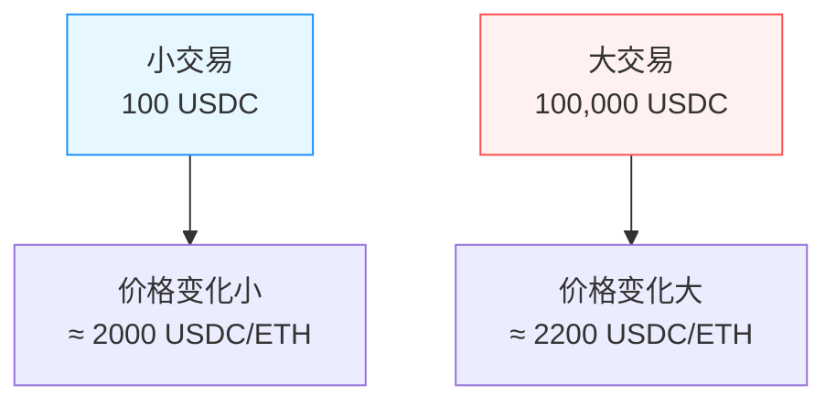

# 恒定函数做市商 - 通俗易懂版

> **原文**: https://learnblockchain.cn/article/23781?course_id=100  
> **核心**: 理解 `x × y = k` 公式  
> **难度**: ⭐⭐

---

## 🎯 一句话理解

**"池子里两种代币的乘积永远不变，你想拿走多少 A，就要放入足够的 B"**

---

## 📐 核心公式：`x × y = k`

### 不要被名字吓到

**"恒定函数做市商"** 听起来很高深，其实就是一个简单的公式：

```
x × y = k
```

- **x** = 池子里代币 0 的数量（比如 ETH）
- **y** = 池子里代币 1 的数量（比如 USDC）
- **k** = 它们的乘积（一个固定值）

### 举例说明

假设有一个 ETH/USDC 池子：

```
初始状态:
- 100 个 ETH (x)
- 200,000 USDC (y)
- k = 100 × 200,000 = 20,000,000
```

**现在你想用 USDC 买 ETH：**

```
你放入: 20,000 USDC
池子给你: ? 个 ETH

计算:
- 新的 USDC = 200,000 + 20,000 = 220,000
- k 必须保持不变 = 20,000,000
- 新的 ETH = k ÷ 新的USDC = 20,000,000 ÷ 220,000 = 90.91
- 池子给你 = 100 - 90.91 = 9.09 ETH
```

**验证**: 90.91 × 220,000 = 20,000,020 ≈ k ✅

---

## 💰 交易是怎么定价的？

### 直觉 vs 实际

**直觉**: 如果当前价格是 1 ETH = 2000 USDC，那我放 2000 USDC 应该得到 1 ETH？

**实际**: **不是！** 你会得到更少！

### 为什么？供需法则！



**核心原理**: 
- 你想从池子里拿走 **越多** 代币
- 相对于池子储备金的 **比例越大**
- **价格就越差**（滑点越大）

这就是**供需法则**在起作用！

---

## 🧮 计算输出量

### 考虑手续费

实际上公式是这样的：

```
(x + Δx × 997)(y - Δy) = k × 1000
```

- **997/1000** = 0.3% 手续费
- 你放 1000 个代币，只有 997 个真正进入池子
- 3 个是手续费，归 LP 所有

### 实战计算

**题目**: 
- 池子: 100 ETH + 200,000 USDC
- 你输入: 10,000 USDC
- 手续费: 0.3%
- 你能得到多少 ETH？

**解答**:
```
1. 扣除手续费: 10,000 × 997/1000 = 9,970 USDC
2. 新的 USDC: 200,000 + 9,970 = 209,970
3. k = 100 × 200,000 = 20,000,000
4. 新的 ETH: 20,000,000 ÷ 209,970 = 95.25
5. 你得到: 100 - 95.25 = 4.75 ETH
6. 实际价格: 10,000 ÷ 4.75 = 2,105 USDC/ETH
```

**滑点**: (2105 - 2000) ÷ 2000 = 5.25%

---

## 📊 那条神奇的曲线

### 恒定乘积曲线长这样

```
y（USDC）
↑
│     ● 曲线
│    /
│   /
│  /
│ /
│/
└────────→ x（ETH）
```

**每条曲线代表一个 k 值**。

### 交易就是在曲线上移动

```
交易前: ● 点A (100 ETH, 200,000 USDC)
         |
         | 你放 20,000 USDC
         ↓
交易后: ● 点B (90.91 ETH, 220,000 USDC)
```

**关键认知**:
- 曲线上的每个点都是一个可能的"状态"
- 交易让你从一个点移动到另一个点
- 永远在同一条曲线上移动（k 不变）

---

## 🎯 三个重要价格

### 1. 交易前价格（即时价格）

```
交易前: 100 ETH, 200,000 USDC
价格 = 200,000 ÷ 100 = 2,000 USDC/ETH
```

### 2. 交易后价格（新的即时价格）

```
交易后: 90.91 ETH, 220,000 USDC
价格 = 220,000 ÷ 90.91 = 2,420 USDC/ETH
```

### 3. 实际交易价格（执行价格）

```
你放了 20,000 USDC，得到 9.09 ETH
实际价格 = 20,000 ÷ 9.09 = 2,200 USDC/ETH
```

**发现了吗？**
- 交易前: 2000 USDC/ETH
- 实际: 2200 USDC/ETH（差了 200）
- 交易后: 2420 USDC/ETH（差了 420）

**这就是滑点！**

---

## 💡 为什么这条曲线这么聪明？

### 自动调节供需

```
你想买 100 个 ETH（小额）:
→ 池子还有 100 个，充足
→ 价格 ≈ 2000 USDC/ETH（正常）

你想买 90 个 ETH（大额）:
→ 池子只剩 10 个了，稀缺
→ 价格飙升到 5000+ USDC/ETH（贵！）
```

**这就是市场机制！**

### 不需要计算价格！

Uniswap **根本不计算价格**，它只做一件事：

```
你给多少 X → 我给你多少 Y（保证 x×y=k）
```

价格？那是**结果**，不是**输入**！

---

## 📝 关键术语

| 术语 | 含义 |
|------|------|
| **恒定乘积** | x × y = k，交易后乘积不变 |
| **即时价格（Spot Price）** | 交易前的价格，= y/x |
| **执行价格** | 实际交易的价格，= Δy/Δx |
| **滑点（Slippage）** | 执行价格与即时价格的差异 |
| **储备金（Reserve）** | 池子里两种代币的数量（x 和 y） |

---

## ✅ 学习完成检查

- [ ] 理解了 `x × y = k` 的含义
- [ ] 能手动计算交易输出量
- [ ] 理解了滑点是怎么来的
- [ ] 知道手续费是怎么扣的
- [ ] 理解了供需法则在 AMM 中的体现

---

**下一步**: 学习 [Uniswap V3 简介](./04-V3简介.md) — 理解集中流动性的概念！🚀
