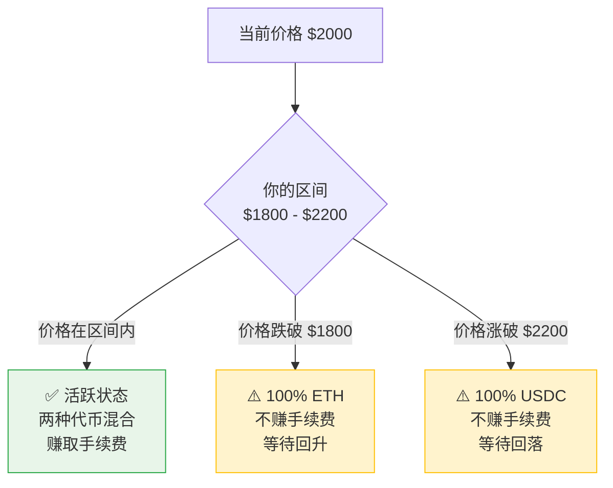

# Uniswap V3 简介 - 通俗易懂版

> **原文**: https://learnblockchain.cn/article/23783?course_id=100  
> **核心**: 理解"集中流动性"创新  
> **难度**: ⭐⭐⭐

---

## 🎯 V2 的问题：资金浪费太严重！

### V2 的致命缺陷

V2 的流动性分布在 **0 到无穷大** 的整个价格范围。

**例子**:
```
ETH 当前价格: $2000

V2 流动性池:
$0    $1000    $2000    $10000    ∞
|------|--------|--------|---------|
   ❌       ❌      ✅       ❌      ❌
 闲置     闲置    活跃     闲置    闲置
```

**问题**: 
- 99% 的资金在 **闲置**！
- 只有当前价格附近的资金在 **工作**
- 资金效率极低

### 类比理解

**V2 就像这样开店**:

```
你开了一家 24 小时便利店:
- 凌晨 3 点: 没人买东西（但店开着）
- 下午 3 点: 很多人买东西（只有这时赚钱）
- 晚上 11 点: 没人买东西（但店开着）

结果: 99% 的时间在浪费电费！
```

---

## ✨ V3 的创新：集中流动性

### 一句话理解

**"把资金集中在你最看好的价格区间，不再浪费在 0 到无穷大"**

### V3 是怎么做的？

```
V3 流动性池:
$0    $1500    $2000    $2500    ∞
|------|--------|--------|---------|
   ❌    ✅✅✅    ✅✅✅    ✅✅✅     ❌
  不投  LP A 投  LP B 投  LP C 投  不投
        $1500   $1800   $2200
       -$2500  -$2200  -$2500
```

**关键区别**:
- LP 可以 **自定义价格区间**
- 资金只在你选择的区间内 **工作**
- 资金效率提升 **最高 4000 倍**！

---

## 📊 V2 vs V3 直观对比

| 版本 | 价格区间 | 资金利用率 | 说明 |
|------|---------|-----------|------|
| **V2** | 0 → ∞ | ~1% | 大部分资金闲置 |
| **V3** | $1800-$2200 | 100% | 全部资金工作 |

**V3 的资金效率是 V2 的 100 倍！**

---

## 🔍 V3 的核心概念：价格区间

### 三种仓位状态



### 区间选择的权衡

```
窄区间（$1900-$2100）:
✅ 资金效率最高
✅ 手续费收益最高
❌ 容易被踢出区间

宽区间（$1500-$2500）:
✅ 不容易被踢出
❌ 资金效率低
❌ 手续费收益低
```

---

## 📏 Ticks（价格刻度）

### 什么是 Tick？

**Tick = 价格的最小单位**

V3 把价格范围分成一个个小格子（Tick）：

```
Tick 系统:
... -3  -2  -1   0   1   2   3 ...
     |   |   |   |   |   |   |
  $1940 $1960 $1980 $2000 $2020 $2040 $2060
```

### 手续费等级

| 手续费 | Tick 间距 | 适用场景 |
|--------|----------|---------|
| 0.05% | 10 | 稳定币（USDC/USDT） |
| 0.3% | 60 | 主流币（ETH/USDC） |
| 1% | 200 | 长尾代币 |

---

## 💡 V3 的独特优势

### 1. 可以做限价单

```
你想在 $2200 卖出 ETH:
→ 在 $2200-$2201 区间添加流动性（只有 USDC）
→ 当价格涨到 $2200，自动卖出
→ 这就是限价单！
```

### 2. 可以定制手续费

不同交易对可以选择不同的手续费率。

### 3. 可以主动管理

价格接近边界时，可以移除旧流动性，添加新流动性。

---

## ✅ 学习完成检查

- [ ] 理解了 V2 的资金浪费问题
- [ ] 理解了集中流动性的概念
- [ ] 知道如何选择价格区间
- [ ] 理解了三种仓位状态
- [ ] 理解了 Tick 系统的作用

---

**下一步**: 学习 [开发环境搭建](./05-开发环境.md) 🚀
