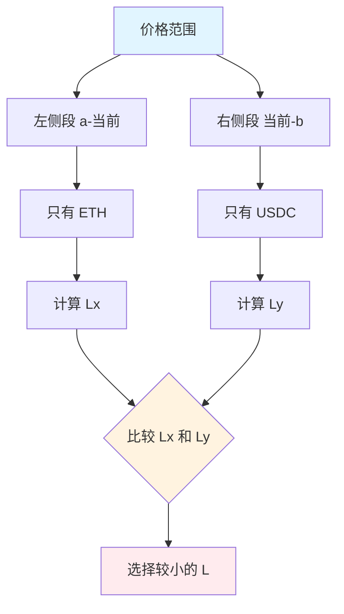

# 02 流动性计算

## 📌 前置知识

没有流动性就无法交易。为了完成首次 Swap，我们需要先往池子里"注水"（添加流动性）。

### 添加流动性需要确定两件事

| 要素 | 说明 |
|------|------|
| **价格范围** | 你希望在哪个价格区间内提供流动性？ |
| **Token 数量** | 需要往池子里放多少 ETH 和 USDC？ |

> 💡 **提示**：在后面的章节中，这些计算会由合约自动完成。但为了让你理解原理，我们先手动算一遍。

---

## 1️⃣ 价格范围计算

### 回顾：Tick 是什么？

在 Uniswap V3 中，整个价格轴被切成了很多小段，每一段叫做一个 **Tick**。

- 每个 Tick 对应一个价格
- 每个 Tick 有一个索引（整数）

### 我们的场景

| 价格 | 说明 |
|------|------|
| **当前价格** | 1 ETH = 5000 USDC |
| **价格下限** | 1 ETH = 4545 USDC |
| **价格上限** | 1 ETH = 5500 USDC |

当我们用 USDC 购买 ETH 时，价格会**上涨**。所以我们需要确保价格上涨后，**仍然不超过 5500**。

### 计算三个关键 Tick

我们需要找到三个 Tick：
1. **当前 Tick**（对应 5000 USDC）
2. **下限 Tick**（对应 4545 USDC）
3. **上限 Tick**（对应 5500 USDC）

### 数学公式

#### 第一步：计算价格的平方根

```
√P = √(y / x)
```

由于 ETH 是 x 储备，USDC 是 y 储备：

| 价格点 | 计算公式 | 结果 |
|--------|---------|------|
| 当前价格 √Pc | √(5000 / 1) | ≈ 70.71 |
| 下限价格 √Pl | √(4545 / 1) | ≈ 67.42 |
| 上限价格 √Pu | √(5500 / 1) | ≈ 74.16 |

#### 第二步：将价格转换为 Tick

公式：

```
i = log√1.0001(√P)
```

计算结果：

| 价格点 | Tick 索引 |
|--------|----------|
| 当前 Tick | **85176** |
| 下限 Tick | **84222** |
| 上限 Tick | **86129** |

### Python 代码示例

```python
import math

def price_to_tick(p):
    """将价格转换为 Tick 索引"""
    return math.floor(math.log(p, 1.0001))

# 计算当前价格的 Tick
tick = price_to_tick(5000)
print(tick)  # 输出：85176
```

### 第三步：转换为 Q64.96 格式

> **什么是 Q64.96？**
> 
> 这是 Uniswap V3 用来存储 √P 的**定点数格式**：
> - 整数部分：64 位
> - 小数部分：96 位

转换方法很简单：**将数字乘以 2^96**

```python
q96 = 2**96

def price_to_sqrtp(p):
    """将价格转换为 Q64.96 格式的 √P"""
    return int(math.sqrt(p) * q96)

# 计算结果
sqrtp_current = price_to_sqrtp(5000)
# 5602277097478614198912276234240
```

### 最终结果

| 价格点 | Q64.96 格式的 √P |
|--------|-----------------|
| 当前 √Pc | `5602277097478614198912276234240` |
| 下限 √Pl | `5314786713428871004159001755648` |
| 上限 √Pu | `5875717789736564987741329162240` |

> ⚠️ **重要**：乘法必须在转整数之前进行，否则会丢失精度！

---

## 2️⃣ Token 数量计算

### 要往池子里放多少 Token？

答案是：**越多越好！** 数量没有严格限制，只要足够支撑我们的交易即可。

对于首次 Swap，我们选择：

| Token | 数量 |
|-------|------|
| **ETH** | 1 个 |
| **USDC** | 5000 个 |

### 为什么是这个比例？

因为**池子储备的比例 = 当前现货价格**

```
5000 USDC / 1 ETH = 5000 USDC/ETH ✅
```

如果想保持相同的价格，可以等比例放大：
- 2 ETH + 10,000 USDC ✅
- 10 ETH + 50,000 USDC ✅

---

## 3️⃣ 流动性数量 L 的计算 ⚠️

这是**最复杂的部分**，请集中注意力！

### 回顾基础公式

在无限曲线上：

```
L = √(x × y)
```

但我们只提供**有限价格范围**的流动性，所以需要用更高级的公式。

### 核心概念：价格范围可能会"耗尽"

想象一下：如果一直从池子里买 ETH，最终池子里的 ETH 会被买光，只剩下 USDC。

```
价格轴：
a ←────────── 当前 ──────────→ b
│            价格              │
只有 ETH     两种都有        只有 USDC
```

- **a 点**：价格最低，池子里只剩 ETH
- **b 点**：价格最高，池子里只剩 USDC

### 策略：我们需要两个 L

为什么？因为：

| 曲线段 | 组成 | 计算方式 |
|--------|------|---------|
| **当前价格左侧** | 只有 Token X (ETH) | 从 Δx 计算 |
| **当前价格右侧** | 只有 Token Y (USDC) | 从 Δy 计算 |



### 为什么选择较小的 L？

因为我们要让流动性**均匀分布**在曲线上：

- 如果选大的 L，会导致一边流动性过多
- 选小的 L 后，可以将多余的 Token 数量向下调整
- 这样两侧就有**相同的 L**，流动性分布均匀

### 计算公式推导

#### 基础公式

```
Δx = (1/√Pc - 1/√Pb) × L
Δy = (√Pc - √Pa) × L
```

#### 从 Δx 计算 L

```
L = Δx × (√Pb × √Pc) / (√Pb - √Pc)
```

#### 从 Δy 计算 L

```
L = Δy / (√Pc - √Pa)
```

### 代入数值计算

#### 计算 L_x（从 ETH 数量）

```python
# Python 计算
delta_x = 1  # 1 ETH
sqrtp_b = 5875717789736564987741329162240  # √Pb
sqrtp_c = 5602277097478614198912276234240  # √Pc

L_x = delta_x * (sqrtp_b * sqrtp_c) // (sqrtp_b - sqrtp_c)
# 结果：1519437308014769733632
```

#### 计算 L_y（从 USDC 数量）

```python
# Python 计算
delta_y = 5000  # 5000 USDC
sqrtp_c = 5602277097478614198912276234240  # √Pc
sqrtp_a = 5314786713428871004159001755648  # √Pa

L_y = delta_y * q96 // (sqrtp_c - sqrtp_a)
# 结果：1517882343751509868544
```

### 选择较小的 L

```
L_x = 1519437308014769733632
L_y = 1517882343751509868544

✅ 选择：L = 1517882343751509868544（较小的那个）
```

### 调整 Token 数量

选了较小的 L 后，需要重新计算另一个 Token 的数量：

```python
# 保持 L = 1517882343751509868544
# 重新计算 ETH 数量
delta_x_adjusted = L * (sqrtp_b - sqrtp_c) // (sqrtp_b * sqrtp_c)
# 结果：0.998976618347425280 ETH
```

### 最终结果

| 参数 | 值 |
|------|---|
| **流动性 L** | `1517882343751509868544` |
| **需要 ETH** | `0.998976618347425280` 个 |
| **需要 USDC** | `5000` 个 |
| **当前 Tick** | `85176` |
| **下限 Tick** | `84222` |
| **上限 Tick** | `86129` |

---

## 🎯 总结

完成流动性计算后，我们得到了所有需要的参数：

```python
# 所有计算结果汇总
current_tick = 85176
lower_tick = 84222
upper_tick = 86129

sqrt_price_current = 5602277097478614198912276234240
liquidity = 1517882343751509868544

amount_eth = 0.998976618347425280
amount_usdc = 5000
```

下一步，我们将把这些参数**硬编码到 Solidity 合约中**！

---

> 💡 **提示**：如果数学部分让你感到困惑，别担心！重点理解概念即可。在后续实践中，你会逐渐掌握这些计算。
