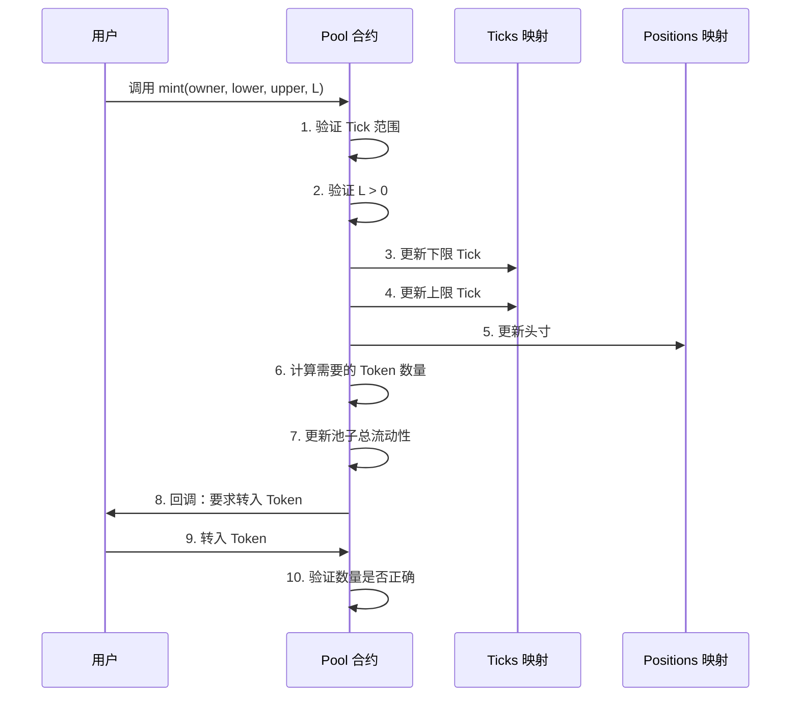
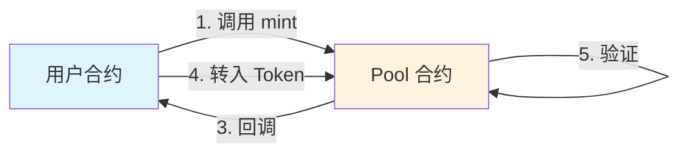

# 03 提供流动性

## 🎯 本章目标

理论讲够了，现在开始**写代码**！

我们将创建第一个智能合约——**Pool 合约**，并实现提供流动性的功能。

---

## 📦 项目初始化

### 使用 Foundry 创建项目

```bash
# 创建项目文件夹
mkdir uniswapv3-code
cd uniswapv3-code

# 初始化 Forge 项目
forge init --vscode
```

### 清理默认文件

删除 Forge 自动生成的示例文件：
- `script/Contract.s.sol`
- `src/Contract.sol`
- `test/Contract.t.sol`

---

## 🏊 Pool 合约

### 核心概念：Core vs Periphery

Uniswap 的合约分为两类：

| 类型 | 说明 | 特点 |
|------|------|------|
| **Core 合约** | 实现核心逻辑 | 最小化、底层、**不**对用户友好 |
| **Periphery 合约** | 用户友好接口 | 封装 Core 合约，提供便利功能 |

Uniswap V3 有 2 个 Core 合约：
1. **Pool 合约**：实现 DEX 的核心功能（我们现在的重点）
2. **Factory 合约**：Pool 的注册表，简化部署

### 创建 Pool 合约

```solidity
// src/UniswapV3Pool.sol
pragma solidity ^0.8.14;

contract UniswapV3Pool {
    // 合约内容
}
```

---

## ️ 合约数据结构

### Pool 合约需要存储什么？

| 数据项 | 说明 |
|--------|------|
| **两个 Token 地址** | 交易对的地址（immutable，部署后不变） |
| **流动性头寸（Positions）** | 每个流动性提供者的仓位信息 |
| **Tick 注册表** | 每个 Tick 的状态和流动性 |
| **Tick 范围限制** | 最小和最大 Tick 常量 |
| **流动性总量 L** | 池子当前的流动性 |
| **当前价格和 Tick** | 池子的实时状态 |

### 完整的数据结构

```solidity
// src/lib/Tick.sol
library Tick {
    struct Info {
        bool initialized;      // 是否已初始化
        uint128 liquidity;     // 该 Tick 的流动性
    }
}

// src/lib/Position.sol
library Position {
    struct Info {
        uint128 liquidity;     // 该头寸的流动性
    }
}

// src/UniswapV3Pool.sol
contract UniswapV3Pool {
    using Tick for mapping(int24 => Tick.Info);
    using Position for mapping(bytes32 => Position.Info);
    using Position for Position.Info;

    // Tick 范围限制
    int24 internal constant MIN_TICK = -887272;
    int24 internal constant MAX_TICK = -MIN_TICK;

    // Token 地址（immutable）
    address public immutable token0;
    address public immutable token1;

    // 状态打包（节省 Gas）
    struct Slot0 {
        uint160 sqrtPriceX96;  // 当前 √P
        int24 tick;            // 当前 Tick
    }
    Slot0 public slot0;

    // 流动性总量
    uint128 public liquidity;

    // Tick 信息
    mapping(int24 => Tick.Info) public ticks;
    
    // 头寸信息
    mapping(bytes32 => Position.Info) public positions;

    // 构造函数
    constructor(
        address token0_,
        address token1_,
        uint160 sqrtPriceX96,
        int24 tick
    ) {
        token0 = token0_;
        token1 = token1_;
        slot0 = Slot0({sqrtPriceX96: sqrtPriceX96, tick: tick});
    }
}
```

### 关键概念解释

#### 1. `using A for B` 语法

这是 Solidity 的特性，用库合约 A 的函数扩展类型 B：

```solidity
using Tick for mapping(int24 => Tick.Info);
```

**作用**：可以直接在 `mapping(int24 => Tick.Info)` 上调用 `Tick` 库的函数。

#### 2. Slot0 打包

将 `sqrtPriceX96` 和 `tick` 放在同一个 `struct` 中：

```solidity
struct Slot0 {
    uint160 sqrtPriceX96;  // 20 字节
    int24 tick;            // 3 字节
}
```

**好处**：这两个变量经常一起读写，打包到一个 Storage Slot（32 字节）中，**节省 Gas**。

---

## 💰 Minting（提供流动性）

### 为什么叫 "Minting"？

在 Uniswap V2 中，提供流动性时会"铸造"（mint）LP Token 给用户。

V3 不再铸造 LP Token，但**保留了这个名字**。

### Mint 函数签名

```solidity
function mint(
    address owner,        // 流动性所有者地址
    int24 lowerTick,      // 价格范围下限
    int24 upperTick,      // 价格范围上限
    uint128 amount        // 流动性数量 L
) external returns (uint256 amount0, uint256 amount1);
```

> 💡 **注意**：用户指定的是 **L 值**，而不是实际的 Token 数量。
> 
> Pool 合约是 Core 合约，不追求用户友好。后续我们会创建一个辅助合约，帮用户把 Token 数量转换为 L。

### Minting 工作流程



### 第一步：验证 Tick 范围

```solidity
if (
    lowerTick >= upperTick ||           // 下限必须小于上限
    lowerTick < MIN_TICK ||             // 不能小于最小值
    upperTick > MAX_TICK                // 不能大于最大值
) revert InvalidTickRange();
```

### 第二步：验证流动性数量

```solidity
if (amount == 0) revert ZeroLiquidity();
```

### 第三步：更新 Ticks 和 Positions

```solidity
// 更新上下限 Tick
ticks.update(lowerTick, amount);
ticks.update(upperTick, amount);

// 更新头寸
Position.Info storage position = positions.get(
    owner,
    lowerTick,
    upperTick
);
position.update(amount);
```

#### Tick.update 函数

```solidity
// src/lib/Tick.sol
function update(
    mapping(int24 => Tick.Info) storage self,
    int24 tick,
    uint128 liquidityDelta
) internal {
    Tick.Info storage tickInfo = self[tick];
    uint128 liquidityBefore = tickInfo.liquidity;
    uint128 liquidityAfter = liquidityBefore + liquidityDelta;

    // 首次添加流动性时，标记为已初始化
    if (liquidityBefore == 0) {
        tickInfo.initialized = true;
    }

    tickInfo.liquidity = liquidityAfter;
}
```

#### Position.update 函数

```solidity
// src/libs/Position.sol
function update(Info storage self, uint128 liquidityDelta) internal {
    uint128 liquidityBefore = self.liquidity;
    uint128 liquidityAfter = liquidityBefore + liquidityDelta;

    self.liquidity = liquidityAfter;
}
```

### 第四步：计算 Token 数量

还记得上一章手动计算的结果吗？现在我们**硬编码**这些值：

```solidity
amount0 = 0.998976618347425280 ether;  // ETH 数量
amount1 = 5000 ether;                   // USDC 数量
```

> ⚠️ **后续改进**：在后面的章节中，我们会用实际计算公式替换这些硬编码值。

### 第五步：更新池子总流动性

```solidity
liquidity += uint128(amount);
```

### 第六步：通过回调获取 Token

这是 Uniswap V3 的**核心设计模式**：

```solidity
// 记录当前余额
uint256 balance0Before;
uint256 balance1Before;
if (amount0 > 0) balance0Before = balance0();
if (amount1 > 0) balance1Before = balance1();

// 回调：要求调用者转入 Token
IUniswapV3MintCallback(msg.sender).uniswapV3MintCallback(
    amount0,
    amount1
);

// 验证余额是否正确增加
if (amount0 > 0 && balance0Before + amount0 > balance0())
    revert InsufficientInputAmount();
if (amount1 > 0 && balance1Before + amount1 > balance1())
    revert InsufficientInputAmount();
```

### 回调接口定义

```solidity
// src/interfaces/IUniswapV3MintCallback.sol
interface IUniswapV3MintCallback {
    function uniswapV3MintCallback(
        uint256 amount0,
        uint256 amount1
    ) external;
}
```

### 为什么用回调？

| 优点 | 说明 |
|------|------|
| **安全性** | 合约在回调前已经计算好需要的数量，不信任用户输入 |
| **状态一致性** | 回调时可以访问合约当前状态 |
| **灵活性** | 调用者可以是任何实现了回调接口的合约 |

> ⚠️ **限制**：只有合约才能实现回调函数，普通 EOA（外部账户）无法直接调用 Pool 合约。
> 
> 这就是为什么后续我们需要一个 **Manager 合约**（Periphery）来充当中介。

---

## 📝 完整的 Mint 函数

```solidity
function mint(
    address owner,
    int24 lowerTick,
    int24 upperTick,
    uint128 amount
) external returns (uint256 amount0, uint256 amount1) {
    // 1. 验证 Tick 范围
    if (
        lowerTick >= upperTick ||
        lowerTick < MIN_TICK ||
        upperTick > MAX_TICK
    ) revert InvalidTickRange();

    // 2. 验证流动性数量
    if (amount == 0) revert ZeroLiquidity();

    // 3. 更新 Ticks
    ticks.update(lowerTick, amount);
    ticks.update(upperTick, amount);

    // 4. 更新头寸
    Position.Info storage position = positions.get(
        owner,
        lowerTick,
        upperTick
    );
    position.update(amount);

    // 5. 计算 Token 数量（硬编码）
    amount0 = 0.998976618347425280 ether;
    amount1 = 5000 ether;

    // 6. 更新总流动性
    liquidity += uint128(amount);

    // 7. 回调获取 Token
    uint256 balance0Before;
    uint256 balance1Before;
    if (amount0 > 0) balance0Before = balance0();
    if (amount1 > 0) balance1Before = balance1();
    
    IUniswapV3MintCallback(msg.sender).uniswapV3MintCallback(
        amount0,
        amount1
    );
    
    if (amount0 > 0 && balance0Before + amount0 > balance0())
        revert InsufficientInputAmount();
    if (amount1 > 0 && balance1Before + amount1 > balance1())
        revert InsufficientInputAmount();

    // 8. 返回数量
    return (amount0, amount1);
}

// 辅助函数：获取余额
function balance0() internal view returns (uint256) {
    return IERC20(token0).balanceOf(address(this));
}

function balance1() internal view returns (uint256) {
    return IERC20(token1).balanceOf(address(this));
}
```

---

## 🧪 测试 Mint 功能

### 创建测试合约

```solidity
// test/UniswapV3Pool.t.sol
pragma solidity ^0.8.14;

import "forge-std/Test.sol";
import "../src/UniswapV3Pool.sol";
import "../src/ERC20Mintable.sol";

contract UniswapV3PoolTest is Test {
    UniswapV3Pool pool;
    ERC20Mintable token0;
    ERC20Mintable token1;

    function setUp() public {
        // 部署测试代币
        token0 = new ERC20Mintable("Wrapped Ether", "WETH", 18);
        token1 = new ERC20Mintable("USD Coin", "USDC", 18);

        // 计算好的参数
        int24 currentTick = 85176;
        uint160 currentSqrtP = 5602277097478614198912276234240;

        // 部署 Pool
        pool = new UniswapV3Pool(
            address(token0),
            address(token1),
            currentSqrtP,
            currentTick
        );
    }

    function testMintSuccess() public {
        // 给测试合约铸造 Token
        token0.mint(address(this), 1 ether);
        token1.mint(address(this), 5000 ether);

        // 调用 mint
        (uint256 amount0, uint256 amount1) = pool.mint(
            address(this),
            84222,    // lower tick
            86129,    // upper tick
            1517882343751509868544  // L
        );

        // 验证返回值
        assertEq(amount0, 0.998976618347425280 ether, "invalid ETH amount");
        assertEq(amount1, 5000 ether, "invalid USDC amount");

        // 验证池子流动性
        assertEq(pool.liquidity(), 1517882343751509868544, "invalid pool liquidity");

        // 验证余额
        assertEq(token0.balanceOf(address(pool)), 0.998976618347425280 ether);
        assertEq(token1.balanceOf(address(pool)), 5000 ether);
    }

    // 实现回调
    function uniswapV3MintCallback(uint256 amount0, uint256 amount1) public {
        token0.transfer(msg.sender, amount0);
        token1.transfer(msg.sender, amount1);
    }
}
```

### 运行测试

```bash
forge test -vv
```

---

## 🎯 总结

本章我们完成了：

✅ 创建 Pool 合约的基础结构  
✅ 实现了 `mint` 函数提供流动性  
✅ 理解了回调机制的设计  
✅ 编写并运行了测试用例  

### 核心设计模式



下一章，我们将实现 **Swap 功能**！🚀
