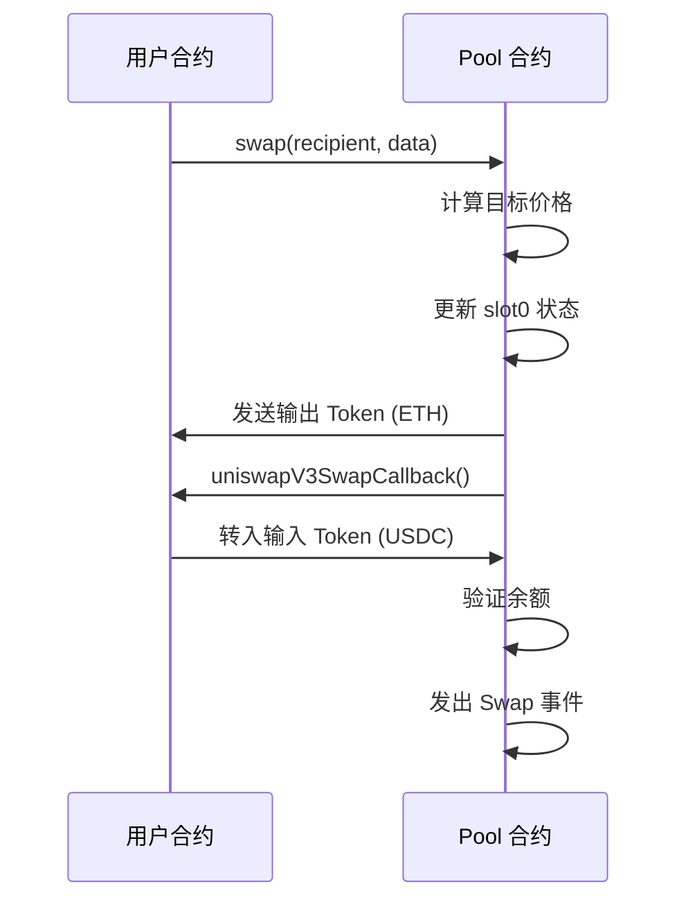

# 04 首次 Swap

## 🎯 本章目标

现在池子里已经有流动性了，我们可以进行**首次代币兑换（Swap）**！

---

## 💡 核心概念：用大白话理解 Swap

### Swap 是什么？

想象你在一家**货币兑换店**：

```
你：我有 42 USDC，想换 ETH
店员：当前汇率是 1 ETH = 5000 USDC
店员：我给你 0.00839 ETH，你给我 42 USDC
交易完成 ✅
```

这就是 Swap —— **用一种代币换另一种代币**。

---

### 核心公式（说人话版）

#### 关键问题：Pool 怎么知道该给你多少 ETH？

在 V2 中，Pool 看自己的"库存"（储备量）来计算。

但在 V3 中，我们用的是：
- **L（流动性）**：池子里有多少"交易能力"
- **√P（价格）**：当前的汇率

#### 核心公式

**前提：在一个价格范围内 Swap 时，L 保持不变**

所以可以用这个公式计算：
```
Δy = L × Δ√P

变形得到：
Δ√P = Δy ÷ L
```

就像弹簧：
```
力 F = 弹性系数 k × 伸长量 Δx

k 不变（弹簧特性）
所以：Δx = F ÷ k
```

我们知道：
- **Δy = 42 USDC**（你投入的 USDC）
- **L = 1517882343751509868544**（池子的流动性，不变）

所以可以算出：
```
Δ√P = 42 ÷ 1517882343751509868544
    = 2192253463713690532467206957
```

然后：
```
新价格 = 旧价格 + Δ√P
       = 5602277097478614198912276234240 + 2192253463713690532467206957
       = 5604469350942327889444743441197
```

最后根据新价格，算出你应该得到多少 ETH。

---

### 为什么 Swap 是安全的？

#### 关键：原子性（Atomicity）

**整个 Swap 交易是一个原子操作：要么全部成功，要么全部失败（回滚）**

就像银行转账：
```
❌ 不安全的方式：
Step 1: 从A账户扣 1000 元
Step 2: 给B账户加 1000 元
如果 Step 2 失败 → A的钱没了，B也没收到 → 灾难！

✅ 安全的方式（原子性）：
整个交易是一个原子操作
如果任何一步失败 → 全部回滚（就像什么都没发生过）
```

#### Pool 的 Swap 流程

```solidity
function swap() {
    Pool 给你 ETH          ← Step 1
    调用你的回调函数         ← Step 2
    你给 Pool USDC         ← Step 3
    Pool 验证余额           ← Step 4
}
```

**如果 Step 4 验证失败**：
- Step 1 转给你的 ETH **自动退回**
- Step 3 你转给 Pool 的 USDC **自动退回**
- 所有状态**回到交易前**

#### 安全性的真正来源

| 误解 | 真相 |
|------|------|
| "Pool 先给你钱，所以你要信任 Pool" | ❌ 整个交易是原子的，失败会回滚 |
| "回调是为了让用户先给钱" | ❌ 回调是为了让 Pool 自己计算数量 |
| "安全性来自信任" | ❌ 安全性来自**验证+回滚** |

**正确的理解**：
```
安全性 = Pool自己计算 + 验证收到钱 + 失败回滚
       = 不需要信任任何人（原子性保证）
```

---

### 回调机制：谁调用谁？

#### Mint（提供流动性）vs Swap（兑换）

**Mint 的回调**：
```
你 → Pool.mint()
Pool → 你的合约.uniswapV3MintCallback()
你的合约 → 转账给 Pool
```

**Swap 的回调**：
```
你 → Pool.swap()
Pool → 先给你 ETH（输出）
Pool → 你的合约.uniswapV3SwapCallback()
你的合约 → 转账 USDC 给 Pool（输入）
```

**为什么顺序反了？**

因为 Swap 时：
1. Pool **先给你** ETH（它有的）
2. 然后 Pool **向你要** USDC（你有的）

就像你去银行取钱：
```
Step 1: 你说 "我要取 1000 元"
Step 2: 银行先给你 1000 元现金
Step 3: 银行从你的账户扣款 ← 这就是回调！
```

---

## 1️⃣ 计算 Swap 数量

### 场景设定

我们决定用 **42 USDC** 购买 ETH。

### 核心问题

在 V2 中，我们直接用池子储备计算。但在 V3 中，我们有：
- **L**（流动性）
- **√P**（当前价格）

并且我们知道：
- 在一个价格范围内 Swap 时，**L 保持不变**
- 只有 **√P 会变化**

### 关键公式

```
L = Δy / Δ√P
```

我们知道：
- **Δy = 42 USDC**（我们投入的 USDC）
- **L = 1517882343751509868544**（上一章计算的流动性）

所以可以计算出：

```
Δ√P = Δy / L
    = 42 / 1517882343751509868544
    = 2192253463713690532467206957
```

### 计算目标价格

```
√P_target = √P_current + Δ√P
          = 5602277097478614198912276234240 + 2192253463713690532467206957
          = 5604469350942327889444743441197
```

### Python 验证

```python
amount_in = 42 * eth  # 42 USDC
price_diff = (amount_in * q96) // liq
price_next = sqrtp_cur + price_diff

print("New price:", (price_next / q96) ** 2)
print("New sqrtP:", price_next)
print("New tick:", price_to_tick((price_next / q96) ** 2))

# 输出：
# New price: 5003.913912782393
# New sqrtP: 5604469350942327889444743441197
# New tick: 85184
```

### 计算获得的 ETH 数量

使用数量计算公式：

```python
amount_in = calc_amount1(liq, price_next, sqrtp_cur)
amount_out = calc_amount0(liq, price_next, sqrtp_cur)

print("USDC in:", amount_in / eth)
print("ETH out:", amount_out / eth)

# 输出：
# USDC in: 42.0
# ETH out: 0.008396714242162444
```

### 验证计算

使用另一个公式验证：

```
Δx = Δ(1/√P) × L
```

注意：`Δ(1/√P)` **不等于** `1/Δ√P`！

正确计算：

```
Δ(1/√P) = 1/√P_target - 1/√P_current
        = 1/5604469350942327889444743441197 - 1/5602277097478614198912276234240
        = -6.982190286589445e-35 × 2^96
        = -0.00000553186106731426

Δx = -0.00000553186106731426 × 1517882343751509868544
   = -8396714242162698
   = -0.008396714242162698 ETH
```

✅ **结果接近！**（负数表示从池子取出）

---

## 2️⃣ 实现 Swap 函数

### Swap 函数签名

```solidity
function swap(
    address recipient,
    bytes calldata data
) public returns (int256 amount0, int256 amount1);
```

### 第一步：硬编码计算好的值

```solidity
int24 nextTick = 85184;
uint160 nextPrice = 5604469350942327889444743441197;

amount0 = -0.008396714242162444 ether;  // ETH 出（负数）
amount1 = 42 ether;                       // USDC 入
```

### 第二步：更新池子状态

```solidity
(slot0.tick, slot0.sqrtPriceX96) = (nextTick, nextPrice);
```

### 第三步：发送输出 Token

```solidity
// 给接收者发送 ETH
IERC20(token0).transfer(recipient, uint256(-amount0));
```

### 第四步：回调获取输入 Token

```solidity
// 记录当前余额
uint256 balance1Before = balance1();

// 回调：要求调用者转入 USDC
IUniswapV3SwapCallback(msg.sender).uniswapV3SwapCallback(
    amount0,
    amount1,
    data
);

// 验证余额是否正确增加
if (balance1Before + uint256(amount1) < balance1())
    revert InsufficientInputAmount();
```

### 第五步：发出事件

```solidity
emit Swap(
    msg.sender,      // 发起者
    recipient,       // 接收者
    amount0,         // ETH 变化
    amount1,         // USDC 变化
    slot0.sqrtPriceX96,  // 新价格
    liquidity,       // 流动性
    slot0.tick       // 新 Tick
);
```

### 完整的 Swap 函数

```solidity
function swap(
    address recipient,
    bytes calldata data
) public returns (int256 amount0, int256 amount1) {
    // 1. 硬编码计算好的值
    int24 nextTick = 85184;
    uint160 nextPrice = 5604469350942327889444743441197;

    amount0 = -0.008396714242162444 ether;
    amount1 = 42 ether;

    // 2. 更新状态
    (slot0.tick, slot0.sqrtPriceX96) = (nextTick, nextPrice);

    // 3. 发送输出 Token
    IERC20(token0).transfer(recipient, uint256(-amount0));

    // 4. 回调获取输入 Token
    uint256 balance1Before = balance1();
    IUniswapV3SwapCallback(msg.sender).uniswapV3SwapCallback(
        amount0,
        amount1,
        data
    );
    if (balance1Before + uint256(amount1) < balance1())
        revert InsufficientInputAmount();

    // 5. 发出事件
    emit Swap(
        msg.sender,
        recipient,
        amount0,
        amount1,
        slot0.sqrtPriceX96,
        liquidity,
        slot0.tick
    );

    return (amount0, amount1);
}
```

### Swap 回调接口

```solidity
// src/interfaces/IUniswapV3SwapCallback.sol
interface IUniswapV3SwapCallback {
    function uniswapV3SwapCallback(
        int256 amount0,
        int256 amount1,
        bytes calldata data
    ) external;
}
```

---

## 🧪 测试 Swap 功能

### 测试用例

```solidity
function testSwapBuyEth() public {
    // 1. 设置测试环境
    TestCaseParams memory params = TestCaseParams({
        wethBalance: 1 ether,
        usdcBalance: 5000 ether,
        currentTick: 85176,
        lowerTick: 84222,
        upperTick: 86129,
        liquidity: 1517882343751509868544,
        currentSqrtP: 5602277097478614198912276234240,
        shouldTransferInCallback: true,
        mintLiqudity: true
    });
    
    (uint256 poolBalance0, uint256 poolBalance1) = setupTestCase(params);

    // 2. 给测试合约铸造 42 USDC
    token1.mint(address(this), 42 ether);

    // 3. 执行 Swap
    (int256 amount0Delta, int256 amount1Delta) = pool.swap(
        address(this),
        ""
    );

    // 4. 验证返回值
    assertEq(amount0Delta, -0.008396714242162444 ether, "invalid ETH out");
    assertEq(amount1Delta, 42 ether, "invalid USDC in");

    // 5. 验证用户余额
    assertEq(
        token0.balanceOf(address(this)),
        uint256(int256(userBalance0Before) - amount0Delta),
        "invalid user ETH balance"
    );
    assertEq(
        token1.balanceOf(address(this)),
        0,
        "invalid user USDC balance"
    );

    // 6. 验证池子余额
    assertEq(
        token0.balanceOf(address(pool)),
        uint256(int256(poolBalance0) + amount0Delta),
        "invalid pool ETH balance"
    );
    assertEq(
        token1.balanceOf(address(pool)),
        uint256(int256(poolBalance1) + amount1Delta),
        "invalid pool USDC balance"
    );

    // 7. 验证池子状态
    (uint160 sqrtPriceX96, int24 tick) = pool.slot0();
    assertEq(
        sqrtPriceX96,
        5604469350942327889444743441197,
        "invalid current sqrtP"
    );
    assertEq(tick, 85184, "invalid current tick");
    assertEq(
        pool.liquidity(),
        1517882343751509868544,
        "invalid current liquidity"
    );
}
```

### 回调实现

```solidity
function uniswapV3SwapCallback(
    int256 amount0,
    int256 amount1,
    bytes calldata data
) public {
    // 只转入正数（需要支付的 Token）
    if (amount0 > 0) {
        token0.transfer(msg.sender, uint256(amount0));
    }
    if (amount1 > 0) {
        token1.transfer(msg.sender, uint256(amount1));
    }
}
```

---

## 🎯 总结

### Swap 流程



### 关键要点

| 要点 | 说明 |
|------|------|
| **L 不变** | 单价格范围内 Swap，流动性总量不变 |
| **√P 变化** | 价格会沿着曲线移动 |
| **回调机制** | Pool 不直接接收 Token，而是通过回调 |
| **事件记录** | 每次 Swap 都发出事件，方便链下监听 |

### 运行测试

```bash
forge test -vv --match-test testSwapBuyEth
```

---

### 📝 家庭作业

编写一个测试，让它因为 `InsufficientInputAmount` 错误而失败。

> 💡 **提示**：这里有一个隐藏的 Bug 😉

---

**下一章，我们将创建一个 Manager 合约，让普通用户也能与 Pool 交互！** 🚀
