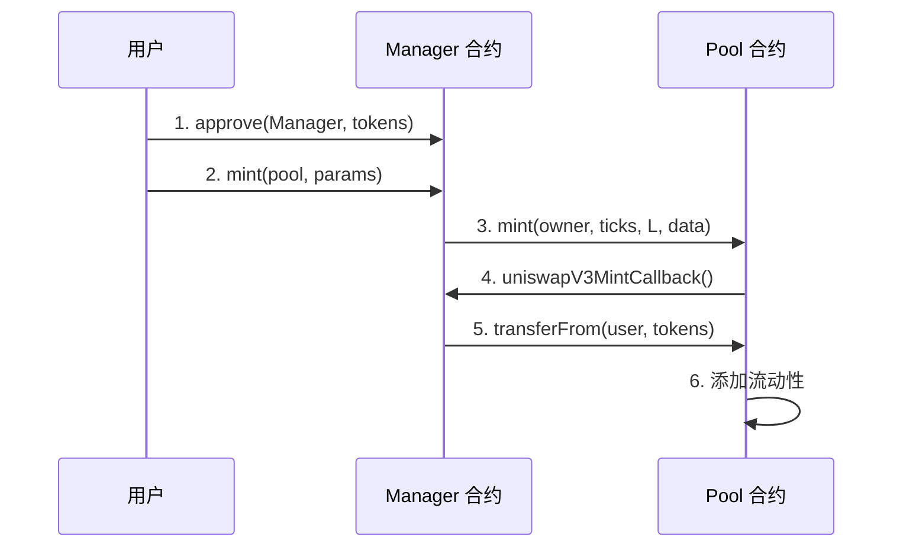
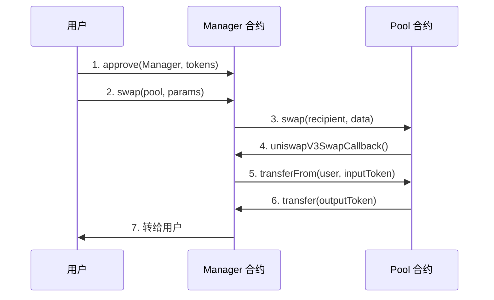
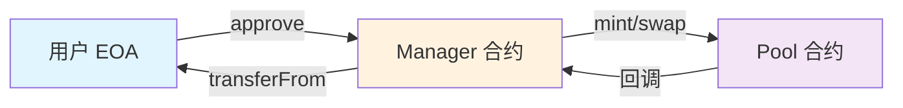

# 05 管理器合约

## 🎯 本章目标

在部署 Pool 合约之前，我们需要解决一个**关键问题**：

> **普通用户（EOA）无法直接调用 Pool 合约！**

### 问题根源

Pool 合约使用了**回调机制**：

```solidity
// Pool 合约期望调用者是一个合约
IUniswapV3MintCallback(msg.sender).uniswapV3MintCallback(...);
IUniswapV3SwapCallback(msg.sender).uniswapV3SwapCallback(...);
```

但普通用户地址（EOA）**不是合约**，无法实现回调函数！

### 解决方案

创建一个 **Manager 合约**（Periphery 合约）作为中介：

| 合约 | 类型 | 职责 |
|------|------|------|
| **Pool** | Core | 核心逻辑，不友好 |
| **Manager** | Periphery | 用户友好，封装 Pool |

---

## 📋 工作流程

### 提供流动性流程



### 交换代币流程



---

## 🔧 升级 Pool 合约

### 问题：回调需要更多信息

当前的回调函数：

```solidity
function uniswapV3MintCallback(uint256 amount0, uint256 amount1) public {
    token0.transfer(msg.sender, amount0);  // ❌ 写死了 token 地址
    token1.transfer(msg.sender, amount1);
}
```

**问题**：
1. 回调函数硬编码了 `token0` 和 `token1`
2. Manager 合约要与**任何 Pool** 交互，每个 Pool 的 token 都不同

### 解决方案：传递额外数据

#### 1. 定义数据结构

```solidity
// src/UniswapV3Pool.sol
struct CallbackData {
    address token0;     // token0 地址
    address token1;     // token1 地址
    address payer;      // 付款人地址
}
```

#### 2. 修改 Mint 函数

```solidity
function mint(
    address owner,
    int24 lowerTick,
    int24 upperTick,
    uint128 amount,
    bytes calldata data  // ✅ 新增：编码的额外数据
) external returns (uint256 amount0, uint256 amount1) {
    // ... 验证和更新逻辑 ...

    // 将编码数据传递给回调
    IUniswapV3MintCallback(msg.sender).uniswapV3MintCallback(
        amount0,
        amount1,
        data  // ✅ 新增参数
    );

    // ... 验证余额 ...
}
```

#### 3. 修改 Swap 函数

```solidity
function swap(
    address recipient,
    bytes calldata data  // ✅ 新增参数
) public returns (int256 amount0, int256 amount1) {
    // ... 计算和更新逻辑 ...

    // 将编码数据传递给回调
    IUniswapV3SwapCallback(msg.sender).uniswapV3SwapCallback(
        amount0,
        amount1,
        data  // ✅ 新增参数
    );

    // ... 验证余额 ...
}
```

#### 4. 更新回调接口

```solidity
// src/interfaces/IUniswapV3MintCallback.sol
interface IUniswapV3MintCallback {
    function uniswapV3MintCallback(
        uint256 amount0,
        uint256 amount1,
        bytes calldata data  // ✅ 新增
    ) external;
}

// src/interfaces/IUniswapV3SwapCallback.sol
interface IUniswapV3SwapCallback {
    function uniswapV3SwapCallback(
        int256 amount0,
        int256 amount1,
        bytes calldata data  // ✅ 新增
    ) external;
}
```

### 为什么用 `bytes calldata data`？

| 方案 | 优点 | 缺点 |
|------|------|------|
| 增加函数参数 | 类型安全 | 函数签名变长，不灵活 |
| **abi.encode()** | ✅ 灵活，可扩展 | 需要解码 |

使用 `bytes` 的好处：
- 不影响函数签名
- 可以传递任意数据
- 后续扩展不需要修改接口

---

## 🏗️ 实现 Manager 合约

### Manager 合约的核心职责

Manager 合约非常简单：
1. 接收用户调用
2. 转发到 Pool 合约
3. 实现回调函数
4. 使用 `transferFrom` 从用户转币

### 完整代码

```solidity
// src/UniswapV3Manager.sol
pragma solidity ^0.8.14;

import "./UniswapV3Pool.sol";
import "./interfaces/IERC20.sol";

contract UniswapV3Manager {
    
    // 提供流动性
    function mint(
        address poolAddress_,
        int24 lowerTick,
        int24 upperTick,
        uint128 liquidity,
        bytes calldata data
    ) public {
        UniswapV3Pool(poolAddress_).mint(
            msg.sender,          // owner 是用户
            lowerTick,
            upperTick,
            liquidity,
            data
        );
    }

    // 交换代币
    function swap(
        address poolAddress_,
        bytes calldata data
    ) public {
        UniswapV3Pool(poolAddress_).swap(
            msg.sender,          // recipient 是用户
            data
        );
    }

    // Mint 回调实现
    function uniswapV3MintCallback(
        uint256 amount0,
        uint256 amount1,
        bytes calldata data
    ) public {
        // 解码数据
        UniswapV3Pool.CallbackData memory extra = abi.decode(
            data,
            (UniswapV3Pool.CallbackData)
        );

        // 从用户转账到 Pool
        if (amount0 > 0) {
            IERC20(extra.token0).transferFrom(
                extra.payer,
                msg.sender,
                amount0
            );
        }
        if (amount1 > 0) {
            IERC20(extra.token1).transferFrom(
                extra.payer,
                msg.sender,
                amount1
            );
        }
    }

    // Swap 回调实现
    function uniswapV3SwapCallback(
        int256 amount0,
        int256 amount1,
        bytes calldata data
    ) public {
        // 解码数据
        UniswapV3Pool.CallbackData memory extra = abi.decode(
            data,
            (UniswapV3Pool.CallbackData)
        );

        // 从用户转账到 Pool
        if (amount0 > 0) {
            IERC20(extra.token0).transferFrom(
                extra.payer,
                msg.sender,
                uint256(amount0)
            );
        }
        if (amount1 > 0) {
            IERC20.extra.token1).transferFrom(
                extra.payer,
                msg.sender,
                uint256(amount1)
            );
        }
    }
}
```

### 关键区别：TransferFrom

| 测试合约 | Manager 合约 |
|---------|-------------|
| `token.transfer()` | `token.transferFrom(payer, ...)` |
| 转移测试合约的币 | 转移用户的币 |
| 不需要 approve | 需要用户先 approve |

---

## 🧪 更新测试

### 编码 CallbackData

```solidity
// 在测试合约中准备数据
UniswapV3Pool.CallbackData memory callbackData = UniswapV3Pool.CallbackData({
    token0: address(token0),
    token1: address(token1),
    payer: address(this)
});

// 编码为 bytes
bytes memory data = abi.encode(callbackData);
```

### 测试 Mint

```solidity
function testMintWithManager() public {
    // 1. 部署 Manager
    UniswapV3Manager manager = new UniswapV3Manager();

    // 2. 铸造 Token 给测试合约
    token0.mint(address(this), 1 ether);
    token1.mint(address(this), 5000 ether);

    // 3. Approve Manager
    token0.approve(address(manager), 1 ether);
    token1.approve(address(manager), 5000 ether);

    // 4. 准备回调数据
    UniswapV3Pool.CallbackData memory callbackData = UniswapV3Pool.CallbackData({
        token0: address(token0),
        token1: address(token1),
        payer: address(this)
    });
    bytes memory data = abi.encode(callbackData);

    // 5. 调用 Manager.mint
    (uint256 amount0, uint256 amount1) = manager.mint(
        address(pool),
        84222,
        86129,
        1517882343751509868544,
        data
    );

    // 6. 验证结果
    assertEq(amount0, 0.998976618347425280 ether);
    assertEq(amount1, 5000 ether);
    assertEq(pool.liquidity(), 1517882343751509868544);
}
```

### 测试 Swap

```solidity
function testSwapWithManager() public {
    // 1. 先添加流动性（同上）
    // ...

    // 2. 铸造 42 USDC
    token1.mint(address(this), 42 ether);

    // 3. Approve Manager
    token1.approve(address(manager), 42 ether);

    // 4. 准备回调数据
    UniswapV3Pool.CallbackData memory callbackData = UniswapV3Pool.CallbackData({
        token0: address(token0),
        token1: address(token1),
        payer: address(this)
    });
    bytes memory data = abi.encode(callbackData);

    // 5. 调用 Manager.swap
    (int256 amount0Delta, int256 amount1Delta) = manager.swap(
        address(pool),
        data
    );

    // 6. 验证结果
    assertEq(amount0Delta, -0.008396714242162444 ether);
    assertEq(amount1Delta, 42 ether);
}
```

---

## 🎯 总结

### Manager 合约的作用



### 关键要点

| 要点 | 说明 |
|------|------|
| **Core vs Periphery** | Pool 是 Core（核心逻辑），Manager 是 Periphery（用户接口） |
| **回调机制** | Pool 通过回调获取 Token，不信任用户 |
| **TransferFrom** | Manager 使用 transferFrom 从用户转币 |
| **Approve 流程** | 用户必须先 approve Manager 合约 |
| **编码数据** | 使用 abi.encode() 传递额外信息 |

### 完整的交互流程

```
1. 用户 approve Manager（授权）
2. 用户调用 Manager.mint/swap
3. Manager 转发到 Pool
4. Pool 回调 Manager
5. Manager 从用户 transferFrom
6. Pool 完成操作
7. 结果返回给用户
```

---

**下一章，我们将把合约部署到本地区块链！** 🚀
