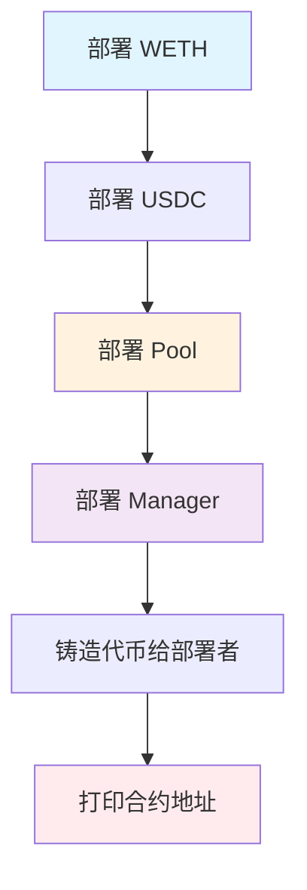

# 06 部署

## 🎯 本章目标

池合约已经完成了！现在，让我们把它**部署到本地区块链**，方便后续从前端应用中使用它。

---

## 🌐 选择本地区块链网络

### 为什么需要本地网络？

智能合约开发需要一个本地网络，用于开发和测试。我们需要：

| 需求 | 说明 |
|------|------|
| **真实的区块链** | 必须是真实的 Ethereum 网络，不是模拟器 |
| **速度** | 交易立即挖出，快速迭代 |
| **以太币** | 能生成任意数量的 ETH 支付 Gas |
| **作弊码** | 允许伪装地址、直接改合约状态等 |

### 主流方案对比

| 方案 | 语言 | 测试 | 趋势 |
|------|------|------|------|
| **Ganache** (Truffle) | JavaScript | JS | 📉 逐渐淘汰 |
| **Hardhat** | JavaScript | JS | 📊 广泛使用 |
| **Anvil** (Foundry) | **Solidity** | **Solidity** | 📈 新兴推荐 |

**我们选择 Anvil**，因为：
- ✅ 用 Solidity 写测试和部署脚本
- ✅ 速度快，功能强大
- ✅ 与 Forge 完美集成

---

## 🚀 运行本地区块链

### 启动 Anvil

```bash
$ anvil --code-size-limit 50000
```

> **为什么设置 50000？**
> 
> 以太坊限制合约最大 24576 字节。我们的合约会超过这个限制，所以需要放宽。

### Anvil 启动后会做什么？

1. **创建 10 个账户**，每个有 10,000 ETH
2. **启动 JSON-RPC 接口** 在 `127.0.0.1:8545`
3. **打印地址和私钥**（部署时会用到）

### 验证节点是否运行

```bash
# 用 curl 调用
$ curl -X POST -H 'Content-Type: application/json' \
  --data '{"id":1,"jsonrpc":"2.0","method":"eth_chainId"}' \
  http://127.0.0.1:8545
  
{"jsonrpc":"2.0","id":1,"result":"0x7a69"}  # 31337 的十六进制

# 或用 cast (Foundry 工具)
$ cast chain-id
31337

$ cast balance 0xf39fd6e51aad88f6f4ce6ab8827279cfffb92266
10000000000000000000000  # 10000 ETH
```

---

## 📦 编写部署脚本

### 什么是部署？

部署合约就是：
1. **编译** 源代码成 EVM 字节码
2. **发送交易**，包含字节码
3. **创建新地址**，执行构造函数，存储字节码

### 创建部署脚本

```solidity
// scripts/DeployDevelopment.s.sol
// SPDX-License-Identifier: UNLICENSED
pragma solidity ^0.8.14;

import "forge-std/Script.sol";

contract DeployDevelopment is Script {
    function run() public {
        // 部署参数
        uint256 wethBalance = 1 ether;
        uint256 usdcBalance = 5042 ether;  // 5000 流动性 + 42 用于 swap
        int24 currentTick = 85176;
        uint160 currentSqrtP = 5602277097478614198912276234240;

        // 开始广播交易
        vm.startBroadcast();

        // 1. 部署代币
        ERC20Mintable token0 = new ERC20Mintable("Wrapped Ether", "WETH", 18);
        ERC20Mintable token1 = new ERC20Mintable("USD Coin", "USDC", 18);

        // 2. 部署 Pool
        UniswapV3Pool pool = new UniswapV3Pool(
            address(token0),
            address(token1),
            currentSqrtP,
            currentTick
        );

        // 3. 部署 Manager
        UniswapV3Manager manager = new UniswapV3Manager();

        // 4. 铸造代币给部署者
        token0.mint(msg.sender, wethBalance);
        token1.mint(msg.sender, usdcBalance);

        // 停止广播
        vm.stopBroadcast();

        // 打印合约地址
        console.log("WETH address", address(token0));
        console.log("USDC address", address(token1));
        console.log("Pool address", address(pool));
        console.log("Manager address", address(manager));
    }
}
```

### 关键概念：`vm.startBroadcast()`

这是 Foundry 的**作弊码**（Cheat Code）：

| 功能 | 说明 |
|------|------|
| **vm.startBroadcast()** | 之后的代码都会变成交易 |
| **vm.stopBroadcast()** | 停止广播 |
| **msg.sender** | 在广播块中是发送交易的地址 |

### 部署顺序



---

##  执行部署

### 运行部署脚本

```bash
$ forge script scripts/DeployDevelopment.s.sol \
  --broadcast \
  --fork-url http://localhost:8545 \
  --private-key $PRIVATE_KEY \
  --code-size-limit 50000
```

### 参数说明

| 参数 | 说明 |
|------|------|
| **--broadcast** | 启用交易广播（默认不广播） |
| **--fork-url** | 指定 Anvil 节点地址 |
| **--private-key** | 部署者私钥（用 Anvil 启动时打印的任一私钥） |
| **--code-size-limit** | 放宽合约大小限制 |

### 部署过程

1. **编译合约** → 生成字节码
2. **发送交易** → Anvil 立即挖出
3. **获取收据** → Forge 通过 JSON-RPC 查询状态
4. **保存记录** → 交易收据保存到 `broadcast/` 文件夹

### 输出示例

```
== Logs ==
  WETH address 0x5FbDB2315678afecb367f032d93F642f64180aa3
  USDC address 0xe7f1725E7734CE288F8367e1Bb143E90bb3F0512
  Pool address 0x9fE46736679d2D9a65F0992F2272dE9f3c7fa6e0
  Manager address 0xCf7Ed3AccA5a467e9e704C703E8D87F634fB0Fc9
```

**恭喜！你刚刚部署了一个智能合约！** 🎉

---

## 🔍 与合约交互

### ABI 是什么？

每个合约都有一组公共函数。但编译后的字节码**丢失了函数名**，只能用**选择器**（Selector）标识。

选择器 = 函数签名的 Keccak256 哈希的前 4 字节：

```
选择器 = hash("transfer(address,address,uint256)")[0:4]
```

### 查询代币余额

#### 方法 1：用 curl（底层）

```bash
# 函数签名：balanceOf(address)
# 选择器：70a08231

$ curl -X POST http://localhost:8545 \
  -H "Content-Type: application/json" \
  -d '{
    "jsonrpc":"2.0",
    "method":"eth_call",
    "params":[{
      "to":"0x5FbDB2315678afecb367f032d93F642f64180aa3",
      "data":"0x70a08231000000000000000000000000f39fd6e51aad88f6f4ce6ab8827279cfffb92266"
    },"latest"],
    "id":1
  }'
  
{"result":"0x0de0b6b3a7640000"}  # 1 ETH
```

#### 方法 2：用 cast（推荐）

```bash
# cast 会自动编码参数
$ cast call 0x5FbDB2315678afecb367f032d93F642f64180aa3 \
  "balanceOf(address)" \
  0xf39fd6e51aad88f6f4ce6ab8827279cfffb92266
  
0x0de0b6b3a7640000  # 1000000000000000000 = 1 ETH
```

### 查询 Pool 状态

```bash
# 查询当前价格和 Tick
$ cast call <POOL_ADDRESS> "slot0()"

(uint160 sqrtPriceX96, int24 tick) = (5602277097478614198912276234240, 85176)

# 查询流动性
$ cast call <POOL_ADDRESS> "liquidity()"

1517882343751509868544
```

---

## 🧪 验证部署

### 检查代币余额

```bash
# 部署者的 WETH 余额
$ cast balance --erc20 <WETH_ADDRESS> <DEPLOYER_ADDRESS>

# 部署者的 USDC 余额
$ cast balance --erc20 <USDC_ADDRESS> <DEPLOYER_ADDRESS>
```

### 检查 Pool 参数

```bash
# Token 地址
$ cast call <POOL_ADDRESS> "token0()"
$ cast call <POOL_ADDRESS> "token1()"

# 当前价格
$ cast call <POOL_ADDRESS> "slot0()"
```

---

## 🎯 总结

### 部署流程回顾

**Step 1**: 启动 Anvil 本地节点  
**Step 2**: 编写部署脚本（Solidity）  
**Step 3**: 使用 `vm.startBroadcast()` 广播交易  
**Step 4**: 按顺序部署：代币 → Pool → Manager  
**Step 5**: 用 `cast` 验证合约状态  

### 关键工具

| 工具 | 用途 |
|------|------|
| **Anvil** | 本地区块链节点 |
| **Forge** | 编译和运行部署脚本 |
| **cast** | 与合约交互、查询状态 |

### 核心概念

| 概念 | 说明 |
|------|------|
| **广播交易** | `vm.startBroadcast()` 之后的代码变成交易 |
| **作弊码** | Foundry 提供的特殊功能，如伪造地址、修改状态 |
| **ABI 选择器** | 函数签名的哈希前 4 字节，用于调用合约 |
| **JSON-RPC** | 与以太坊节点通信的标准接口 |

---

**下一章，我们将构建前端界面，让普通用户也能使用我们的 DEX！** 🚀
