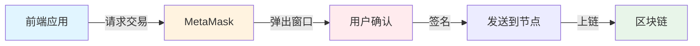
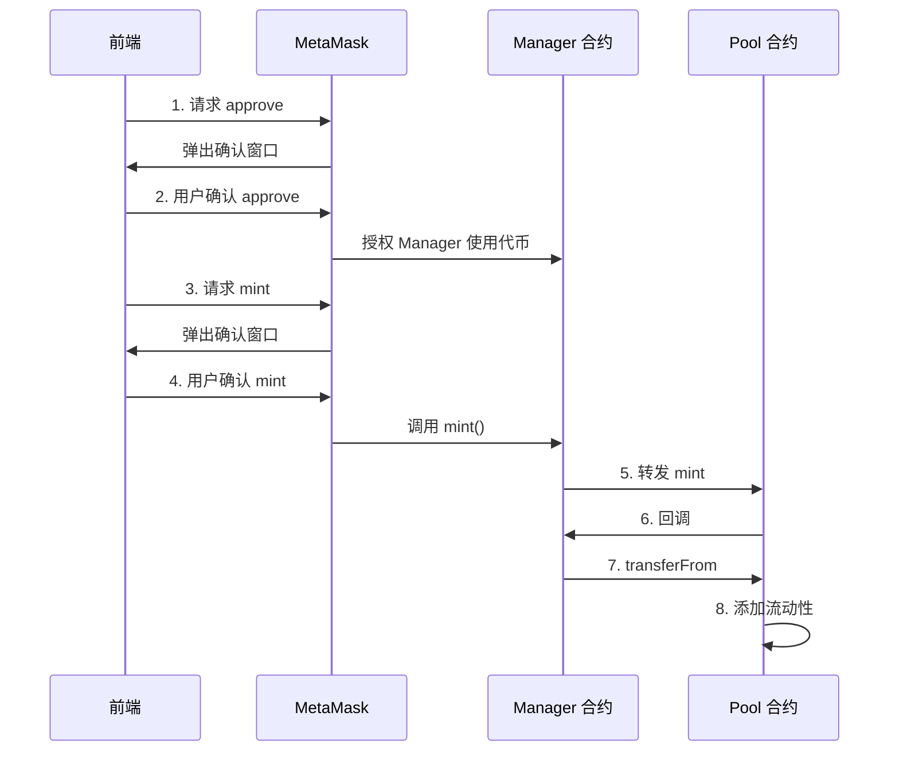
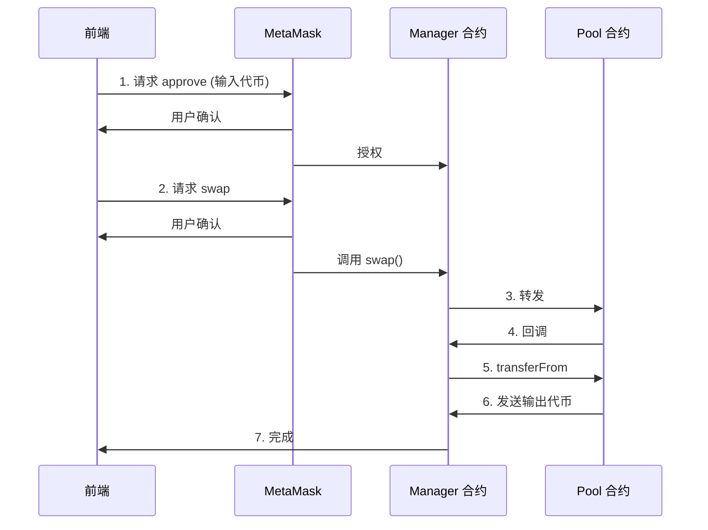

# 07 用户界面

## 🎯 本章目标

终于，我们到达了本里程碑的最后一站——**构建用户界面**！

> 💡 **提示**：构建前端不是本书的主要目标，所以本章重点是**如何用 MetaMask + Ethers.js 与智能合约交互**，而不是从头搭建 React 项目。

---

## 🧰 工具概览

### 什么是 MetaMask？

MetaMask 是一个**浏览器扩展钱包**，它的功能：

| 功能 | 说明 |
|------|------|
| **管理私钥** | 创建和存储私钥 |
| **显示余额** | 查看 ETH 和代币余额 |
| **切换网络** | 连接不同的区块链网络 |
| **签名交易** | 用私钥安全签署交易 |
| **充当提供者** | 连接以太坊节点，提供 JSON-RPC 接口 |

### MetaMask 工作流程



### 便捷库：Ethers.js

MetaMask 功能有限，我们需要另一个库来简化交互。

| 库 | 特点 | 选择 |
|----|------|------|
| **web3.js** | 老牌库 | 可用 |
| **ethers.js** | 接口清晰，我们选它 | ✅ 推荐 |

---

## 🔄 完整工作流程

### 1. 连接到本地节点

MetaMask 需要连接到以太坊节点。我们要连接到本地的 Anvil 节点。

**步骤**：

**Step 1**: 打开 MetaMask  
**Step 2**: 点击网络列表 → "添加网络"  
**Step 3**: 输入 RPC URL：`http://localhost:8545`  
**Step 4**: 自动检测链 ID（Anvil 是 31337）

### 2. 导入私钥

**Step 1**: 在 MetaMask 中点击地址列表 → "导入账户"  
**Step 2**: 粘贴部署时选择的私钥  
**Step 3**: 导入代币地址（WETH、USDC）

> ⚠️ **MetaMask 的缓存问题**：
> 
> 重启 Anvil 后，MetaMask 可能显示旧的余额。解决方法：
> - 进入高级设置 → 点击"重置账户"

### 3. 前端连接 MetaMask

并非每个网站都能访问你的 MetaMask 地址。网站需要先请求权限。

#### 连接代码

```javascript
// ui/src/contexts/MetaMask.js
const connect = () => {
    // 检查 MetaMask 是否安装
    if (typeof (window.ethereum) === 'undefined') {
        return setStatus('not_installed');
    }

    // 请求账户和链 ID
    Promise.all([
        window.ethereum.request({ method: 'eth_requestAccounts' }),
        window.ethereum.request({ method: 'eth_chainId' }),
    ]).then(function ([accounts, chainId]) {
        setAccount(accounts[0]);
        setChain(chainId);
        setStatus('connected');
    }).catch(function (error) {
        console.error(error);
    });
}
```

**关键点**：
- `window.ethereum` 是 MetaMask 提供的接口对象
- `eth_requestAccounts` 触发 MetaMask 弹出授权窗口
- 用户可以选择授予哪个地址的访问权限

---

## 💰 提供流动性

### 完整流程



### 前端代码

#### 第一步：创建合约实例

```javascript
// 创建 Token 合约实例
token0 = new ethers.Contract(
    props.config.token0Address,
    props.config.ABIs.ERC20,
    new ethers.providers.Web3Provider(window.ethereum).getSigner()
);
```

**参数说明**：
- 合约地址
- 合约 ABI（接口定义）
- Signer（MetaMask 提供的签名者）

#### 第二步：准备参数

```javascript
const addLiquidity = (account, { token0, token1, manager }, { managerAddress, poolAddress }) => {
    // 硬编码的值（与测试相同）
    const amount0 = ethers.utils.parseEther("0.998976618347425280");
    const amount1 = ethers.utils.parseEther("5000");
    const lowerTick = 84222;
    const upperTick = 86129;
    const liquidity = ethers.BigNumber.from("1517882343751509868544");
    
    // 编码回调数据
    const extra = ethers.utils.defaultAbiCoder.encode(
        ["address", "address", "address"],
        [token0.address, token1.address, account]
    );
    
    // ...
```

#### 第三步：检查授权额度

```javascript
Promise.all([
    token0.allowance(account, managerAddress),
    token1.allowance(account, managerAddress)
]).then(([allowance0, allowance1]) => {
    // ...
```

#### 第四步：Approve + Mint

```javascript
.then(() => {
    // 如果授权额度不足，先 approve
    if (allowance0.lt(amount0)) {
        return token0.approve(managerAddress, amount0).then(tx => tx.wait());
    }
}).then(() => {
    if (allowance1.lt(amount1)) {
        return token1.approve(managerAddress, amount1).then(tx => tx.wait());
    }
}).then(() => {
    // 调用 mint
    return manager.mint(poolAddress, lowerTick, upperTick, liquidity, extra)
        .then(tx => tx.wait());
}).then(() => {
    alert('流动性添加成功！');
});
```

### 关键概念：BigNumber

JavaScript 的数字精度有限，无法安全处理 `uint256`。

```javascript
// ❌ 错误：会丢失精度
const bigNumber = 1517882343751509868544;

// ✅ 正确：使用 ethers 的 BigNumber
const bigNumber = ethers.BigNumber.from("1517882343751509868544");
```

---

## 🔄 交换代币

### Swap 流程



### 前端代码

```javascript
const swap = (amountIn, account, { tokenIn, manager, token0, token1 }, { managerAddress, poolAddress }) => {
    // 将输入金额转为 wei
    const amountInWei = ethers.utils.parseEther(amountIn);
    
    // 编码回调数据
    const extra = ethers.utils.defaultAbiCoder.encode(
        ["address", "address", "address"],
        [token0.address, token1.address, account]
    );

    // 检查授权额度
    tokenIn.allowance(account, managerAddress)
    .then((allowance) => {
        // 如果不足，先 approve
        if (allowance.lt(amountInWei)) {
            return tokenIn.approve(managerAddress, amountInWei).then(tx => tx.wait());
        }
    })
    .then(() => {
        // 调用 swap
        return manager.swap(poolAddress, extra).then(tx => tx.wait());
    })
    .then(() => {
        alert('Swap 成功！');
    })
    .catch((err) => {
        console.error(err);
        alert('Swap 失败！');
    });
}
```

---

## 📡 订阅状态变更

### 为什么需要订阅？

在去中心化应用中，**反映当前区块链状态**非常重要：

| 场景 | 问题 | 后果 |
|------|------|------|
| 过时的价格 | 用户看到旧价格 | 滑点过大，交易失败 |
| 未更新的余额 | 用户以为代币已到账 | 重复操作 |

### Ethers.js 事件监听

```javascript
// 监听 Pool 的 Swap 事件
pool.on("Swap", (sender, recipient, amount0, amount1, sqrtPriceX96, liquidity, tick) => {
    console.log("发生了 Swap！");
    console.log("新价格:", sqrtPriceX96);
    console.log("新 Tick:", tick);
    
    // 更新 UI
    updatePriceDisplay(sqrtPriceX96);
});

// 监听区块变化
provider.on("block", (blockNumber) => {
    console.log("新区块:", blockNumber);
    
    // 刷新余额
    refreshBalances();
});
```

### 清理监听器

```javascript
// 组件卸载时清理
useEffect(() => {
    pool.on("Swap", handleSwap);
    
    return () => {
        pool.off("Swap", handleSwap);
    };
}, [pool]);
```

---

## 🎯 总结

### 前端与区块链交互的核心流程

**Step 1**: 连接 MetaMask（`eth_requestAccounts`）  
**Step 2**: 创建合约实例（地址 + ABI + Signer）  
**Step 3**: 检查授权额度（`allowance`）  
**Step 4**:  Approve（如需要）  
**Step 5**: 调用合约函数（`mint` / `swap`）  
**Step 6**: 等待交易确认（`tx.wait()`）  
**Step 7**: 更新 UI 状态  

### 关键工具

| 工具 | 作用 |
|------|------|
| **MetaMask** | 钱包 + 签名者 + 提供者 |
| **Ethers.js** | 简化合约交互 |
| **BigNumber** | 安全处理大整数 |
| **事件监听** | 实时更新区块链状态 |

### 常见模式

```javascript
// 标准交互模式
contract.function(params)
    .then(tx => tx.wait())          // 等待确认
    .then(receipt => {              // 处理结果
        console.log("交易成功", receipt);
        updateUI();
    })
    .catch(err => {                 // 错误处理
        console.error("交易失败", err);
        showError(err.message);
    });
```

---

**🎉 恭喜！你完成了第一个里程碑！**

你现在已经：
- ✅ 理解了 Uniswap V3 的核心数学
- ✅ 编写了 Pool 合约
- ✅ 实现了提供流动性和 Swap
- ✅ 部署到了本地区块链
- ✅ 构建了前端界面

**下一个里程碑，我们将支持双向交易和更复杂的功能！** 🚀
