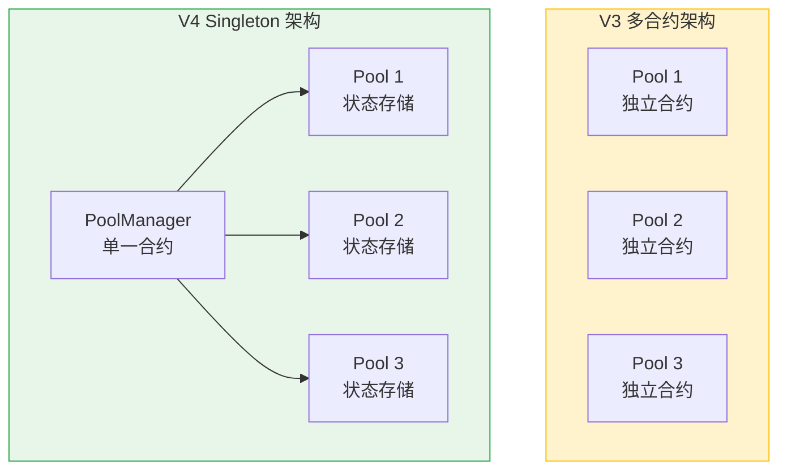
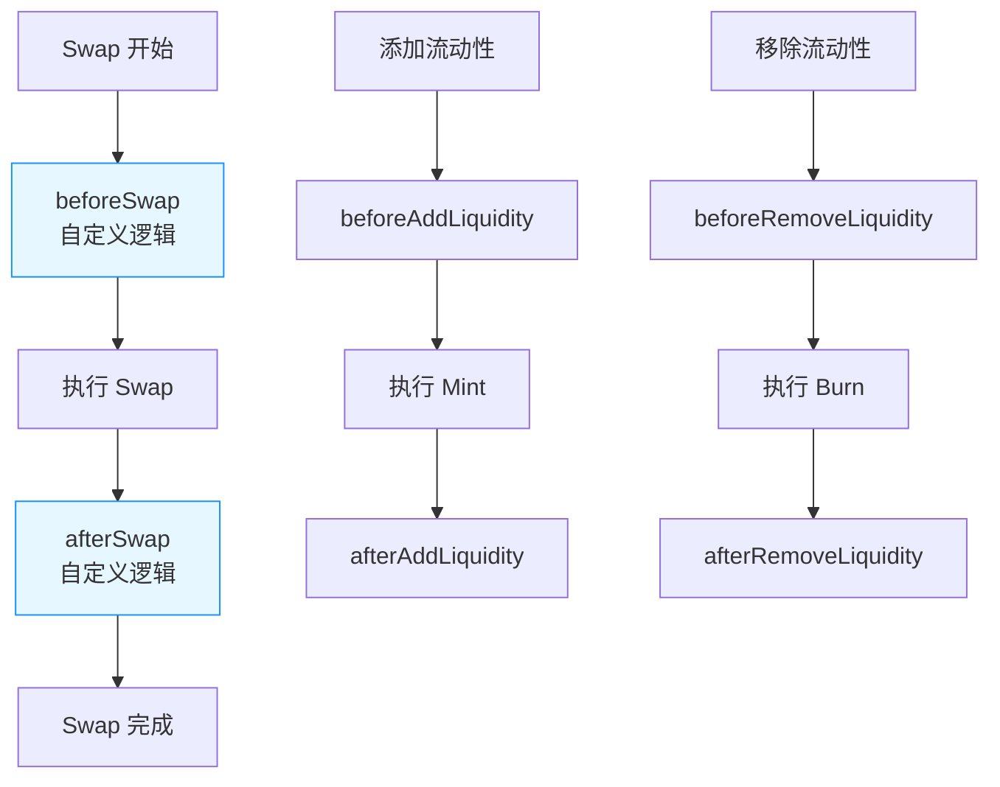

# Uniswap V4 核心概念

> **定位**: 未来趋势，理解 Hooks 架构和极致灵活性

---

## 🎯 一句话理解

**"像搭积木一样定制你的 AMM，想要什么功能就加什么 Hooks"**

---

## 🏗️ 核心创新：Singleton 架构

### V3 vs V4 架构对比



**关键差异**:
- **V3**: 每个交易对 = 独立合约（部署成本高）
- **V4**: 所有交易对 = 一个合约（PoolManager）
- **Gas 节省**: 创建新池子节省 ~99% Gas

---

## 🔌 Hooks 机制

### 什么是 Hooks？

**定义**: 在关键操作前后执行的自定义回调函数

**类比**: 就像 WordPress 的插件系统，核心功能不变，你可以添加任意功能

### Hooks 触发点



### Hooks 能做什么？

| 功能 | 实现方式 | 例子 |
|------|---------|------|
| **动态手续费** | `beforeSwap` | 根据波动率调整手续费 |
| **限价单** | `beforeSwap` | 价格达到 X 才执行 |
| **自动复投** | `afterSwap` | 手续费自动添加流动性 |
| **MEV 保护** | `beforeSwap` | 检查抢跑交易 |
| **Oracle 集成** | `afterSwap` | 更新外部预言机 |
| **权限控制** | `beforeAddLiquidity` | 白名单 LP |

---

## 💰 Flash Accounting（闪电记账）

### 原理

**V3 问题**: 每次操作立即结算代币转移，Gas 高

**V4 解决**: 延迟结算，批量处理

**流程**:
```
1. 用户操作（Swap/Mint/Burn）
2. PoolManager 记录 "delta"（差额）
3. 多个操作累积 delta
4. 最后一次性结算（settle）
```

**例子**:
```solidity
// V3: 立即转移
swap() → 立即 transfer token

// V4: 延迟结算
swap() → 记录 delta = +100 USDC
mint() → 记录 delta = -50 USDC
settle() → 净转移 +50 USDC（一次 transfer）
```

**Gas 节省**: 多步操作可节省 ~30-50% Gas

---

## 🔥 原生 ETH 支持

### V3 问题

- 必须使用 WETH（Wrapped ETH）
- 多一次 wrap/unwrap 操作
- 额外 Gas 成本

### V4 解决

- 直接支持原生 ETH
- 使用 `Currency` 类型统一处理
- 无需 WETH 包装

**代码示例**:
```solidity
// V3: 必须用 WETH
IERC20(WETH).approve(router, amount);
router.swap(WETH, USDC, amount, ...);

// V4: 直接用 ETH
Currency eth = Currency.wrap(address(0)); // 0x0 代表 ETH
poolManager.swap(key, params, ...);
```

**Gas 节省**: ~20,000 Gas/次（免去 wrap/unwrap）

---

## 🔌 Hooks 实战

### 创建自定义 Hooks

**步骤**:
1. 继承 `BaseHook` 合约
2. 实现需要的回调函数
3. 部署 Hooks 合约
4. 创建 Pool 时关联 Hooks

**示例: 动态手续费 Hooks**

```solidity
contract VolatilityFeeHook is BaseHook {
    function beforeSwap(
        address,
        PoolKey calldata key,
        IPoolManager.SwapParams calldata params,
        bytes calldata
    ) external override returns (bytes4, BeforeSwapDelta, uint24) {
        // 计算波动率
        uint256 volatility = getVolatility(key);
        
        // 根据波动率设置手续费
        uint24 fee;
        if (volatility > 100) {
            fee = 10000; // 1%
        } else if (volatility > 50) {
            fee = 3000;  // 0.3%
        } else {
            fee = 500;   // 0.05%
        }
        
        return (
            BaseHook.beforeSwap.selector,
            BeforeSwapDelta(0, 0),
            fee
        );
    }
}
```

### 使用 Hooks

```solidity
// 1. 部署 Hooks
VolatilityFeeHook hook = new VolatilityFeeHook(poolManager);

// 2. 创建带 Hooks 的 Pool
PoolKey memory key = PoolKey({
    currency0: Currency.wrap(USDC),
    currency1: Currency.wrap(ETH),
    fee: 3000,        // 基础手续费（可被 Hooks 覆盖）
    tickSpacing: 60,
    hooks: hook       // 关联 Hooks
});

poolManager.initialize(key, sqrtPriceX96);
```

---

## 🎯 内置 Hooks 类型

### 官方示例 Hooks

| Hooks 类型 | 功能 | 适用场景 |
|-----------|------|---------|
| **Limit Order** | 限价单 | 精确价格成交 |
| **TWAP Oracle** | 时间加权预言机 | 抗操纵价格 |
| **Geomean Oracle** | 几何平均预言机 | DeFi 价格喂价 |
| **Donation** | 捐赠机制 | 协议收入 |
| **WL Fee** | 白名单手续费 | 特权用户优惠 |
| **CZ Fee** | 条件手续费 | 动态费率 |
| **Arb Rebate** | 套利回扣 | 激励套利者 |
| **Custom Accounting** | 自定义记账 | 特殊结算逻辑 |

---

## 🔄 操作类型（Actions）

### V4 新特性

**Actions**: 可组合的原子操作

**例子: 闪电贷 + Swap**
```solidity
// 单个交易中完成多个操作
actions: [
    Action.SWAP,           // 1. 先 Swap
    Action.DONATE,         // 2. 再捐赠
    Action.SETTLE,         // 3. 结算
    Action.TAKE            // 4. 提取
]
```

**优势**:
- ✅ 原子性: 要么全成功，要么全失败
- ✅ 灵活组合: 像搭积木一样编排
- ✅ 降低 Gas: 批量操作优化

---

## 🛠️ 开发者必知

### 核心合约架构

| 合约 | 作用 |
|------|------|
| **PoolManager** | 核心合约，管理所有 Pool |
| **Pool** | 库合约，Pool 逻辑（非独立合约） |
| **PositionManager** | NFT 仓位管理（Periphery） |
| **V4Router** | 路由合约（Periphery） |
| **Hooks 合约** | 自定义回调（用户部署） |

### 关键类型

```solidity
// Pool 标识
struct PoolKey {
    Currency currency0;      // 代币 0
    Currency currency1;      // 代币 1
    uint24 fee;              // 手续费
    int24 tickSpacing;       // Tick 间距
    IHooks hooks;            // Hooks 合约
}

// Currency 类型（支持 ETH 和 ERC20）
type Currency is address;

// Delta 类型（闪电记账）
type BalanceDelta is int256;
```

### 实战模板

```solidity
// 1. 创建 Pool（带 Hooks）
function createPool(
    Currency currency0,
    Currency currency1,
    uint24 fee,
    int24 tickSpacing,
    IHooks hooks,
    uint160 sqrtPriceX96
) public {
    PoolKey memory key = PoolKey({
        currency0: currency0,
        currency1: currency1,
        fee: fee,
        tickSpacing: tickSpacing,
        hooks: hooks
    });
    
    poolManager.initialize(key, sqrtPriceX96);
}

// 2. Swap（使用 Actions）
function swap(
    PoolKey calldata key,
    bool zeroForOne,
    int256 amountSpecified,
    uint160 sqrtPriceLimitX96
) public {
    IPoolManager.SwapParams memory params = IPoolManager.SwapParams({
        zeroForOne: zeroForOne,
        amountSpecified: amountSpecified,
        sqrtPriceLimitX96: sqrtPriceLimitX96
    });
    
    poolManager.swap(key, params, msg.sender);
}

// 3. 添加流动性
function addLiquidity(
    PoolKey calldata key,
    int24 tickLower,
    int24 tickUpper,
    uint128 liquidity
) public {
    IPoolManager.ModifyLiquidityParams memory params = IPoolManager.ModifyLiquidityParams({
        tickLower: tickLower,
        tickUpper: tickUpper,
        liquidityDelta: int128(liquidity),
        salt: 0
    });
    
    poolManager.modifyLiquidity(key, params, msg.sender);
}
```

---

## 🎯 V4 优缺点总结

### ✅ 优点
- **极致灵活**: Hooks 实现任意定制
- **Gas 极低**: Singleton + Flash Accounting
- **原生 ETH**: 无需 WETH
- **可组合性**: Actions 原子操作
- **未来趋势**: 下一代 DEX 标准

### ❌ 缺点
- **复杂度极高**: Hooks 开发难度大
- **安全风险**: 自定义 Hooks 可能引入漏洞
- **工具不完善**: 生态还在早期
- **文档较少**: 学习资源有限

---

## 📖 推荐学习资源

1. **[Uniswap V4 官方文档](https://docs.uniswap.org/contracts/v4/overview)**
2. **[登链社区 V4 专栏](https://learnblockchain.cn/column/126)**
3. **[V4 Core 源码](https://github.com/Uniswap/v4-core)**
4. **[V4 Periphery 源码](https://github.com/Uniswap/v4-periphery)**
5. **[Uniswap V4 技术博客](https://blog.uniswap.org/)**

---

## 🚀 学习建议

### 如果你...

**✅ 已经掌握 V2 和 V3**
→ 可以直接学习 V4，重点理解 Hooks 机制

**✅ 想开发自定义 DEX**
→ V4 是你的不二之选，Hooks 让你实现任意功能

**✅ 只想使用 DEX**
→ 暂时不用深究 V4，V3 已经足够

**⏰ 等待生态成熟**
→ V4 刚发布，建议先观察，等工具完善后再深入学习

---

**恭喜！你已经了解 Uniswap V2/V3/V4 的核心概念！** 🎉

**下一步**: 
- 实战练习: 在测试网部署 V2 Pool
- 深入学习: 阅读 V3 源码
- 探索前沿: 研究 V4 Hooks 示例
