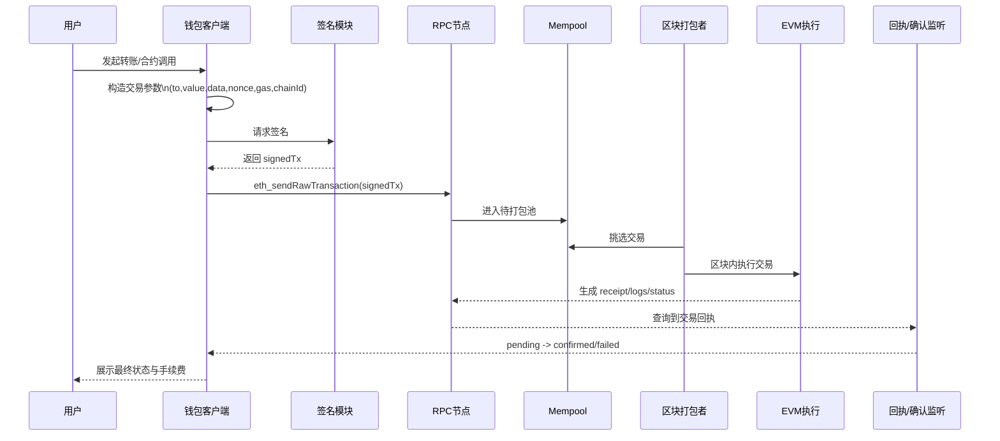

# 01 状态机与 EVM 执行模型

## 总览图

## 1. 先建立一个“系统级”心智模型
以太坊可以看成一台全球共享的状态机：

- 输入：交易（Transaction）
- 执行器：EVM（Ethereum Virtual Machine）
- 输出：新状态 + 收据（Receipt）+ 日志（Log）

你作为钱包工程师，最重要的是把“交易发送”理解成“触发一次确定性的状态迁移”。

## 2. 状态机里的“状态”到底是什么
全网在某个区块高度有一个一致状态快照，核心由账户树（状态 trie）表达。  
每个账户包含：

- `balance`
- `nonce`
- `codeHash`
- `storageRoot`

交易执行后，这些字段会发生变化，并最终体现在新的状态根（`stateRoot`）上。

## 3. 一笔交易在链上的生命周期
从钱包角度看，一笔交易通常经历：

1. 构造交易参数（`to`、`value`、`data`、`gasLimit`、`maxFeePerGas`、`maxPriorityFeePerGas`、`nonce`、`chainId`）
2. 本地签名（EOA 私钥）
3. 广播到节点 mempool
4. 打包进区块并执行
5. 拿到 `txHash`、`receipt.status`、`logs`
6. 等待确认数（Confirmations）

这 6 步中，2/3/5 是钱包工程最常见故障点。

## 4. EVM 执行与 Gas 的本质
EVM 是一个按 opcode 计费的执行环境：

- 每条指令消耗不同 gas
- 用户设置 `gasLimit` 控制“最多愿意消耗多少计算”
- `baseFee` 由区块动态调整，`tip` 给打包者

关键工程结论：

- `out of gas` 会导致状态回滚，但已消耗 gas 不退
- 合约 `revert` 也会回滚状态，但 gas 同样会被消耗
- 钱包前端必须把“失败也扣手续费”讲清楚

## 5. 执行结果怎么判断
不要只看 `eth_sendRawTransaction` 成功返回的 `txHash`。  
真正的业务成功标准是 `receipt.status == 1`，并结合事件日志做二次校验。

建议最小校验顺序：

1. `getTransactionReceipt(txHash)` 是否存在
2. `status` 是否为 `1`
3. 关键事件（如 `Transfer`）是否出现
4. 事件参数是否符合业务预期

## 6. 钱包工程实践建议
### 6.1 交易状态机（客户端）
建议前端或服务端维护统一状态：

- `created`
- `signed`
- `broadcasted`
- `pending`
- `confirmed`
- `failed`
- `dropped/replaced`

### 6.2 不同失败类型要区分
- 签名失败（用户拒绝、硬件钱包断连）
- 广播失败（RPC 异常、nonce too low）
- 链上执行失败（revert/out of gas）

区分后才能给用户正确可执行的下一步提示。

## 7. 常见误区
- 误区 1：有 `txHash` 就是成功  
  事实：只是“被网络接收”，不代表执行成功。
- 误区 2：`estimateGas` 一定准确  
  事实：链上状态变化后，估算可能失效。
- 误区 3：交易被打包就结束了  
  事实：还要考虑重组（reorg）和确认数策略。

## 8. 本章你要做到的能力
- 能完整描述“一笔交易如何让状态变化”
- 能解释 `status=0` 与 `status=1` 的业务差异
- 能在钱包代码中实现交易状态追踪与失败分类
