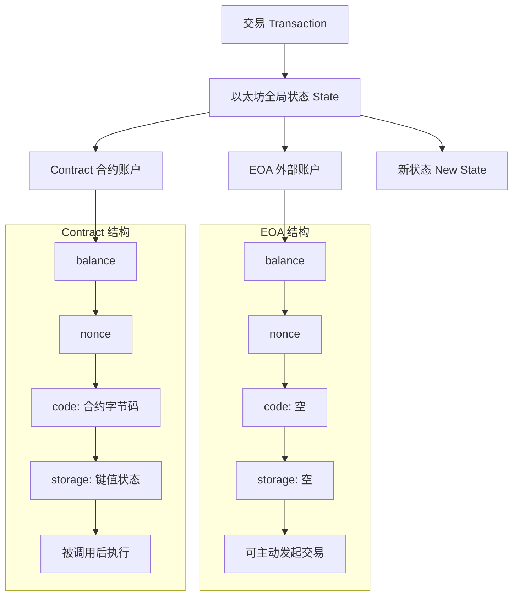

# 02 账户模型与账户结构

## 目录
- [总览图](#sec-overview)
- [1. Account Model 是什么](#sec-1)
- [2. 两类账户](#sec-2)
  - [EOA（Externally Owned Account）](#sec-2-eoa)
  - [Contract Account](#sec-2-contract)
- [3. 账户四元组](#sec-3)
- [4. Nonce：钱包最容易踩坑的字段](#sec-4)
  - [4.1 基本规则](#sec-4-1)
  - [4.2 `nonce too low` 场景与处理](#sec-4-2)
  - [4.3 相同 nonce 替换交易（Replace）经典场景](#sec-4-3)
  - [4.4 钱包服务端常见问题](#sec-4-4)
  - [4.5 工程建议](#sec-4-5)
- [5. Balance：不仅是 ETH 余额](#sec-5)
- [6. 合约账户的 code/storage 对钱包的意义](#sec-6)
  - [6.1 `code`：先判断“这地址能做什么”](#sec-6-1)
  - [6.2 `storage`：再判断“这个合约当前是什么状态”](#sec-6-2)
  - [6.3 钱包读链的推荐顺序](#sec-6-3)
  - [6.4 为什么这两者对钱包特别重要](#sec-6-4)
- [7. 钱包视角的最小接口清单](#sec-7)
  - [7.1 `eth_getBalance`](#sec-7-1)
  - [7.2 `eth_getTransactionCount`](#sec-7-2)
  - [7.3 `eth_estimateGas`](#sec-7-3)
  - [7.4 `eth_feeHistory` / `eth_maxPriorityFeePerGas`](#sec-7-4)
    - [7.4.1 `maxFeePerGas` 与 `maxPriorityFeePerGas` 详解（EIP-1559）](#sec-7-4-1)
  - [7.5 `eth_sendRawTransaction`](#sec-7-5)
  - [7.6 `eth_getTransactionReceipt`](#sec-7-6)
  - [7.7 `eth_call`](#sec-7-7)
- [8. 本章你要做到的能力](#sec-8)

## 总览图

## 1. Account Model 是什么
以太坊采用账户模型（Account Model），可以理解为“全局共享账本中的对象集合”。  
每个账户是一个对象，交易直接修改对象字段。

和 UTXO 不同，这个模型对钱包开发更直观：

- 查询余额简单（`eth_getBalance`）
- 查询 nonce 简单（`eth_getTransactionCount`）
- 但并发发交易时 nonce 管理更复杂

## 2. 两类账户

## EOA（Externally Owned Account）
- 由私钥控制
- 可以主动发起交易
- 没有代码和存储

## Contract Account
- 由合约代码控制
- 不能主动发交易
- 由外部调用触发执行

一句话区分：  
EOA 负责“签名与触发”，合约账户负责“逻辑与状态”。

## 3. 账户四元组
账户核心字段可以抽象为：

- `nonce`：该账户已发送交易数（EOA）或已创建合约数（历史语义）
- `balance`：余额（wei）
- `code`：合约字节码（EOA 为空）
- `storage`：合约状态键值存储（EOA 为空）

钱包工程里最常用的是 `nonce` 与 `balance`。

## 4. Nonce：钱包最容易踩坑的字段
`nonce` 是防重放和交易排序的关键。

### 4.1 基本规则
- 同一 EOA 的交易 nonce 必须严格递增
- 相同 nonce 的新交易会尝试替换旧交易（Replace）
- nonce 过低会被节点拒绝（常见报错：`nonce too low`）
- nonce 过高会卡在 pending 队列中等待前序 nonce

### 4.2 `nonce too low` 场景与处理
常见触发场景：

- 并发发送交易，多个请求拿到同一个 nonce
- 用 `latest` 查询 nonce，而不是 `pending`
- 同 nonce 交易已被打包或已在节点 pending 池中

常见错误表现：

- `nonce too low`
- 替换交易时也可能看到 `replacement transaction underpriced`

处理建议（钱包侧）：

1. 先查 `eth_getTransactionCount(address, "pending")` 获取当前可用 nonce
2. 若是“加速/取消”旧交易，nonce 保持不变并提高费用参数
3. 若是“新交易”，使用新的 pending nonce 重新签名再广播

### 4.3 相同 nonce 替换交易（Replace）经典场景
什么时候会出现：

- 旧交易还在 `pending`，尚未被区块确认
- 你又发了一笔同地址、同 nonce 的新交易
- 新交易手续费更高，节点会尝试用新交易替换旧交易

核心结论：

- 同 nonce 替换只发生在“待确认阶段”
- 一旦旧交易已被打包确认，就不能再替换

最常见的两种业务动作：

1. 加速（Speed Up）：交易内容不变，只提高费用参数，让它更快被打包
2. 取消（Cancel）：同 nonce 发一笔给自己的小额交易（或 0 转账），用更高费用抢先确认

常见失败报错：

- `replacement transaction underpriced`（加价不够）
- `nonce too low`（旧交易已先被确认或 nonce 已推进）

工程实现建议：

1. 替换前先查 `pending` nonce，并检查旧交易是否已确认
2. 替换交易必须复用相同 nonce
3. 同时提高 `maxPriorityFeePerGas` 和 `maxFeePerGas`（常用策略：至少上调约 10%）
4. 广播后维护“旧 txHash -> 新 txHash”映射，避免前端状态错乱

### 4.4 钱包服务端常见问题
- 多实例并发发交易，拿到相同 nonce，导致冲突
- 从 `latest` 取 nonce 而不是 `pending`，造成重复
- 交易长时间 pending 后，没有替换提速策略

### 4.5 工程建议
- 统一 nonce 管理器（内存锁 + 持久化）
- 默认从 `pending` 视图取 nonce
- 实现“加速（speed up）”与“取消（cancel）”能力

## 5. Balance：不仅是 ETH 余额
钱包通常要同时处理：

- 原生币余额（ETH）
- Token 余额（ERC-20 `balanceOf`）
- 可用余额与预留手续费之间的关系

发送 Token 时，gas 仍由 ETH 支付。  
这是新用户失败率很高的点，前端要提前拦截提示。

## 6. 合约账户的 code/storage 对钱包的意义
即便你做钱包，也必须理解合约账户：

- `code` 决定接口能力（ERC-20、ERC-721、自定义）
- `storage` 决定链上状态（额度、授权、订单等）

钱包读链本质上是“读取合约状态 + 解释 ABI + 渲染为业务语义”。

### 6.1 `code`：先判断“这地址能做什么”
钱包拿到一个地址时，建议第一步就做 `eth_getCode(address)`：

- 返回 `0x`：通常是 EOA（外部账户）
- 返回非空字节码：是合约账户

这一步决定后续解析路径：

- EOA：按转账地址处理
- 合约：按 ABI/方法签名做能力识别（ERC-20、ERC-721、ERC-1155、自定义）

工程常见坑：

- 代理合约（Proxy）地址上的 `code` 不等于业务逻辑实现代码
- 仅靠合约名或 UI 标签判断协议类型容易误判，建议以接口探测结果为准

### 6.2 `storage`：再判断“这个合约当前是什么状态”
`storage` 是合约状态事实来源。  
钱包常见业务数据都来自 storage，例如：

- Token 余额（`balanceOf`）
- 授权额度（`allowance`）
- NFT 所有权（`ownerOf`）
- 订单/仓位等协议状态

生产中通常优先通过 `eth_call` 读标准方法；  
排障时再用 `eth_getStorageAt` 直读 slot 做底层验证。

工程常见坑：

- 不同区块高度读到的状态不同，查询时要明确 block tag（`latest` / `pending`）
- 多 RPC 节点有短暂高度差，聚合结果时要带区块号做一致性校验

### 6.3 钱包读链的推荐顺序
1. `eth_getCode` 判断地址类型
2. 识别协议能力（ABI/方法签名/接口探测）
3. 用 `eth_call` 拉取核心业务状态
4. 解码并转换成业务字段（金额、权限、资产展示）
5. 展示时附带数据来源区块号，减少“前端状态跳变”争议

### 6.4 为什么这两者对钱包特别重要
- `code` 决定“你能不能正确解释用户将要做的操作”
- `storage` 决定“你展示给用户的是不是当前真实状态”

如果这两层做错，最常见后果就是：资产展示错误、授权风险漏报、签名前风险提示失真。

## 7. 钱包视角的最小接口清单
至少要稳定封装这些 RPC 能力：

- `eth_getBalance`
- `eth_getTransactionCount`
- `eth_estimateGas`
- `eth_feeHistory` / `eth_maxPriorityFeePerGas`
- `eth_sendRawTransaction`
- `eth_getTransactionReceipt`
- `eth_call`

### 7.1 `eth_getBalance`
用途：查询地址原生币余额（ETH）。  
典型业务场景：

- 资产首页展示主币余额
- 转账前余额校验（是否够转账金额）
- Token 转账前手续费余额校验（是否有足够 ETH 支付 gas）

### 7.2 `eth_getTransactionCount`
用途：查询地址当前 nonce（建议用 `pending` 视图）。  
典型业务场景：

- 构造新交易时分配 nonce
- 并发发交易时检测 nonce 是否冲突
- 交易失败重发、加速或取消前做 nonce 对齐

### 7.3 `eth_estimateGas`
用途：估算某笔交易大概会消耗多少 gas。  
典型业务场景：

- 交易确认页展示预估手续费
- 发送前设置 `gasLimit`（常见做法是估算值再加一点 buffer）
- 发送前预检查明显会失败的调用（如参数错误、权限不足）

### 7.4 `eth_feeHistory` / `eth_maxPriorityFeePerGas`
用途：获取链上近期费率情况，辅助生成 EIP-1559 费用参数。  
典型业务场景：

- 自动推荐慢/中/快三档费率
- 网络拥堵时动态调高费率
- 加速（speed up）时重新计算 `maxFeePerGas` 和 `maxPriorityFeePerGas`

#### 7.4.1 `maxFeePerGas` 与 `maxPriorityFeePerGas` 详解（EIP-1559）
先记住 3 个角色：

- `baseFee`：链上基础费，由协议根据拥堵自动调整（会被销毁）
- `maxPriorityFeePerGas`：你愿意给打包者的小费上限
- `maxFeePerGas`：你愿意支付的总 gas 单价上限

核心计算公式：

`effectivePriorityFeePerGas = min(maxPriorityFeePerGas, maxFeePerGas - baseFee)`  
`effectiveGasPrice = baseFee + effectivePriorityFeePerGas`  
`实际手续费 = gasUsed * effectiveGasPrice`

重点理解：

- `maxFeePerGas` 是“预算天花板”，不是实际一定会支付的价格
- 你最终支付通常低于 `maxFeePerGas`
- 若 `maxFeePerGas < baseFee`，交易通常无法被打包（会 pending）

数字例子 1（不拥堵）：

- `gasUsed = 21,000`
- `baseFee = 20 gwei`
- `maxPriorityFeePerGas = 2 gwei`
- `maxFeePerGas = 60 gwei`

则：

- `effectivePriority = min(2, 60-20) = 2`
- `effectiveGasPrice = 20 + 2 = 22 gwei`
- 实际按 `22 gwei` 计费，而不是按 `60 gwei`

数字例子 2（baseFee 上涨）：

- 当 `baseFee = 58 gwei` 时，仍可打包，实际约 `60 gwei`
- 当 `baseFee = 61 gwei` 时，`maxFeePerGas(60) < baseFee(61)`，交易大概率不进块

钱包工程建议：

1. 推荐费率时，`maxFeePerGas` 要给 `baseFee` 波动留余量
2. 加速交易时，同 nonce 替换并同时提高 `maxFeePerGas` 与 `maxPriorityFeePerGas`
3. 前端文案要明确：`maxFeePerGas` 是上限，不代表一定扣这么多

### 7.5 `eth_sendRawTransaction`
用途：广播本地签名后的原始交易。  
典型业务场景：

- 用户确认签名后真正发交易上链
- 服务端托管钱包签名后统一广播
- 广播失败时识别 `nonce too low`、`replacement transaction underpriced` 等错误并重试

### 7.6 `eth_getTransactionReceipt`
用途：查询交易执行结果、gas 消耗、事件日志。  
典型业务场景：

- 轮询交易状态（pending -> confirmed/failed）
- 判断执行是否成功（`status == 1`）
- 解析日志确认业务事件（如 ERC-20 `Transfer` 是否发生）

### 7.7 `eth_call`
用途：只读调用合约方法，不上链、不消耗用户 gas。  
典型业务场景：

- 查询 Token 余额（`balanceOf`）
- 查询授权额度（`allowance`）
- 读取 NFT 持仓、订单状态、协议配置等业务数据
- 提交交易前做只读模拟，提前发现明显失败原因

如果你做多链钱包，再加一层链能力抽象（EVM 兼容链参数差异）。

## 8. 本章你要做到的能力
- 解释为什么以太坊用账户模型更适合智能合约
- 设计一个可靠 nonce 分配与冲突恢复机制
- 明确区分 ETH 余额不足与 gas 余额不足两类失败
