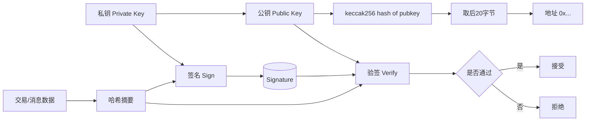
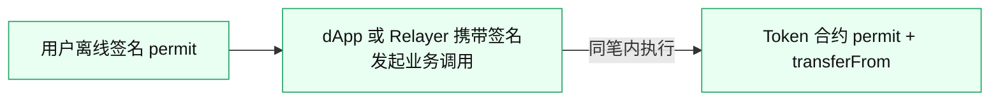
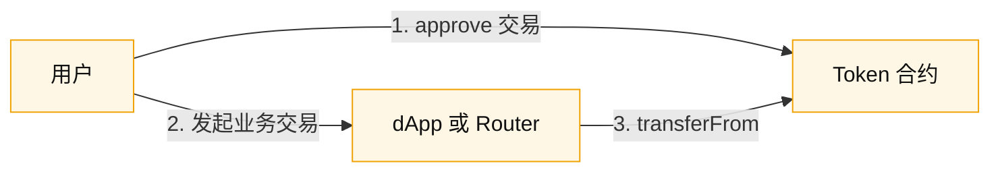

# 03 密钥、地址与签名

## 目录
- [总览图](#sec-1)
- [1. 私钥、公钥、地址的关系](#sec-2)
- [2. 钱包开发中的密钥管理层级](#sec-3)
- [3. 地址校验与显示](#sec-4)
- [4. 签名类型（钱包必须掌握）](#sec-5)
- [4.1 交易签名](#sec-6)
- [4.2 消息签名](#sec-7)
- [4.3 Permit 授权签名（EIP-2612）](#sec-permit)
- [5. 交易签名的关键字段](#sec-8)
- [6. 钱包安全设计要点](#sec-9)
- [6.1 私钥不出安全边界](#sec-10)
- [6.2 签名前人机确认](#sec-11)
- [6.3 防钓鱼策略](#sec-12)
- [7. 常见事故复盘视角](#sec-13)
- [8. 本章你要做到的能力](#sec-14)

## 总览图

## 1. 私钥、公钥、地址的关系
以太坊地址推导链路：

`私钥 -> 公钥 -> keccak256(公钥) -> 取后 20 字节`

补充两个关键点：

- 地址是公钥的哈希截断，不等于公钥本身
- 地址可以公开，私钥必须绝对保密

## 2. 钱包开发中的密钥管理层级
常见分层：

- 助记词（BIP-39）
- 种子（Seed）
- 分层派生路径（BIP-32/44）
- 具体账户私钥（如 `m/44'/60'/0'/0/0`）

工程实践中，建议把“派生”和“签名”能力隔离成独立模块，避免业务代码直接接触私钥材料。

## 3. 地址校验与显示
EVM 地址长度固定 20 字节，通常展示为 `0x` + 40 hex。  
前端应优先展示 EIP-55 checksum 格式，减少人工录入错误。

最小校验：

- 格式合法（hex、长度）
- checksum 校验（若 mixed-case）
- 黑名单或风险地址校验（可选）

## 4. 签名类型（钱包必须掌握）

## 4.1 交易签名
用于真正上链交易，结果可广播到网络。

## 4.2 消息签名
- `personal_sign`：对消息加前缀后签名
- `eth_signTypedData_v4`：EIP-712 结构化签名

EIP-712 是钱包安全交互核心，因为“可读性强”，用户更容易识别钓鱼内容。

## 4.3 Permit 授权签名（EIP-2612）
`permit` 是一种“先签名、后上链”的授权方式，用离线签名替代单独的 `approve` 交易。

### 4.3.1 `approve` 与 `permit` 差异对照
| 维度 | `approve` | `permit`（EIP-2612） |
| --- | --- | --- |
| 用户动作 | 用户直接发链上授权交易 | 用户先离线签名授权消息 |
| 授权上链方式 | `approve(spender, amount)` | `permit(owner, spender, value, deadline, v, r, s)` |
| 交易数量 | 常见为 2 笔（授权 + 业务交易） | 常见可合并为 1 笔（业务调用里携带 permit） |
| Gas 支付者 | 通常是用户自己 | 通常是提交交易的一方（dApp 或 Relayer） |
| 代币支持范围 | ERC-20 普遍支持 | 仅支持实现 EIP-2612 的代币 |
| 防重放机制 | 主要依赖链上状态推进 | `nonce` + `deadline` + EIP-712 域分隔（含 `chainId`） |

### 4.3.2 实战怎么选
- 代币支持 `permit`：优先用 `permit`，流程更短、首笔交互体验更好。
- 代币不支持 `permit`：使用传统 `approve` + 业务交易流程。
- 多代币统一体验：可以评估 `Permit2`，但它是独立方案，不等同 EIP-2612。

### 4.3.3 安全要点
- `permit` 不是“更安全”，只是“更省步骤”，本质仍是授权。
- 对 `spender`、`amount`、`deadline` 做强提示，避免用户盲签。
- 默认建议小额度、短时效授权，避免长期无限授权风险。

风险提示：`permit` 本质仍是授权，若签了恶意或无限额度授权，也可能导致资产被转走。

## 5. 交易签名的关键字段
签名前必须明确：

- `chainId`：防跨链重放
- `nonce`
- `gasLimit`
- `maxFeePerGas`
- `maxPriorityFeePerGas`
- `to` / `value` / `data`

其中 `chainId` 漏传或错误，是多链钱包高危问题。

## 6. 钱包安全设计要点

## 6.1 私钥不出安全边界
- 移动端：系统安全区（如 Keychain/Keystore）
- 服务端：HSM/KMS 或 MPC
- 浏览器插件：本地加密存储 + 强密码策略

## 6.2 签名前人机确认
- 展示 `to`、金额、预估手续费、链 ID、合约方法名
- 对 `approve`、`setApprovalForAll`、`permit` 做高风险提示

## 6.3 防钓鱼策略
- 域名白名单与签名上下文提示
- 对未知合约和盲签增加确认层级
- 结合模拟执行（transaction simulation）做风险预警

## 7. 常见事故复盘视角
- 用户签了 `permit` 导致代币被转走
- 错链签名导致资产误操作
- 前端展示“看不懂的十六进制 data”，用户盲签

钱包价值不只是“能签名”，而是“让用户理解自己签了什么”。

## 8. 本章你要做到的能力
- 讲清地址推导与签名验证基本流程
- 在代码层实现签名参数完整性校验
- 建立高风险签名的交互与风控策略
