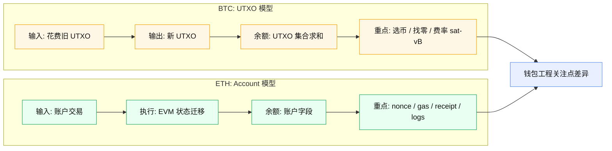

# 04 ETH 与 BTC 模型差异与钱包实现

## 目录
- [总览图](#sec-1)
- [1. 先看结论](#sec-2)
- [2. 数据模型差异](#sec-3)
  - [2.1 BTC（UTXO）](#sec-3-1)
  - [2.2 ETH（Account）](#sec-3-2)
- [3. 交易构造差异](#sec-6)
  - [3.1 BTC 钱包重点](#sec-6-1)
  - [3.2 ETH 钱包重点](#sec-6-2)
- [4. 费用机制差异](#sec-9)
  - [4.1 BTC](#sec-9-1)
  - [4.2 ETH](#sec-9-2)
- [5. 状态追踪差异](#sec-12)
  - [5.1 BTC](#sec-12-1)
  - [5.2 ETH](#sec-12-2)
- [6. 智能合约能力带来的钱包复杂度](#sec-15)
- [7. 对钱包工程师的能力要求对比](#sec-16)
- [8. 系统化学习建议（4 周）](#sec-17)
  - [8.1 第 1 周：基础交易闭环](#sec-17-1)
  - [8.2 第 2 周：签名与安全](#sec-17-2)
  - [8.3 第 3 周：工程化](#sec-17-3)
  - [8.4 第 4 周：进阶能力](#sec-17-4)
- [9. 本章你要做到的能力](#sec-22)

## 总览图

## 1. 先看结论
- BTC：UTXO 模型，交易是“花费旧输出，创建新输出”
- ETH：Account 模型，交易是“修改全局账户状态”

这决定了钱包在“余额计算、交易构造、费用策略、状态追踪”上的实现方式完全不同。

## 2. 数据模型差异

### 2.1 BTC（UTXO）
- 余额来自多个未花费输出聚合
- 发送时要做选币（coin selection）
- 常见有找零地址管理问题

### 2.2 ETH（Account）
- 余额是账户字段，直接读取
- 无需选币，但需要严格管理 nonce
- 合约调用可携带任意数据并改变复杂状态

## 3. 交易构造差异

### 3.1 BTC 钱包重点
- 选择 UTXO 集合
- 估算字节大小与费率（sat/vB）
- 构造找零输出

### 3.2 ETH 钱包重点
- 生成 `to/value/data`
- 估算 `gasLimit`
- 计算 EIP-1559 费用参数
- 管理 nonce 与替换交易

## 4. 费用机制差异

### 4.1 BTC
- 费用由交易体积决定，通常 `fee = vsize * feerate`

### 4.2 ETH
- 费用由执行复杂度决定，`fee = gasUsed * gasPrice`
- 在 EIP-1559 下，近似为 `gasUsed * (baseFee + priorityFee)`

对钱包工程来说，ETH 的“可预测性”通常比 BTC 更依赖执行估算和模拟。

## 5. 状态追踪差异

### 5.1 BTC
- 更关注 UTXO 是否确认、是否双花

### 5.2 ETH
- 更关注交易执行是否成功（`receipt.status`）
- 还要关注事件日志是否符合业务预期

因此 ETH 钱包后端通常会实现“交易 + 事件”双轨索引。

## 6. 智能合约能力带来的钱包复杂度
ETH 钱包必须处理：

- Token 标准差异（ERC-20/721/1155）
- 授权风险（`approve` 无限额度）
- 合约升级与代理模式
- 多调用组合（multicall/batch）

这部分复杂度在 BTC 原生钱包中相对较少。

## 7. 对钱包工程师的能力要求对比
如果你做 ETH 钱包，除了账户与交易，还需要：

- ABI 解码能力
- 合约安全常识
- 签名标准（EIP-712 等）
- 多链 RPC 异常与兼容性治理

## 8. 系统化学习建议（4 周）

### 8.1 第 1 周：基础交易闭环
- ETH 转账
- ERC-20 转账
- 交易状态跟踪

### 8.2 第 2 周：签名与安全
- `personal_sign` 与 EIP-712
- 授权风险提示
- 钓鱼场景演练

### 8.3 第 3 周：工程化
- nonce 管理器
- 费用策略与加速取消
- RPC 容灾和重试

### 8.4 第 4 周：进阶能力
- 交易模拟
- 事件索引
- 风控规则引擎（地址、方法、额度）

## 9. 本章你要做到的能力
- 清楚解释 BTC 与 ETH 钱包为何设计不同
- 识别 Account 模型下的工程核心难点（nonce、gas、执行结果）
- 制定一条面向生产的钱包能力建设路线
