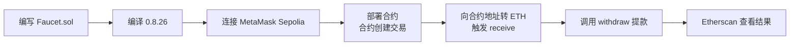

# 第02章 以太坊基础（Web3开发者精简版）

> 状态：已完成（优化版）
> 目标：掌握ETH单位换算、钱包安全、交易发送、合约部署与调用的完整流程

## 一句话版

第 2 章是**新手实操入门章**：用 MetaMask 收发 ETH → 用 Remix 部署合约 → 调用合约提款，走通完整链路。

## 核心概念速览

### ETH 单位换算

| 单位 | 换算关系 | 用途 |
|------|----------|------|
| **wei** | 1 wei（最小单位） | 链上内部记账 |
| **gwei** | 1 gwei = 10^9 wei | Gas 价格展示 |
| **ether（ETH）** | 1 ETH = 10^18 wei | 用户界面显示 |

**关键认知**：
- 交易里看到的大整数（如 1000000000000000000）就是 wei
- 钱包显示的 ETH 是对 wei 的可读化转换
- 所有链上计算都以 wei 为单位

---

## 钱包的本质

**钱包不是"装币的地方"，而是"私钥管理器 + 交易签名器"**

### 核心关系

| 概念 | 说明 | 安全级别 |
|------|------|----------|
| **私钥** | 控制资产的唯一凭证 | ⭐⭐⭐⭐⭐ 绝不可泄露 |
| **助记词** | 私钥的人类可读备份（12/24词） | ⭐⭐⭐⭐⭐ 离线物理备份 |
| **密码** | 仅保护本机访问，不是资产安全 | ⭐⭐ 可重置 |

### 安全底线（务必执行）

1. ✅ **助记词纸质/金属备份至少两份，异地存放**
2. ✅ **绝不放网盘、聊天软件、截图、备忘录**
3. ✅ **大额转账前先小额测试**
4. ✅ **新地址先做收发闭环测试，再放大金额**

---

## MetaMask 核心知识

### 网络切换

| 网络 | 用途 | 获取 ETH 方式 |
|------|------|--------------|
| **主网（Mainnet）** | 真实资产操作 | 交易所购买/OTC |
| **Sepolia** | 当前主流测试网 | Faucet 免费领取 |
| **Holesky** | 质押/共识层测试 | Faucet 免费领取 |
| **Local Node** | 本地开发调试 | 自动分配（Anvil/Hardhat） |

**重要认知**：
- 同一私钥在不同网络地址相同（`0x...` 一样）
- 但各网络余额彼此独立，不互通

---

## 为什么测试网也要 Gas

**误解**：测试网免费 = 不需要 Gas

**真相**：
- 测试网 ETH 可免费领取，但**交易规则和主网一致**
- 收费是为了模拟真实环境，防止垃圾交易和 DoS 攻击

**常见问题**：
```
账户余额：0.05 ETH
尝试发送：0.05 ETH
结果：失败 ❌

原因：还要额外支付 Gas 费用
正确做法：发送金额 + 预估 Gas <= 账户余额
         例如：发送 0.049 ETH，留 0.001 ETH 作 Gas
```

---

## 区块浏览器正确使用

### Etherscan 能查什么

| 查询内容 | 用途 |
|----------|------|
| **交易状态** | 是否上链、成功/失败 |
| **地址历史** | 所有出入账记录 |
| **合约调用** | 函数调用参数和返回值 |
| **内部交易** | 合约执行过程中的子调用 |

### ⚠️ 注意事项

1. **区块浏览器是"查看器"，不是绝对真理源头**
2. **地址中毒攻击**：复制地址必须逐字符核对首尾
   - 攻击者发送 0 ETH 交易，让你的剪贴板被恶意地址覆盖
   - 下次粘贴时可能转错地址

---

## EOA vs 合约账户

| 类型 | 有无私钥 | 能否主动发起交易 | 示例 |
|------|----------|-----------------|------|
| **EOA（外部账户）** | ✅ 有 | ✅ 能 | 你的 MetaMask 账户 |
| **合约账户** | ❌ 无 | ❌ 不能，只能被调用响应 | DeFi 协议、NFT 合约 |

**关键结论**：
1. 只有 EOA 能"主动发起"交易
2. 合约不能自己凭空发起交易，只能在被调用时执行
3. 给合约发交易时，`data` 字段指定要调用哪个函数

---

## Faucet 合约示例分析

### 合约功能

```solidity
// 简化的 Faucet 合约
contract Faucet {
    // 任何人可提款
    function withdraw(uint amount) public {
        require(amount <= 1000000000000 wei, "单次提款上限 0.000001 ETH");
        payable(msg.sender).transfer(amount);
    }
    
    // 接收 ETH
    receive() external payable {}
}
```

### ⚠️ 这个示例故意"不完美"（教学用）

| 问题 | 说明 | 生产环境应如何 |
|------|------|---------------|
| **无错误信息** | `require` 最好带报错信息 | `require(cond, "error msg")` |
| **transfer 限制** | 有 2300 gas 限制，复杂场景失败 | 使用 `call{value: amount}("")` |
| **无权限控制** | 任何人都能提款 | 添加白名单/频率限制 |

---

## Remix 实操流程

### 完整部署调用链



### 每一步的本质

| 步骤 | 链上动作 | 说明 |
|------|----------|------|
| **部署合约** | 合约创建交易（`to = 0x0`） | 消耗 Gas，获得合约地址 |
| **给合约转 ETH** | 普通转账交易 | 触发合约 `receive()` 函数 |
| **调用 withdraw** | 合约调用交易 | 执行合约逻辑，内部转账 |

---

## Internal Transaction（内部交易）

### 什么是内部交易

```
你发给合约的：外部交易（External Transaction）
  ↓
合约执行过程中调用：internal transfer
  ↓
Etherscan 显示：内部交易（Internal Transaction）
```

### 示例场景

```
外部交易：
- From: 你的地址
- To: Faucet 合约地址
- Value: 0 ETH（只是调用函数）
- Data: withdraw 函数签名 + 参数

内部交易（由合约执行触发）：
- From: Faucet 合约地址
- To: 你的地址
- Value: 0.000001 ETH
```

**为什么重要**：
- 帮助理解合约执行的完整资金流向
- 调试合约时查看内部调用链
- 审计时追踪资产移动路径

---

## 你要记住的 5 件事

1. ✅ **链上金额内部一律按 wei 处理**，不要直接用 ETH 计算
2. ✅ **钱包安全本质是私钥/助记词安全**，密码只保护本机
3. ✅ **交易成本 = gasUsed × gasPrice**（EIP-1559 后是 baseFee + priorityFee）
4. ✅ **合约部署后是独立账户**，有自己地址和余额，能收发 ETH
5. ✅ **看懂"外部交易 + 内部交易"**，你就真正入门了合约交互

---

## 自测题

**题目**：你账户余额是 `0.05 ETH`，为什么"发送 0.05 ETH"可能失败？

**答案要点**：
1. 因为还要额外支付 Gas，余额不能全部作为转账值发送
2. 正确做法：`发送金额 + 预估 Gas 费用 <= 账户余额`
3. 测试网也一样遵守这个规则（只是 ETH 免费领）
4. 钱包通常会自动预留 Gas，手动计算时需注意

---

## 进阶实践

### 场景：如何安全地给新合约地址转账

**检查清单**：
1. ✅ 确认合约已正确部署（Etherscan 显示 "Contract Creation"）
2. ✅ 查看合约是否有 `receive()` 或 `fallback()` 函数
3. ✅ 小额测试（先转 0.001 ETH 验证）
4. ✅ 确认交易成功后再转大额
5. ✅ 使用 Etherscan 的 "Verify Contract" 确认代码可信

### 常用命令（Hardhat/Foundry）

```bash
# Hardhat 本地节点
npx hardhat node

# Foundry 本地节点
anvil

# 部署合约（Hardhat）
npx hardhat run scripts/deploy.js --network sepolia

# 部署合约（Foundry）
forge create Faucet --private-key $PRIVATE_KEY --rpc-url $RPC_URL
```

---

## 本章核心

第 2 章的本质不是"点点按钮"，而是让你亲手走通一次完整链路：

> **钱包管理密钥 → 发交易 → 部署合约 → 调用合约 → 在区块浏览器验证结果**

**开发者视角**：理解每个操作的链上本质（交易类型、Gas 消耗、状态变化），这是后续开发的基础。
