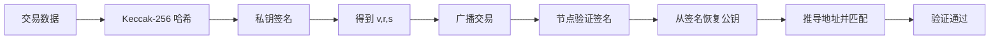

# 第04章 密码学（Web3开发者精简版）

> 状态：已完成（优化版）
> 目标：掌握私钥-公钥-地址关系、哈希应用、签名机制、BLS 聚合签名、KZG 承诺的工程意义

## 一句话版

以太坊密码学的核心不是"把数据藏起来"，而是"**公开可验证地证明你有权做这件事**"。

## 核心概念速览

### 密码学在以太坊中的定位

| 传统密码学 | 以太坊密码学 |
|-----------|-------------|
| 加密内容，防止他人看到 | 身份认证 + 完整性校验 + 不可抵赖 |
| 私密性优先 | 公开可验证性优先 |
| 加密算法（AES、RSA） | 哈希（Keccak）、签名（ECDSA、BLS） |

**关键认知**：
- 以太坊默认是公开系统，交易和状态都能被看到
- 私钥不上传链，链上只看到地址和签名
- 密码学保证的是"谁发起的"和"有没有被篡改"

---

## 私钥、公钥、地址：完整推导链

### 三者关系图

```
私钥（256 位随机数）
  ↓ 椭圆曲线乘法（secp256k1）
公钥（512 位，64 字节）
  ↓ Keccak-256 哈希
地址哈希（256 位，32 字节）
  ↓ 取后 20 字节
地址（160 位，20 字节，0x 开头）
```

### 详细推导过程

| 步骤 | 输入 | 输出 | 计算难度 |
|------|------|------|----------|
| **1. 生成私钥** | 随机数生成器 | 256 位大整数 | 容易（随机生成） |
| **2. 推导公钥** | 私钥 | 512 位（64 字节） | 容易（椭圆曲线点乘） |
| **3. 哈希公钥** | 公钥 | 256 位（32 字节） | 容易（Keccak-256） |
| **4. 截取地址** | 哈希值 | 后 20 字节（40 字符） | 容易（字符串截取） |

**不可逆性**：
- ✅ 私钥 → 公钥：容易
- ✅ 公钥 → 地址：容易
- ❌ 地址 → 公钥：**不可能**（哈希单向）
- ❌ 公钥 → 私钥：**不可能**（椭圆曲线离散对数问题）

### 代码示例

```javascript
// ethers.js 示例
const { Wallet } = require('ethers');

// 生成随机钱包
const wallet = Wallet.createRandom();

console.log('私钥:', wallet.privateKey);      // 0x...
console.log('公钥:', wallet.publicKey);        // 0x04...（130 字符）
console.log('地址:', wallet.address);          // 0x...（42 字符）

// 从私钥恢复钱包
const walletFromKey = new Wallet('0x...privatekey...');
console.log('恢复的地址:', walletFromKey.address); // 地址相同
```

---

## 哈希函数：以太坊的"数据指纹机"

### 哈希的核心特性

| 特性 | 说明 | 应用 |
|------|------|------|
| **确定性** | 同样输入永远同样输出 | 数据完整性校验 |
| **快速计算** | 正向计算很快 | 实时验证 |
| **单向性** | 不能从输出反推输入 | 地址生成、密码存储 |
| **抗碰撞** | 很难找到两个不同输入产生相同输出 | 唯一标识、签名安全 |
| **雪崩效应** | 输入微小变化导致输出巨大变化 | 数据篡改检测 |

### Keccak-256 vs SHA3-256：⚠️ 常见坑

| 特性 | Keccak-256 | SHA3-256（FIPS 标准） |
|------|-----------|---------------------|
| **来源** | Keccak 原始提案 | NIST 标准化后版本 |
| **填充规则** | 不同 | 不同 |
| **以太坊使用** | ✅ 是 | ❌ 否 |
| **结果相同吗** | ❌ 不同！ | ❌ 不同！ |

**重要认知**：
- 以太坊使用的是 **Keccak-256**（原始版本）
- 不是 FIPS 标准的 **SHA3-256**
- 两者参数不同，计算结果不同！

```javascript
// ethers.js 中
const { keccak256, toUtf8Bytes } = require('ethers');

const hash = keccak256(toUtf8Bytes('Hello'));
// 这是 Keccak-256，不是 SHA3-256

// Solidity 中
bytes32 hash = keccak256(abi.encodePacked('Hello'));
// 同样是 Keccak-256
```

---

## ERC-55：地址校验和

### 问题背景

原始 16 进制地址（`0x742d35Cc6634C0532925a3b844Bc9e7595f2bD38`）没有天然校验位，容易手输错。

### ERC-55 方案

使用**大小写混合编码**嵌入校验信息：

```
校验和地址：0x742d35Cc6634C0532925a3b844Bc9e7595f2bD38
               ^  ^     ^        ^         ^   ^
          大小写混合编码校验位
```

**工作原理**：
1. 将地址转为小写
2. 对小写地址做 Keccak-256 哈希
3. 根据哈希结果的每一位，决定地址对应位置是否大写
4. 钱包通过校验大小写模式检测大多数输入错误

**局限性**：
- ✅ 能检测大多数手误（约 99.988%）
- ❌ 不是防黑客万能方案
- ❌ 不能防止故意伪造的相似地址

---

## ECDSA 签名：所有权证明

### 签名流程



### 签名数据结构

| 字段 | 说明 | 大小 |
|------|------|------|
| **r** | 签名第一部分 | 32 字节 |
| **s** | 签名第二部分 | 32 字节 |
| **v** | 恢复标识符 | 1 字节（27 或 28） |

### 离线签名的重要性

**冷热分离架构**：

```
在线机器（热）
  ↓ 组装未签名交易
离线设备（冷）
  ↓ 私钥签名
在线机器（热）
  ↓ 广播已签名交易
网络
```

**优势**：
- ✅ 私钥永不接触互联网
- ✅ 大幅降低被盗风险
- ✅ 适合大额资产管理

```javascript
// ethers.js 离线签名示例
const { Wallet, parseEther } = require('ethers');

// 冷钱包（离线）
const coldWallet = new Wallet('0x...privatekey...');

// 热机器组装交易
const tx = {
  to: '0xRecipient...',
  value: parseEther('1.0'),
  nonce: 42,
  gasLimit: 21000,
  maxFeePerGas: parseUnits('20', 'gwei'),
  maxPriorityFeePerGas: parseUnits('1', 'gwei'),
  chainId: 1
};

// 冷钱包签名
const signedTx = await coldWallet.signTransaction(tx);
console.log('已签名交易:', signedTx);

// 热机器广播
await provider.sendTransaction(signedTx);
```

---

## BLS 签名：PoS 时代的聚合利器

### 为什么 PoS 需要 BLS

**问题**：
- PoS 下有数十万验证者
- 每 12 秒出一个区块，需要收集大量签名
- 如果用 ECDSA，存储和验证成本爆炸

**BLS 的解决方案**：**签名可聚合**

### BLS 核心特性

| 特性 | 说明 | 工程价值 |
|------|------|----------|
| **签名聚合** | 多个签名合并成一个 | 存储从 N × 96 字节 → 96 字节 |
| **公钥聚合** | 多个公钥合并成一个 | 验证只需一次配对运算 |
| **验证高效** | 聚合签名验证快于逐个验证 | 从 O(N) → O(1) |

### 聚合示例

```
传统方式（ECDSA）：
1000 个验证者 → 1000 个签名（96 KB）→ 1000 次验证

BLS 方式：
1000 个验证者 → 1 个聚合签名（96 字节）→ 1 次验证
```

### 与罚没（Slashing）的关系

```
验证者签名区块
  ↓
收集多个签名
  ↓
聚合成一个签名
  ↓
写入区块头
  ↓
若发现双签（同一高度签两个区块）
  ↓
从聚合签名中提取违规者
  ↓
执行罚没（扣除质押 ETH）
```

---

## KZG 承诺：数据可用性的基石

### 解决的问题

**背景**：
- L2 需要向以太坊发布大量数据（交易、状态）
- 如果每个节点都全量下载并长期保存，成本极高
- 目标：证明数据存在，但无需全节点存储全部数据

### KZG 直觉理解

```
大数据（如 L2 发布的 128 KB blob）
  ↓ 编码为多项式
多项式 f(x)
  ↓ 在随机点求值 + 椭圆曲线承诺
KZG 承诺（~48 字节）
  ↓ 生成证明
KZG 证明（~48 字节）
  ↓ 验证
快速验证：多项式在特定点的值正确
```

### 工程收益

| 收益 | 说明 | 对比 |
|------|------|------|
| **承诺小** | ~48 字节 | 原始数据可能几 MB |
| **证明小** | ~48 字节 | 传输成本极低 |
| **验证快** | 椭圆曲线配对运算 | 比下载全量数据快几个数量级 |
| **支持采样** | 节点可随机抽查 | 数据可用性采样（DAS）的基础 |

### EIP-4844（Proto-Danksharding）

**引入**：
- 新的交易类型 `0x03`（Blob 交易）
- 每笔交易可携带最多 6 个 blob（每个 128 KB）
- 独立的 blob gas 市场
- L2 数据发布成本降低 10-100 倍

**未来路线**：
- EIP-4844 → 完整 Danksharding → 数据可用性采样（DAS）
- 目标：以太坊 L1 成为数据可用性层，L2 处理执行

---

## 你要记住的 6 件事

1. ✅ **以太坊密码学核心是"可验证性"，不是"默认保密性"**
2. ✅ **私钥不上传链，签名才上链**（离线签名是最佳实践）
3. ✅ **地址由公钥哈希得到，方向单向不可逆**
4. ✅ **以太坊地址相关哈希是 Keccak-256，不是 FIPS SHA3**（常见坑！）
5. ✅ **BLS 被选中是因为可聚合**，能扛住 PoS 大规模验证者消息
6. ✅ **KZG 是 EIP-4844 及后续扩展路线的重要密码学基石**

---

## 自测题

**题目**：为什么 PoS 下以太坊没有沿用交易签名常见思路，而要在验证者消息里引入 BLS 聚合签名？

**答案要点**：
1. 验证者数量大（数十万），消息吞吐高，逐个签名逐个验证成本过高
2. BLS 可把多个签名压成一个，显著降低存储和验证开销（从 O(N) → O(1)）
3. 同时仍保留可追责能力，便于检测双签并执行罚没
4. 这是工程可扩展性的必要选择

---

## 进阶实践

### 场景 1：验证地址格式

```javascript
const { getAddress } = require('ethers');

// 校验和地址（正确）
const checksumAddress = getAddress('0x742d35cc6634c0532925a3b844bc9e7595f2bd38');
console.log(checksumAddress); // 0x742d35Cc6634C0532925a3b844Bc9e7595f2bD38

// 如果地址格式错误，getAddress 会抛出异常
try {
  getAddress('0xINVALID...');
} catch (error) {
  console.error('地址格式错误');
}
```

### 场景 2：签名验证

```javascript
const { verifyMessage } = require('ethers');

const message = 'Hello, Ethereum!';
const signature = '0x...'; // 签名
const address = '0x...';   // 声称的签名者

// 从签名恢复地址
const recoveredAddress = verifyMessage(message, signature);

// 验证是否匹配
if (recoveredAddress.toLowerCase() === address.toLowerCase()) {
  console.log('✅ 签名验证通过');
} else {
  console.log('❌ 签名验证失败');
}
```

### 场景 3：理解 Keccak-256

```javascript
const { keccak256, toUtf8Bytes } = require('ethers');

// 以太坊 Keccak-256
const ethHash = keccak256(toUtf8Bytes('Hello'));
console.log('Keccak-256:', ethHash);

// ⚠️ 注意：这不是标准 SHA3-256
// 如果需要标准 SHA3，使用其他库（如 js-sha3）
```

---

## 本章核心

第 4 章真正要你建立的直觉是：

> 以太坊的密码学体系是在"**公开网络里做可信协作**"的工程取舍：
> - **私钥签名**保证所有权
> - **BLS**保证 PoS 可扩展
> - **KZG**保证数据扩展有未来

**开发者视角**：
- 理解密码学原语不是为"会推导公式"，而是为"看懂协议为何这样设计"
- 私钥安全永远第一优先级
- 地址复制粘贴也要做首尾校验，防地址中毒
- 使用库时明确哈希函数是 `keccak256` 还是 `sha3` 标准版
