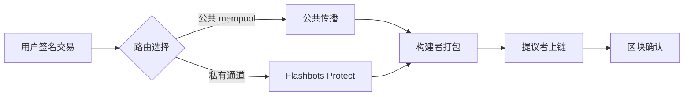

# 第06章 交易（Web3开发者精简版）

> 状态：已完成（优化版）
> 目标：掌握交易结构、类型演进、nonce 管理、gas 计算、签名机制、交易生命周期

## 一句话版

在以太坊里，**交易是"让世界计算机开始干活"的唯一开关**：没有交易，就没有状态变化。

## 核心概念速览

### 交易的本质

| 误解 | 真相 |
|------|------|
| "交易就是转账" | ❌ 交易是状态变更请求 |
| "转账指令" | ✅ 被私钥签名的状态变更请求 |
| "只是转 ETH" | ✅ 可转账、调用合约、部署合约 |

**关键认知**：
- 以太坊状态机**只会响应交易，不会自己跑起来**
- 任何"自动化"都需要外部触发器（用户、机器人、定时服务）发交易

---

## 交易结构详解

### 核心字段

| 字段 | 类型 | 说明 | 必填 |
|------|------|------|------|
| **chainId** | uint | 防跨链重放（EIP-155） | ✅ |
| **nonce** | uint | 同一地址的交易序号 | ✅ |
| **to** | address | 目标地址（EOA/合约/0x0） | ✅ |
| **value** | uint | 转账金额（wei） | ✅（可为 0） |
| **data** | bytes | 调用数据（函数选择器+参数） | ✅（可为空） |
| **gasLimit** | uint | 最大愿意消耗的 gas | ✅ |
| **maxFeePerGas** | uint | 愿意支付的最高单价（EIP-1559） | ✅ |
| **maxPriorityFeePerGas** | uint | 给验证者的小费上限 | ✅ |
| **accessList** | array | 预声明访问的地址/存储槽 | ❌（0x01 类型） |
| **blobVersionedHashes** | array | Blob 哈希列表 | ❌（0x03 类型） |
| **v, r, s** | uint | ECDSA 签名结果 | ✅（签名后） |

**注意**：
- 网络上传的是序列化后的二进制结构（RLP/typed payload）
- UI 里看到的 `from` 等字段是**从签名推导的展示值**，不在交易原始数据中

---

## 交易类型演进（5 种）

### 类型对照表

| 类型 | EIP | 名称 | 新增特性 | 用途 |
|------|-----|------|----------|------|
| **0x00** | - | Legacy（传统） | 基础交易 | 早期以太坊 |
| **0x01** | EIP-2930 | Access List | `accessList` 字段 | 降低冷访问 gas |
| **0x02** | EIP-1559 | 动态费用 | `baseFee` + `priorityFee` | 稳定手续费市场 |
| **0x03** | EIP-4844 | Blob 交易 | `blobVersionedHashes` | L2 数据发布 |
| **0x04** | EIP-7702 | EOA 委托 | EOA 临时可编程 | 批处理、赞助付费 |

### 各类型详解

#### 0x00 Legacy（传统交易）

```solidity
// 交易结构
{
  nonce: 42,
  gasPrice: 20000000000,  // 20 gwei（固定 gas 价格）
  gasLimit: 21000,
  to: 0xRecipient...,
  value: 1000000000000000000,  // 1 ETH
  data: 0x,
  v: 27,
  r: 0x...,
  s: 0x...
}
```

**特点**：
- 只有 `gasPrice` 一把尺子
- 网络拥堵时费用波动剧烈

---

#### 0x02 EIP-1559（当前主流）

```solidity
// 交易结构
{
  chainId: 1,
  nonce: 42,
  maxPriorityFeePerGas: 1000000000,   // 1 gwei（小费）
  maxFeePerGas: 25000000000,          // 25 gwei（最高单价）
  gasLimit: 21000,
  to: 0xRecipient...,
  value: 1000000000000000000,
  data: 0x,
  accessList: [],
  v: 27,
  r: 0x...,
  s: 0x...
}
```

**费用计算**：
```
实际支付 = gasUsed × (baseFee + min(maxPriorityFeePerGas, maxFeePerGas - baseFee))

其中：
- baseFee：协议动态调整，销毁（不给了矿工）
- priorityFee：给验证者的小费
- 剩余 gas 按 maxFeePerGas 退还
```

**示例**：
```
baseFee = 15 gwei
maxFeePerGas = 25 gwei
maxPriorityFeePerGas = 2 gwei

实际单价 = 15 + min(2, 25-15) = 15 + 2 = 17 gwei

Gas 费用 = 21000 × 17 gwei = 0.000357 ETH
其中：
- 0.000315 ETH 销毁（baseFee 部分）
- 0.000042 ETH 给验证者（priorityFee 部分）
```

---

#### 0x03 EIP-4844（Blob 交易）

**用途**：L2 向 L1 发布数据

```solidity
// 新增字段
{
  // ... 0x02 的所有字段
  maxFeePerBlobGas: 1000000000,  // Blob gas 最高单价
  blobVersionedHashes: [         // Blob 版本化哈希
    0x01...,
    0x01...,
    // 最多 6 个 blob
  ]
}
```

**优势**：
- L2 数据发布成本降低 **10-100 倍**
- 独立的 blob gas 市场，不与普通 gas 竞争

---

#### 0x04 EIP-7702（EOA 委托）

**特性**：让 EOA 临时拥有合约代码能力

```solidity
// 新增字段
{
  // ... 0x02 的所有字段
  authorizationList: [           // 授权列表
    {
      chainId: 1,
      address: 0xContract...,    // 委托的代码地址
      nonce: 42,
      v: 27,
      r: 0x...,
      s: 0x...
    }
  ]
}
```

**应用场景**：
- 批量交易（一次签名执行多个操作）
- Gas 赞助（DApp 替用户付费）
- 权限降级（临时授权）

---

## Nonce：最容易卡死系统的点

### Nonce 的本质

**Nonce = 该地址发出的交易编号**（从 0 开始递增）

### 两大核心作用

| 作用 | 说明 | 示例 |
|------|------|------|
| **强制顺序** | 同地址交易必须按 nonce 顺序执行 | nonce 5 必须在 nonce 4 之后 |
| **防重放** | 同一交易不能重复提交 | 节点会拒绝 nonce 已使用的交易 |

### ⚠️ 常见坑点

| 问题 | 现象 | 原因 | 解决方案 |
|------|------|------|----------|
| **Nonce 间隙** | 交易卡在 mempool | 发了 10 和 12，没发 11 | 补发 nonce 11 的交易 |
| **重复 Nonce** | 交易互相替换/竞争 | 两笔交易用同一 nonce | 提高 gas 价格替换 |
| **Nonce 过低** | 交易被拒绝 | nonce 小于当前值 | 查询最新 nonce 重试 |
| **并发冲突** | 多进程抢 nonce 失败 | 同时查询并发送 | 集中管理 nonce |

### Nonce 管理最佳实践

```javascript
// ❌ 错误做法：并发时容易冲突
async function sendMultipleTransactions() {
  for (let i = 0; i < 5; i++) {
    const nonce = await provider.getTransactionCount(address); // 每次都查
    await signer.sendTransaction({ to, value, nonce });
  }
}

// ✅ 正确做法：集中管理 nonce
async function sendMultipleTransactionsSafe() {
  const startNonce = await provider.getTransactionCount(address);
  
  for (let i = 0; i < 5; i++) {
    await signer.sendTransaction({ 
      to, 
      value, 
      nonce: startNonce + i  // 顺序递增
    });
  }
}
```

---

## Gas 详解：不只是"手续费"

### Gas 的两层含义

| 层面 | 说明 | 类比 |
|------|------|------|
| **资源计量** | 每条指令消耗多少计算资源 | 电表计量用电量 |
| **费用结算** | 按实际 `gasUsed` 扣费 | 按用电量交电费 |

### 三个关键参数

| 参数 | 说明 | 设置建议 |
|------|------|----------|
| **gasLimit** | 本次最多愿意消耗多少 gas | 简单转账 21000，合约调用预估 |
| **maxFeePerGas** | 愿意支付的最高单价 | 当前 baseFee × 1.5 ~ 2 |
| **maxPriorityFeePerGas** | 给验证者的小费上限 | 1-3 gwei（非高峰期） |

### Gas 计算示例

```javascript
const { parseUnits } = require('ethers');

// 设置交易参数
const tx = {
  to: '0xContract...',
  data: '0x...',
  gasLimit: 100000,  // 最多消耗 10 万 gas
  maxFeePerGas: parseUnits('25', 'gwei'),           // 最高 25 gwei
  maxPriorityFeePerGas: parseUnits('2', 'gwei')     // 小费 2 gwei
};

// 假设：
// - baseFee = 15 gwei
// - 实际消耗 gasUsed = 85000

// 实际支付：
// 单价 = 15 + min(2, 25-15) = 17 gwei
// 费用 = 85000 × 17 gwei = 0.001445 ETH

// 余额检查：
// 预检查 = 100000 × 25 gwei = 0.0025 ETH（必须满足）
// 实际扣费 = 0.001445 ETH
// 退还 = 0.0025 - 0.001445 = 0.001055 ETH
```

---

## Value 和 Data 的 4 种组合

| 组合 | value | data | 用途 | 示例 |
|------|-------|------|------|------|
| **普通转账** | ✅ 有 | ❌ 无 | EOA → EOA 转 ETH | 钱包转账 |
| **合约调用** | ❌ 无（或 0） | ✅ 有 | 调用合约函数 | approve、swap |
| **带值调用** | ✅ 有 | ✅ 有 | 调用合约并转 ETH | deposit、buy |
| **空交易** | ❌ 无 | ❌ 无 | 无意义（特殊情况除外） | 极少使用 |

### 合约部署（特殊交易）

```javascript
// 部署合约 = to = 0x0 + data = 字节码
const deployTx = {
  to: '0x0000000000000000000000000000000000000000',  // 零地址
  data: '0x608060405234801561001057600080fd5b...',  // 合约字节码
  gasLimit: 1000000,
  // ... 其他字段
};

// 部署成功后获得新合约地址
const receipt = await tx.wait();
console.log('合约地址:', receipt.contractAddress);
```

**注意区分**：
- `to = 0x0`：合约创建（零地址语义）
- `to = 0x000...dEaD`：故意销毁（常见销毁地址）

---

## 签名机制：ECDSA 所有权证明

### 签名流程


### 关键认知

| 要点 | 说明 |
|------|------|
| **私钥不上链** | 链上只有签名（v, r, s） |
| **从签名可恢复公钥** | 节点通过 v, r, s 反推公钥 |
| **公钥推导地址** | 与交易的 `from` 字段对比 |
| **匹配成功 = 有效授权** | 证明发送者有权发起此交易 |

---

## 交易生命周期

### 经典流程


### 现代现实（受 MEV/PBS 影响）



**关键变化**：
- 很多交易不再完全走"公共 mempool 传播"
- 通过私有通道直接进构建者，避免被夹（sandwich）
- 这是 MEV、PBS、交易可见性话题的来源

---

## 多签钱包在以太坊的实现

### EOA 层多签？❌

以太坊**不支持 EOA 层原生多签**，因为 EOA 只能由单一私钥控制。

### 合约层多签？✅

通过智能合约钱包实现多签策略：

```solidity
// 简化的多签逻辑
contract MultiSigWallet {
  address[] public owners;
  uint public required;
  
  modifier onlyOwner() {
    require(isOwner(msg.sender), "Not owner");
    _;
  }
  
  function execute(address to, uint value, bytes data) public onlyOwner {
    // 检查签名数量
    if (confirmations >= required) {
      (bool success, ) = to.call{value: value}(data);
      require(success, "Execution failed");
    }
  }
}
```

**主流方案**：
- **Safe（原 Gnosis Safe）**：最流行的多签钱包
- **Argent**：社交恢复钱包
- ** zkSync 原生多签**：L2 原生支持

---

## 你要记住的 7 件事

1. ✅ **交易是状态机唯一入口**，没有交易就没有状态变化
2. ✅ **`nonce` 管理失误会直接导致卡单或错单**（并发时特别注意）
3. ✅ **EIP-1559 后费用是"基础费 + 小费"模型**（baseFee 销毁）
4. ✅ **`value` 和 `data` 可独立也可同时存在**（4 种组合）
5. ✅ **合约部署本质是"特殊 to + 字节码 data"**（to = 0x0）
6. ✅ **签名证明授权，不暴露私钥**（ECDSA 可恢复公钥）
7. ✅ **现代交易路由已受 MEV/PBS 深刻影响**（私有通道防夹）

---

## 自测题

**题目**：为什么并发发送交易时，最容易出事故的是 nonce，而不是签名算法本身？

**答案要点**：
1. ECDSA 签名由成熟库处理，错误率极低
2. **Nonce 是"同地址全局顺序号"**，并发时最容易抢号或重复
3. 一旦出现间隙或重复，会导致卡单、替换、顺序错乱
4. **工程重点是 nonce 分配与状态跟踪**，而不只是"会签名"

---

## 进阶实践

### 场景 1：替换卡住的交易

```javascript
// 交易卡在 mempool（nonce 间隙）
const stuckNonce = 42;

// 方法 1：补发相同 nonce 的交易（提高 gas）
const replacementTx = {
  to: stuckTx.to,
  value: stuckTx.value,
  nonce: stuckNonce,
  maxFeePerGas: parseUnits('50', 'gwei'),  // 提高费用
  maxPriorityFeePerGas: parseUnits('5', 'gwei')
};

await signer.sendTransaction(replacementTx);

// 方法 2：发送相同 nonce 的空交易（取消）
const cancelTx = {
  to: signer.address,  // 转给自己
  value: 0,
  nonce: stuckNonce,
  maxFeePerGas: parseUnits('50', 'gwei'),
  maxPriorityFeePerGas: parseUnits('5', 'gwei')
};

await signer.sendTransaction(cancelTx);
```

### 场景 2：预估 Gas

```javascript
// 预估合约调用的 gas
const estimatedGas = await contract.estimateGas.myFunction(param1, param2);
console.log('预估 Gas:', estimatedGas.toString());

// 添加 20% 缓冲
const gasLimit = estimatedGas.mul(120).div(100);

// 发送交易
await contract.myFunction(param1, param2, { gasLimit });
```

### 场景 3：使用 Flashbots 防夹

```javascript
const { FlashbotsBundleProvider } = require('@flashbots/ethers-provider-bundle');

// 创建 Flashbots 提供者
const flashbotsProvider = await FlashbotsBundleProvider.create(
  provider,
  authSigner,
  'https://relay.flashbots.net'
);

// 构建交易包
const bundle = [
  {
    signer: wallet,
    transaction: {
      to: contractAddress,
      data: encodedData,
      maxFeePerGas: parseUnits('50', 'gwei'),
      maxPriorityFeePerGas: parseUnits('2', 'gwei')
    }
  }
];

// 发送私有交易包
const result = await flashbotsProvider.sendBundle(bundle, targetBlockNumber);
```

---

## 本章核心

第 6 章真正让你升级的是"**交易工程观**"：

> 写交易不难，难的是在真实网络里把**类型、nonce、gas、签名和生命周期**协同管理好。

**开发者视角**：
- Nonce 管理是并发场景的第一杀手
- Gas 预估和设置直接影响交易成功率
- 理解交易类型演进有助于选择合适的方案
- MEV 时代需要考虑交易隐私和保护策略
