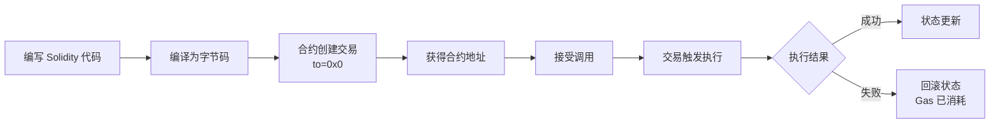

# 第07章 智能合约和 Solidity（Web3开发者精简版）

> 状态：已完成（优化版）
> 目标：掌握合约账户特性、Solidity 核心语法、ABI 机制、调用方式、错误处理、Gas 优化

## 一句话版

智能合约是部署在链上的"**不可改代码**"，只会在交易触发时执行；Solidity 是写这类代码最主流的语言。

## 核心概念速览

### EOA vs 合约账户

| 特性 | EOA（外部账户） | 合约账户 |
|------|----------------|----------|
| **私钥** | ✅ 有 | ❌ 无 |
| **主动发起交易** | ✅ 能 | ❌ 不能 |
| **代码执行** | ❌ 无代码 | ✅ 有代码逻辑 |
| **触发方式** | 用户签名发送 | 被交易调用时执行 |
| **示例** | MetaMask 地址 | Uniswap、ERC-20 代币 |

**关键认知**：
- EOA 决定"**发起**"，合约决定"**执行规则**"
- 合约不会自己跑，必须被交易唤醒

---

## 智能合约的 5 个关键词

| 关键词 | 说明 | 工程意义 |
|--------|------|----------|
| **计算机程序** | 不是法律合同，是代码 | 按代码逻辑执行，无"意图"解释 |
| **不可变** | 部署后代码不能直接改 | 需要升级要用代理模式 |
| **确定性** | 同输入同状态 = 同结果 | 所有节点执行结果一致 |
| **EVM 执行** | 受限运行环境 | 有 gas 限制、操作码限制 |
| **全网共同执行** | 世界计算机模型 | 每个节点都要验证 |

---

## 合约生命周期

### 完整流程



### 关键认知

| 要点 | 说明 |
|------|------|
| **合约不会后台自动跑** | 必须有交易触发 |
| **执行失败整笔回滚** | 状态原子性，但 gas 仍消耗 |
| **多合约调用链原子处理** | 同一笔交易内要么全成功要么全失败 |
| **部署后代码不可改** | 需要升级用代理模式（Proxy） |

---

## 为什么 Solidity 是主流

### 语言生态对比

| 语言 | 生态成熟度 | 工具链 | 审计经验 | 推荐场景 |
|------|-----------|--------|----------|----------|
| **Solidity** | ⭐⭐⭐⭐⭐ | 最全 | 最多 | ✅ 首选 |
| **Vyper** | ⭐⭐⭐ | 较全 | 较多 | 高安全要求 |
| **Yul** | ⭐⭐ | 基础 | 少 | Gas 优化/内联 |
| **Huff** | ⭐ | 底层 | 极少 | 极致优化 |
| **Fe** | ⭐ | 早期 | 无 | 实验性 |

**结论**：对当前阶段，优先 Solidity 是对的。

---

## ABI：合约接口说明书

### 什么是 ABI

**Application Binary Interface** = 外部应用与合约沟通的"翻译协议"

### ABI 告诉外部什么

| 信息 | 说明 | 示例 |
|------|------|------|
| **函数列表** | 合约有哪些可调用的函数 | `transfer`, `balanceOf` |
| **参数类型** | 每个函数参数的数据类型 | `address`, `uint256` |
| **返回值** | 函数返回的数据类型和结构 | `bool`, `(uint256, address)` |
| **事件定义** | 合约会发出哪些事件 | `Transfer`, `Approval` |

### ABI 示例

```json
[
  {
    "inputs": [
      {"name": "to", "type": "address"},
      {"name": "amount", "type": "uint256"}
    ],
    "name": "transfer",
    "outputs": [{"name": "", "type": "bool"}],
    "stateMutability": "nonpayable",
    "type": "function"
  }
]
```

### 前端如何使用 ABI

```javascript
const { Contract } = require('ethers');

const abi = [/* ABI JSON */];
const contractAddress = '0x...';

// 连接合约
const contract = new Contract(contractAddress, abi, signer);

// 调用函数（前端/钱包靠 ABI 构造 calldata）
await contract.transfer(to, amount);

// 读取状态
const balance = await contract.balanceOf(address);
```

---

## 版本与编译器：Pragma 的意义

```solidity
pragma solidity ^0.8.26;
```

**作用**：
- 告诉编译器按哪个版本语义编译
- 避免版本差异导致行为变化或编译失败
- `^0.8.26` 表示兼容 0.8.26 到 0.9.0（不含）

**最佳实践**：
- 生产环境锁定具体版本：`pragma solidity 0.8.26;`
- 开发环境可用范围：`pragma solidity ^0.8.0;`

---

## Solidity 核心语法速查

### 1. 数据类型

| 类型 | 说明 | 示例 | Gas 成本 |
|------|------|------|----------|
| `bool` | 布尔值 | `true`, `false` | 低 |
| `uint256` | 无符号整数（常用） | `0` ~ `2^256-1` | 低 |
| `int256` | 有符号整数 | `-2^255` ~ `2^255-1` | 低 |
| `address` | 以太坊地址 | `0x742d35Cc...` | 中 |
| `address payable` | 可接收 ETH 的地址 | `payable(0x...)` | 中 |
| `bytes32` | 固定长度字节 | `keccak256(...)` | 低 |
| `string` | 动态字符串 | `"Hello"` | 高 |
| `bytes` | 动态字节数组 | `abi.encode(...)` | 高 |
| `mapping` | 键值对映射 | `mapping(address => uint)` | 中 |
| `struct` | 自定义结构体 | `struct User { ... }` | 视字段而定 |

### 2. 变量作用域

| 作用域 | 存储位置 | Gas 成本 | 生命周期 |
|--------|----------|----------|----------|
| **状态变量** | Storage（链上持久化） | 最贵（SSTORE: 20000 gas） | 永久 |
| **局部变量** | Memory/Stack（函数内临时） | 便宜 | 函数执行期间 |
| **全局变量** | 特殊上下文（`msg`, `tx`, `block`） | 只读 | 当前交易 |

**Gas 优化建议**：
- 减少不必要的 storage 读写
- 临时计算用 memory，最后再写 storage

### 3. 函数可见性与修饰

| 修饰符 | 说明 | 用途 |
|--------|------|------|
| `public` | 内外都可调用 | 对外接口 |
| `external` | 仅外部可调用（节省 gas） | 对外接口（推荐） |
| `internal` | 仅内部/子合约可调用 | 内部逻辑 |
| `private` | 仅当前合约可调用 | 私有逻辑 |
| `view` | 只读，不修改状态 | 查询函数 |
| `pure` | 不读写状态 | 纯计算函数 |
| `payable` | 可接收 ETH | 收款函数 |

### 4. 特殊函数

```solidity
// receive：接收纯 ETH（无 data）
receive() external payable {
    // 自动执行
}

// fallback：其他情况（无匹配函数或有 data）
fallback() external payable {
    // 兜底逻辑
}

// 构造函数：部署时执行一次
constructor(address _owner) {
    owner = _owner;
}
```

---

## Modifier：复用前置条件

### 本质

`modifier` = "函数执行前的检查逻辑"

### 常见用法

```solidity
// 权限控制
modifier onlyOwner() {
    require(msg.sender == owner, "Not owner");
    _;  // 继续执行原函数
}

// 暂停机制
modifier whenNotPaused() {
    require(!paused, "Paused");
    _;
}

// 使用
function withdraw(uint amount) external onlyOwner whenNotPaused {
    // 先执行 onlyOwner 和 whenNotPaused 检查
    // 通过后执行此处逻辑
}
```

**优势**：
- ✅ 减少重复代码
- ✅ 权限逻辑更清晰
- ✅ 更利于审计

---

## 继承与多继承

### 单继承

```solidity
contract Base {
    uint public value;
}

contract Child is Base {
    function setValue(uint _value) public {
        value = _value;
    }
}
```

### 多继承（常见模式）

```solidity
// 权限控制基类
contract Ownable {
    address public owner;
    modifier onlyOwner() {
        require(msg.sender == owner);
        _;
    }
}

// 暂停功能
contract Pausable {
    bool public paused;
    modifier whenNotPaused() {
        require(!paused);
        _;
    }
}

// 业务合约继承
contract MyContract is Ownable, Pausable {
    function doSomething() external onlyOwner whenNotPaused {
        // 权限 + 暂停检查
    }
}
```

### ⚠️ 多继承注意事项

| 问题 | 说明 | 解决方案 |
|------|------|----------|
| **函数冲突** | 多个父合约有同名函数 | 必须显式 `override` |
| **构造顺序** | 与继承线性化有关 | 从左到右，最右最后执行 |
| **super 调用** | 可能触发未预期的父链调用 | 理解 C3 线性化规则 |

---

## 错误处理：Require / Revert / Assert

### 对比表

| 语句 | 用途 | Gas 退还 | 适用场景 |
|------|------|----------|----------|
| **require** | 校验输入/前置条件 | ✅ 退还剩余 gas | 最常用 |
| **revert** | 主动中止并回滚 | ✅ 退还剩余 gas | 复杂条件检查 |
| **assert** | 不变量检查 | ❌ 不退还（0.8.0 前） | 内部逻辑错误 |

### 使用示例

```solidity
// require：最常用
function transfer(address to, uint amount) public {
    require(to != address(0), "Invalid address");
    require(balanceOf[msg.sender] >= amount, "Insufficient balance");
    
    balanceOf[msg.sender] -= amount;
    balanceOf[to] += amount;
}

// revert：复杂条件
function withdraw(uint amount) public {
    if (amount > maxWithdrawal) {
        revert WithdrawalExceeded(amount, maxWithdrawal);
    }
    // ...
}

// assert：不变量（不应触发）
function checkInvariant() public {
    assert(totalSupply == sum(balances));  // 如果失败说明有严重 bug
}
```

**最佳实践**：
- 给 `require` 写清楚错误信息或用自定义错误
- 对外部调用结果必须检查
- Solidity 0.8+ 内置溢出检查，不需要额外 assert

---

## Event：链上日志

### 本质

Event = "**链上可检索日志**"，不是状态

### 作用

| 用途 | 说明 |
|------|------|
| **前端监听** | 实时获取合约状态变化 |
| **索引服务** | The Graph 等索引事件数据 |
| **调试审计** | 留下可追溯的执行痕迹 |

### 使用示例

```solidity
// 定义事件
event Transfer(address indexed from, address indexed to, uint256 value);
event Approval(address indexed owner, address indexed spender, uint256 value);

// 触发事件
function transfer(address to, uint256 amount) public {
    // ... 业务逻辑
    emit Transfer(msg.sender, to, amount);
}
```

**建议**：重要状态变化都发事件（存款、提款、权限变更等）

---

## 调用其他合约：三层风险递增

### 1. 直接接口调用（相对安全）✅

```solidity
interface IERC20 {
    function transfer(address to, uint amount) external returns (bool);
}

function safeCall(IERC20 token, address to, uint amount) public {
    bool success = token.transfer(to, amount);
    require(success, "Transfer failed");
}
```

### 2. 地址强转后调用（中风险）⚠️

```solidity
function riskyCall(address tokenAddr, address to, uint amount) public {
    // 假设对方实现符合接口，但链上地址未必真是你以为的逻辑
    IERC20 token = IERC20(tokenAddr);
    token.transfer(to, amount);
}
```

### 3. 低级调用 call/delegatecall（高风险）❌

```solidity
// call：普通外部调用
(bool success, bytes memory data) = target.call{value: amount}("");

// delegatecall：在当前上下文执行外部代码（特别危险！）
(bool success, bytes memory data) = target.delegatecall(calldata);
```

**一句话**：能用高层接口就别先上低级调用。

---

## Gas 优化思路

### 存储优化

| 操作 | Gas 成本 | 优化建议 |
|------|----------|----------|
| **SSTORE（初始化）** | 20,000 | 减少 storage 变量数量 |
| **SSTORE（修改）** | 5,000 | 批量更新 |
| **SLOAD** | 100 | 缓存到 memory |
| **打包存储** | - | 多个小变量打包到 bytes32 |

### 计算优化

| 操作 | Gas 成本 | 说明 |
|------|----------|------|
| ADD/SUB | 3 | 加减法 |
| MUL/DIV | 5 | 乘除法 |
| KECCAK256 | 30 + 6×字 | 哈希计算 |

### 实用技巧

```solidity
// ✅ 技巧 1：减少 storage 读写
function optimize() public {
    uint temp = storageVar;  // 1 次 SLOAD
    temp += 10;
    temp *= 2;
    storageVar = temp;       // 1 次 SSTORE
    // 共 2 次 storage 操作
}

// ❌ 反面教材
function badOptimize() public {
    storageVar += 10;        // 1 SLOAD + 1 SSTORE
    storageVar *= 2;         // 1 SLOAD + 1 SSTORE
    // 共 4 次 storage 操作
}

// ✅ 技巧 2：使用 memory 数组
function process(uint[] memory data) public {
    // memory 数组在函数内处理，不写 storage
}

// ✅ 技巧 3：短路求值
if (condition1 && condition2) {
    // condition2 只在 condition1 为 true 时执行
}
```

---

## 你要记住的 7 件事

1. ✅ **合约只有被交易触发才会执行**（不会后台自动跑）
2. ✅ **合约执行失败会整笔回滚**（但 gas 仍会消耗）
3. ✅ **Solidity 开发离不开 ABI 思维**（前端/钱包靠 ABI 交互）
4. ✅ **权限控制、暂停机制、错误处理是基础骨架**
5. ✅ **继承能提效，但多继承必须显式处理冲突**
6. ✅ **事件是前端与链上状态同步的关键抓手**
7. ✅ **低级调用很强，但风险同样很高**（优先高层接口）

---

## 自测题

**题目**：为什么说"合约不会自己运行"，这句话对系统设计非常关键？

**答案要点**：
1. 合约执行必须由交易触发，不能像后台服务定时跑
2. 任何"自动化"都需要外部触发器（用户、机器人、定时服务）发交易
3. 这直接影响你对任务调度、告警、清算、运维脚本的系统设计
4. 例如：清算机器人必须持续监控并发送交易，合约不会自动清算

---

## 进阶实践

### 场景 1：代理模式实现可升级合约

```solidity
// 使用 OpenZeppelin 的 TransparentUpgradeableProxy
import "@openzeppelin/contracts/proxy/transparent/TransparentUpgradeableProxy.sol";
import "@openzeppelin/contracts/proxy/transparent/ProxyAdmin.sol";

// 部署逻辑
ProxyAdmin admin = new ProxyAdmin();
TransparentUpgradeableProxy proxy = new TransparentUpgradeableProxy(
    address(logicContract),
    address(admin),
    abi.encodeWithSignature("initialize()")
);

// 升级逻辑
admin.upgrade(proxy, newLogicContract);
```

### 场景 2：自定义错误（节省 Gas）

```solidity
// Solidity 0.8.4+ 支持自定义错误
error InsufficientBalance(uint256 available, uint256 required);
error Unauthorized(address caller);

function withdraw(uint amount) public {
    if (balanceOf[msg.sender] < amount) {
        revert InsufficientBalance(balanceOf[msg.sender], amount);
    }
    if (msg.sender != owner) {
        revert Unauthorized(msg.sender);
    }
    // ...
}

// 比 require 更省 gas，且类型安全
```

### 场景 3：监听事件

```javascript
// ethers.js 监听事件
contract.on("Transfer", (from, to, value, event) => {
  console.log(`Transfer: ${from} -> ${to}, Value: ${value}`);
});

// 过滤特定地址
const filter = contract.filters.Transfer(userAddress, null);
const events = await contract.queryFilter(filter);
```

---

## 本章核心

第 7 章最重要的升级是：

> 你开始从"会写 Solidity 语法"转向"**按区块链执行模型去设计合约系统**"。

**开发者视角**：
- 理解合约是被交易触发的，不是后台服务
- 掌握 ABI 是与前端/钱包交互的基础
- Gas 优化是生产环境必修课
- 安全模式（权限、暂停、错误处理）是合约骨架
