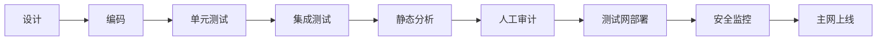

# 第09章 智能合约安全（Web3开发者精简版）

> 状态：已完成（优化版）
> 目标：掌握核心漏洞类型、防护方法、安全工程流程，建立"安全第一"的开发思维

## 一句话版

智能合约安全的本质：**代码上链后难补救，必须把"少犯错、早发现、可回退"放在开发第一位**。

## 核心安全心态

### 智能合约 vs 传统后端

| 维度 | 传统后端 | 智能合约 |
|------|----------|----------|
| **代码可见性** | 私有 | 完全公开 |
| **调用权限** | 受控 | 任何人都可调用 |
| **资产状态** | 数据库记录 | 真实资产在合约里 |
| **出事速度** | 可及时止损 | 秒级被掏空 |
| **修复能力** | 热修复/回滚 | 几乎不可逆 |

**结论**：不能抱着"先上线再修"的思路做合约！

---

## 安全最佳实践（总纲）

1. ✅ **最小化设计**：功能越少、边界越清，攻击面越小
2. ✅ **重用成熟代码**：OpenZeppelin 等经过大量审计和实战检验
3. ✅ **可读可审计**：让别人能快速看懂你的意图
4. ✅ **高覆盖测试**：尤其边界值、异常路径、恶意输入
5. ✅ **防御式编程**：默认所有外部输入都不可信
6. ✅ **多层防线**：代码层 + 部署层 + 治理层都要有防护

---

## 十大核心漏洞与防护

### 1️⃣ 重入攻击（Reentrancy）- 最经典

**攻击原理**：
```solidity
// 错误示例：先外部调用，后更新状态
function withdraw(uint amount) public {
    require(balances[msg.sender] >= amount);
    (bool success, ) = msg.sender.call{value: amount}(""); // ❌ 先转账
    require(success);
    balances[msg.sender] -= amount; // ❌ 后改状态
}
```

**防护方法**：

| 方法 | 说明 | 优先级 |
|------|------|--------|
| **Checks-Effects-Interactions** | 先检查 → 先改状态 → 最后外部交互 | ⭐⭐⭐⭐⭐ |
| **ReentrancyGuard** | 使用 OpenZeppelin 的重入锁 | ⭐⭐⭐⭐⭐ |
| **Pull Payment** | 用户主动提取而非自动发送 | ⭐⭐⭐⭐ |

**正确示例**：
```solidity
// 正确：CEI 模式
function withdraw(uint amount) public {
    require(balances[msg.sender] >= amount);      // 1. Check
    balances[msg.sender] -= amount;               // 2. Effect
    (bool success, ) = msg.sender.call{value: amount}(""); // 3. Interaction
    require(success);
}
```

---

### 2️⃣ DELEGATECALL 误用 - 最危险

**风险本质**：
- `delegatecall` 在**调用者存储上下文**里执行别人的代码
- 存储布局不匹配会导致关键状态被覆盖（如 owner、逻辑地址）

**常见场景**：
- 代理合约（Proxy Pattern）
- 可升级合约
- 库调用

**防护方法**：
1. 谨慎使用 `delegatecall`，优先使用成熟的代理模式实现
2. 严格约束可调用函数面（使用 selector 白名单）
3. 存储布局变更要有清晰迁移方案和专项审计
4. 使用 OpenZeppelin 的 UUPS/Transparent Proxy 模式

---

### 3️⃣ 伪随机（Entropy Illusion）- 最常见误区

**错误做法**：
```solidity
// ❌ 这些值可被观察或操纵
uint random = uint(blockhash(block.number - 1));
uint random = uint(block.timestamp);
uint random = uint(block.coinbase);
```

**为什么危险**：
- `block.timestamp`：矿工可在±15 秒范围内操纵
- `blockhash`：只保留最近 256 个区块，可预测
- `coinbase`：矿工可控制

**正确做法**：

| 场景 | 推荐方案 |
|------|----------|
| **高价值随机**（抽奖、NFT 属性） | Chainlink VRF（可验证随机函数） |
| **中等价值** | Commit-Reveal 方案 |
| **低价值** | PREVRANDAO（合并后的随机源，仍有限制） |

---

### 4️⃣ 未检查外部调用返回值 - 最容易被忽视

**问题示例**：
```solidity
// ❌ 没有检查返回值
token.transfer(to, amount);
// 后续逻辑继续执行，即使转账失败
```

**防护方法**：
```solidity
// ✅ 方法 1：检查返回值
require(token.transfer(to, amount), "Transfer failed");

// ✅ 方法 2：使用 SafeERC20（推荐）
import "@openzeppelin/contracts/token/ERC20/utils/SafeERC20.sol";
using SafeERC20 for IERC20;

token.safeTransfer(to, amount); // 失败会自动 revert
```

---

### 5️⃣ 抢跑 / 三明治攻击（MEV）- DeFi 特有

**攻击原理**：
- Mempool 公开，攻击者能看到待处理交易
- 通过提高 gas 费用插队，在目标交易前后夹击

**常见场景**：
- DEX 交易（用低滑点设置吃差价）
- NFT Mint（抢在其他人之前）
- 清算操作（抢跑清算人）

**防护方法**：

| 方法 | 适用场景 | 效果 |
|------|----------|------|
| **最小产出保护** | DEX swap | `minAmountOut` 防大幅滑点 |
| **Commit-Reveal** | 拍卖、投票 | 隐藏真实意图直到提交后 |
| **私有交易** | 大额交易 | Flashbots Protect 等通道 |
| **时间锁** | 敏感操作 | 延迟执行，给监控留时间 |

---

### 6️⃣ 输入校验不充分 - 最基础但最致命

**常见陷阱**：
```solidity
// ❌ 没有检查零地址
function transfer(address to, uint amount) public {
    balances[to] += amount; // to 是 0x000... 怎么办？
}

// ❌ 没有检查溢出（Solidity <0.8）
uint result = a + b; // 可能溢出
```

**防护清单**：

| 检查项 | 说明 |
|--------|------|
| **零地址检查** | `require(to != address(0))` |
| **权限校验** | `require(msg.sender == owner)` 或使用 AccessControl |
| **数值边界** | `require(amount > 0 && amount <= MAX)` |
| **签名防重放** | 包含 nonce、chainId、合约地址 |
| **避免 abi.encodePacked 歧义** | 动态数据用 `abi.encode` |

---

### 7️⃣ 签名重放攻击

**攻击原理**：
- 同一签名被重复提交
- 跨链/跨合约重放签名

**防护方法**：
```solidity
// ✅ EIP-712 结构化签名（推荐）
bytes32 digest = keccak256(abi.encodePacked(
    "\x19\x01",
    DOMAIN_SEPARATOR,
    keccak256(abi.encode(
        TYPE_HASH,
        owner,
        spender,
        value,
        nonce,      // 每次递增
        deadline
    ))
));

// ✅ 记录已使用的 nonce
mapping(address => uint256) public nonces;

function permit(address owner, address spender, uint value, uint deadline, uint8 v, bytes32 r, bytes32 s) public {
    require(nonces[owner] == nonce, "Invalid nonce");
    nonces[owner]++; // 一次性使用
    // ... 验证签名
}
```

---

### 8️⃣ 预言机价格操纵（Oracle Manipulation）

**攻击原理**：
- 使用单池链上现价作为价格源
- 攻击者用闪电贷大幅拉升/砸低价格
- 利用操纵后的价格套利或清算

**典型案例**：
- bZx 攻击（2020 年，损失 800 万美元）
- Cream Finance 攻击（2021 年，损失 1.3 亿美元）

**防护方法**：

| 方案 | 优点 | 缺点 |
|------|------|------|
| **Chainlink 预言机** | 去中心化、多源聚合 | 有延迟、需要付费 |
| **TWAP（时间加权平均）** | 抗短时操纵 | 滞后、需要调参 |
| **多源对账** | 交叉验证 | 复杂度高 |
| **异常熔断** | 价格波动过大时暂停 | 可能误杀正常交易 |

**推荐实践**：
```solidity
// 使用 TWAP + 价格偏差检查
function getPrice() public view returns (uint) {
    uint twapPrice = oracle.consult(token, amount, period);
    uint spotPrice = oracle.getPrice();
    
    // 价格偏差超过 10% 则拒绝
    require(
        twapPrice > spotPrice * 90 / 100 && 
        twapPrice < spotPrice * 110 / 100,
        "Price deviation too high"
    );
    
    return twapPrice;
}
```

---

### 9️⃣ DoS（拒绝服务）攻击

**常见触发场景**：

| 场景 | 问题 | 解决方案 |
|------|------|----------|
| **无界循环** | 遍历可无限增长的数组，gas 超限 | 改拉取模式/分页处理 |
| **外部调用必成功** | 依赖某个外部调用，失败则整个交易回滚 | 降低耦合，失败可恢复 |
| **权限丢失** | 关键权限丢失导致系统卡死 | 多签管理、紧急暂停机制 |

**错误示例**：
```solidity
// ❌ 遍历可能无限增长的数组
function distributeRewards() public {
    for (uint i = 0; i < users.length; i++) { // 用户多了 gas 不够
        users[i].balance += reward;
    }
}
```

**正确做法**：
```solidity
// ✅ 拉取模式（用户主动领取）
function claimReward() public {
    uint reward = calculateReward(msg.sender);
    rewards[msg.sender] = 0;
    token.transfer(msg.sender, reward);
}
```

---

### 🔟 错误配置 - 非代码 bug 也会炸

**真实案例**：
- 升级脚本顺序错误导致权限丢失
- 初始化参数漏跑或配置错误
- 权限角色分配错误（给普通用户管理员权限）

**防护清单**：

| 检查项 | 说明 |
|--------|------|
| **部署脚本审计** | 和合约代码一样需要审计 |
| **多签审批** | 关键操作走多签（Gnosis Safe） |
| **Checklist** | 部署前逐项检查 |
| **全流程演练** | 主网前在测试网完整演练 |
| **回滚预案** | 准备好紧急回滚方案 |

---

## 安全工程流程

### 开发阶段



### 工具链推荐

| 工具 | 用途 | 类型 |
|------|------|------|
| **Slither** | 静态分析，自动检测常见漏洞 | 免费 |
| **Mythril** | 符号执行，深度分析 | 免费 |
| **Echidna** | 模糊测试 | 免费 |
| **Foundry** | 测试框架 + fuzzing | 免费 |
| **OpenZeppelin Defender** | 监控 + 自动响应 | 付费 |
| **Forta** | 实时威胁检测 | 免费/付费 |

### 测试覆盖率要求

| 测试类型 | 覆盖率目标 | 重点 |
|----------|-----------|------|
| **单元测试** | > 95% | 每个函数的正常和异常路径 |
| **边界测试** | 100% | 零值、最大值、溢出边界 |
| **恶意输入** | 覆盖所有外部入口 | 错误地址、超大数值、重入尝试 |
| **集成测试** | 核心流程 100% | 多合约交互、完整业务流 |

---

## 应急与运维

### 必须具备的安全机制

| 机制 | 作用 | 实现方式 |
|------|------|----------|
| **暂停机制** | 紧急停止合约 | Pausable 模式 |
| **可升级性** | 修复漏洞 | Proxy 模式 |
| **多签管理** | 权限分散 | Gnosis Safe |
| **时间锁** | 延迟执行敏感操作 | TimelockController |
| **白帽计划** | 鼓励负责任披露 | Immunefi、HackerOne |

### 监控告警

```solidity
// 大额转账告警
event LargeTransfer(address indexed from, address indexed to, uint amount);

function transfer(address to, uint amount) public {
    if (amount > ALERT_THRESHOLD) {
        emit LargeTransfer(msg.sender, to, amount);
    }
    // ...
}
```

**监控工具**：
- Tenderly：交易模拟和告警
- OpenZeppelin Defender：自动化监控
- Forta：实时威胁检测

---

## 你要记住的 7 件事

1. **第一原则**：假设所有输入和调用方都不可信
2. **重入防护**：CEI 模式和 ReentrancyGuard 是必修课
3. **签名安全**：必须防重放、防域外复用（nonce + chainId）
4. **价格来源**：预言机不稳，协议就不稳
5. **配置安全**：错误配置同样能造成巨额损失
6. **持续安全**：审计不是终点，运维和升级流程也要审计
7. **重用优先**：OpenZeppelin 等成熟库比自研更安全

---

## 自测题

**题目**：为什么"代码已审计通过"仍然不能代表协议已经安全？

**答案要点**：
1. 审计通常覆盖某一时点代码，不保证后续配置/升级正确
2. 部署参数、权限管理、预言机设置、脚本顺序都可能引入新风险
3. 攻击面不仅在代码逻辑，也在运维流程与治理流程
4. 安全需要持续监控、演练和多层防线

---

## 真实案例教训

| 事件 | 时间 | 损失 | 漏洞类型 | 教训 |
|------|------|------|----------|------|
| **The DAO** | 2016 | 360 万 ETH | 重入攻击 | 催生硬分叉，ETC 诞生 |
| **Parity 多签** | 2017 | 15 万 ETH | 权限漏洞 | 初始化函数未保护 |
| **bZx** | 2020 | 800 万美元 | 预言机操纵 | 单价格源不可信 |
| **Poly Network** | 2021 | 6.1 亿美元 | 跨链验证漏洞 | 跨链桥需极端谨慎 |
| **Wormhole** | 2022 | 3.2 亿美元 | 签名验证漏洞 | 签名必须严格校验 |

---

## 本章核心

第 9 章真正要你建立的是"**安全工程观**"：

> 漏洞不是偶发事故，而是设计、代码、配置、部署、治理任何一环松动后的必然结果。

**开发者箴言**：
- 在智能合约世界，**预防比补救便宜无数倍**
- 每次提交代码前问自己："如果我是攻击者，会怎么利用这段代码？"
- 安全不是功能，是**一切功能的基石**
