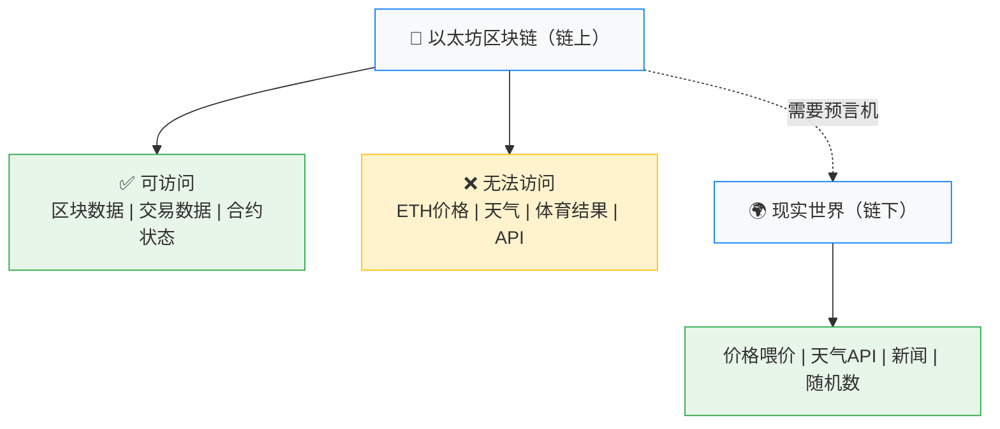
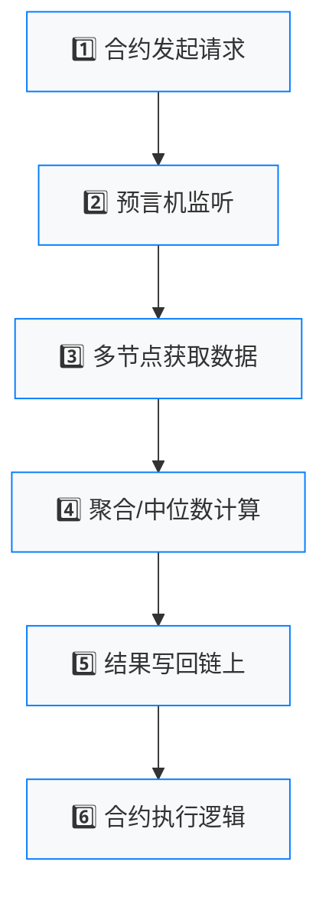
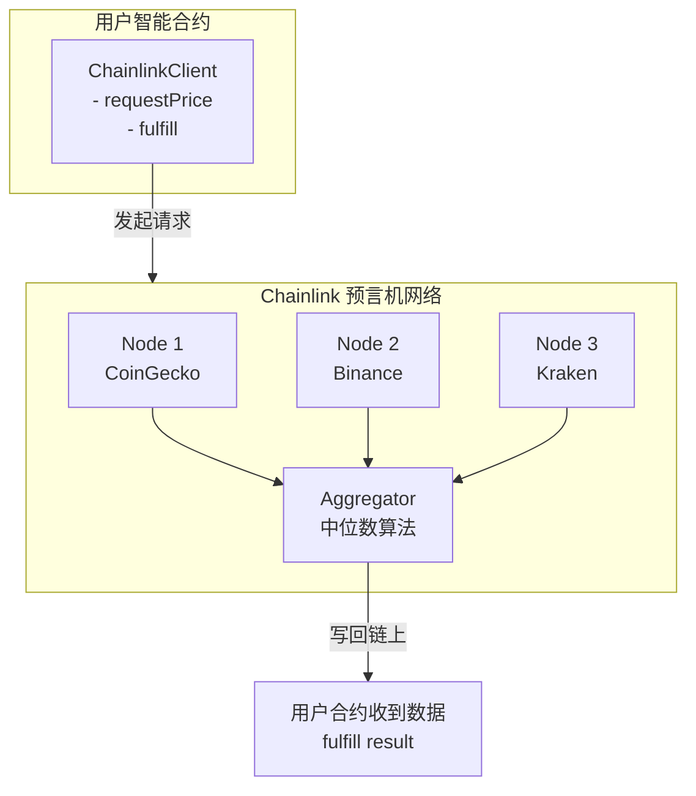

# 第11章 预言机（Oracles）- Web3开发者精简版

> **核心定位**: 预言机是连接链上智能合约与链下现实世界的桥梁，为DeFi、NFT、保险等应用提供外部数据。

---

## 一、为什么需要预言机？

### 智能合约的数据孤岛问题



### 核心矛盾

| 需求 | 区块链特性 | 冲突 |
|------|-----------|------|
| **需要外部数据** | 区块链是封闭系统 | ❌ 智能合约无法直接调用HTTP API |
| **需要随机数** | 区块链是确定性的 | ❌ 所有节点必须产生相同结果 |
| **需要链下计算** | 链上Gas昂贵 | ❌ 复杂计算不适合在链上执行 |

**预言机的作用**：安全地将链下数据引入链上，同时保证数据的可信性。

---

## 二、预言机架构详解

### 1. 基础工作流程



### 2. 中心化 vs 去中心化预言机

| 维度 | 中心化预言机 | 去中心化预言机（如Chainlink） | 优先级 |
|------|-------------|------------------------------|--------|
| **数据源** | 单一来源 | 多个独立节点 | ⭐⭐⭐⭐⭐ |
| **可信度** | 依赖单点信任 | 分布式信任 | ⭐⭐⭐⭐⭐ |
| **故障风险** | 单点故障 | 容错能力强 | ⭐⭐⭐⭐⭐ |
| **操纵风险** | 高（可被控制） | 低（需要控制多数节点） | ⭐⭐⭐⭐⭐ |
| **Gas成本** | 低 | 较高（多个交易） | ⭐⭐⭐ |
| **延迟** | 快 | 较慢（需等待多节点） | ⭐⭐⭐ |
| **典型应用** | 测试网、小项目 | 生产级DeFi协议 | ⭐⭐⭐⭐⭐ |

### 3. Chainlink架构（行业标准）



---

## 三、Chainlink 实战开发

### 1. 安装依赖

```bash
# Hardhat 项目
npm install @chainlink/contracts

# Foundry 项目
forge install smartcontractkit/chainlink
```

### 2. 获取链下数据（单值）

```solidity
// SPDX-License-Identifier: MIT
pragma solidity ^0.8.20;

import "@chainlink/contracts/src/v0.8/ChainlinkClient.sol";

contract DataConsumer is ChainlinkClient {
    using Chainlink for Chainlink.Request;
    
    uint256 public price;
    address private oracle;
    bytes32 private jobId;
    uint256 private fee;
    
    constructor() {
        setChainlinkToken(0x326C977E6efc84E512bB9C30f76E30c160eD06FB);
        oracle = 0x6D9D5d7c6b3b0b0b0b0b0b0b0b0b0b0b0b0b0b0b;
        jobId = "ca98366cc7314957b8c012c72f05aeeb";
        fee = 0.1 * 10 ** 18;
    }
    
    function requestPrice() public {
        Chainlink.Request memory req = buildChainlinkRequest(
            jobId, 
            address(this), 
            this.fulfill.selector
        );
        
        req.add("get", "https://min-api.cryptocompare.com/data/pricemultifull?fsyms=ETH&tsyms=USD");
        req.add("path", "RAW,ETH,USD,PRICE");
        req.addInt("times", 100);
        
        sendChainlinkRequestTo(oracle, req, fee);
    }
    
    function fulfill(bytes32 _requestId, uint256 _price) 
        public 
        recordChainlinkFulfillment(_requestId) 
    {
        price = _price;
    }
    
    function withdrawLink() public {
        LinkTokenInterface link = LinkTokenInterface(chainlinkTokenAddress());
        require(link.transfer(msg.sender, link.balanceOf(address(this))), "Transfer failed");
    }
}
```

### 3. 使用价格喂价（推荐用于DeFi）

```solidity
// SPDX-License-Identifier: MIT
pragma solidity ^0.8.20;

import "@chainlink/contracts/src/v0.8/interfaces/AggregatorV3Interface.sol";

contract PriceConsumer {
    AggregatorV3Interface internal priceFeed;
    
    constructor() {
        priceFeed = AggregatorV3Interface(
            0x5f4eC3Df9cbd43714FE2740f5E3616155c5b8419
        );
    }
    
    function getLatestPrice() public view returns (int price, uint timestamp) {
        (
            uint80 roundID, 
            int _price,
            uint startedAt,
            uint timeStamp,
            uint80 answeredInRound
        ) = priceFeed.latestRoundData();
        
        require(block.timestamp - timeStamp < 1 hours, "Stale price");
        require(_price > 0, "Invalid price");
        
        return (_price, timeStamp);
    }
    
    function getEthValue(uint ethAmount) public view returns (uint) {
        (int price, ) = getLatestPrice();
        return uint(price) * ethAmount / 1e8;
    }
}
```

**关键安全措施**：
```solidity
✅ 必须检查：
1. 数据新鲜度：block.timestamp - timeStamp < 1 hours
2. 价格有效性：price > 0
3. 轮次完整性：answeredInRound >= roundID
```

---

## 四、预言机类型与应用场景

### 1. 按数据流向分类

| 类型 | 方向 | 应用场景 | 示例 |
|------|------|---------|------|
| **入站预言机** | 链下→链上 | 价格喂价、随机数 | Chainlink Price Feed |
| **出站预言机** | 链上→链下 | 触发链下动作 | Chainlink Keepers |
| **跨链预言机** | 链A→链B | 跨链消息传递 | Chainlink CCIP |

### 2. 核心应用场景

#### A. DeFi 价格喂价

```solidity
function borrow(uint amount) public {
    (int ethPrice, ) = priceFeed.latestRoundData();
    
    uint collateralValue = userCollateral * uint(ethPrice) / 1e8;
    uint borrowValue = amount * assetPrice / 1e8;
    
    require(borrowValue <= collateralValue * 75 / 100, "Insufficient collateral");
    
    _borrow(msg.sender, amount);
}
```

**风险案例**：
```
2020年3月12日 "黑色星期四"
- 预言机未及时更新价格
- 使用过时的高价数据清算
- 造成$800万损失

教训：必须检查数据新鲜度！
```

#### B. 随机数生成（VRF）

```solidity
import "@chainlink/contracts/src/v0.8/VRFConsumerBaseV2.sol";

contract Lottery is VRFConsumerBaseV2 {
    VRFV2Wrapper internal vrfWrapper;
    
    uint256 public requestId;
    uint256 public randomWord;
    
    constructor() VRFConsumerBaseV2(0x807E83e2...) {
        vrfWrapper = VRFV2Wrapper(0x195f15F2...);
    }
    
    function pickWinner() public {
        requestId = vrfWrapper.requestRandomWords(
            3, 500000, 1, 1000000000000000000
        );
    }
    
    function fulfillRandomWords(uint256 _requestId, uint256[] memory _randomWords) 
        internal override 
    {
        randomWord = _randomWords[0];
        uint winnerIndex = randomWord % participants.length;
        _awardPrize(participants[winnerIndex]);
    }
}
```

**为什么不能直接用 `block.timestamp` 或 `blockhash`？**
```solidity
❌ 错误做法：
uint random = uint(keccak256(abi.encodePacked(block.timestamp, msg.sender))) % 100;

⚠️ 风险：
- 矿工可以操纵 block.timestamp
- blockhash 只有最近256个区块可用
- 可预测性高，不适合赌博/NFT

✅ 正确做法：使用 Chainlink VRF
```

#### C. 自动化任务（Keepers）

```solidity
import "@chainlink/contracts/src/v0.8/automation/AutomationCompatible.sol";

contract LimitOrder is AutomationCompatibleInterface {
    mapping(address => uint) public limitPrices;
    
    function checkUpkeep(bytes calldata) 
        external view override 
        returns (bool upkeepNeeded, bytes memory) 
    {
        (int currentPrice, ) = priceFeed.latestRoundData();
        return (uint(currentPrice) >= limitPrices[msg.sender], "");
    }
    
    function performUpkeep(bytes calldata) external override {
        _executeOrder(msg.sender);
    }
}
```

**应用场景**：限价单自动成交、贷款自动清算、定期收益复投

---

## 五、预言机安全最佳实践

### 1. 数据源验证

```solidity
function getSafePrice() public view returns (uint) {
    (int chainlinkPrice, ) = chainlinkFeed.latestRoundData();
    uint uniswapPrice = getUniswapTwapPrice();
    
    require(
        abs(chainlinkPrice - uniswapPrice) < chainlinkPrice / 10,
        "Price deviation too high"
    );
    
    return uint(chainlinkPrice);
}
```

### 2. 防止预言机攻击

| 攻击类型 | 原理 | 防护方法 | 优先级 |
|---------|------|---------|--------|
| **价格操纵** | 攻击者在DEX制造极端价格 | 使用TWAP、多源聚合 | ⭐⭐⭐⭐⭐ |
| **重入攻击** | 回调函数再次调用预言机 | CEI模式、ReentrancyGuard | ⭐⭐⭐⭐⭐ |
| **过时数据** | 使用未更新的旧价格 | 检查timestamp | ⭐⭐⭐⭐⭐ |
| **喂价合约劫持** | 替换喂价合约地址 | 使用不可变变量 | ⭐⭐⭐⭐ |

### 3. 实战检查清单

```solidity
modifier safePrice() {
    (int price, , , uint timestamp, ) = priceFeed.latestRoundData();
    require(price > 0, "Invalid price");
    require(block.timestamp - timestamp < 1 hours, "Stale price");
    require(answeredInRound >= roundID, "Incomplete round");
    _;
}
```

---

## 六、预言机生态对比

| 项目 | 核心特性 | 优势 | 劣势 | 典型应用 |
|------|---------|------|------|---------|
| **Chainlink** | 去中心化网络、VRF、Keepers | 生态最成熟、安全性高 | Gas成本高、复杂 | Aave、Synthetix |
| **Pyth Network** | 机构直连喂价、低延迟 | 数据质量高、延迟低 | 去中心化程度较低 | 高性能DeFi |
| **API3** | 第一方预言机 | 无中间人风险 | 生态较小 | 新兴协议 |
| **Tellor** | 工作量证明机制 | 抗审查性强 | 延迟高、成本高 | 需要抗审查的场景 |
| **Band Protocol** | 跨链数据聚合 | 多链支持好 | 市场份额较小 | 跨链应用 |

---

## 七、自测题

### 题目1：为什么不能直接使用 `block.timestamp` 作为随机数种子？

**答案**：
1. 矿工可以操纵 `block.timestamp`（允许±15秒误差）
2. 具有可预测性，攻击者可以提前计算结果
3. 不适合赌博、NFT稀有度分配等需要真正随机性的场景
4. 应使用 Chainlink VRF

### 题目2：以下代码有什么安全隐患？

```solidity
function liquidate(address user) public {
    (int price, , , uint timestamp, ) = priceFeed.latestRoundData();
    
    // 缺少时间戳检查！
    uint collateralValue = getUserCollateral(user) * uint(price) / 1e8;
    
    if (collateralValue < debt[user]) {
        _liquidate(user);
    }
}
```

**答案**：未检查 `timestamp`，可能使用过时价格。修复：添加 `require(block.timestamp - timestamp < 1 hours, "Stale price");`

### 题目3：Chainlink 喂价返回的价格是多少位小数？

**答案**：大多数喂价返回 **8位小数**（如 ETH/USD = 1850.50 表示为 185050000000）

---

## 八、进阶实践

### 实现安全的借贷价格检查

```solidity
// SPDX-License-Identifier: MIT
pragma solidity ^0.8.20;

import "@chainlink/contracts/src/v0.8/interfaces/AggregatorV3Interface.sol";

contract SafeLending {
    AggregatorV3Interface public priceFeed;
    
    mapping(address => uint) public collateral;
    mapping(address => uint) public debt;
    
    uint public constant LIQUIDATION_THRESHOLD = 75;
    uint public constant MAX_PRICE_AGE = 1 hours;
    
    constructor(address _priceFeed) {
        priceFeed = AggregatorV3Interface(_priceFeed);
    }
    
    function getSafePrice() public view returns (uint) {
        (
            uint80 roundID,
            int price,
            uint startedAt,
            uint timestamp,
            uint80 answeredInRound
        ) = priceFeed.latestRoundData();
        
        require(price > 0, "Invalid price");
        require(block.timestamp - timestamp <= MAX_PRICE_AGE, "Stale price");
        require(answeredInRound >= roundID, "Incomplete round");
        
        return uint(price);
    }
    
    function borrow(uint amount) public {
        uint price = getSafePrice();
        uint collateralValue = collateral[msg.sender] * price / 1e8;
        uint newDebt = debt[msg.sender] + amount;
        
        require(
            newDebt * 100 <= collateralValue * LIQUIDATION_THRESHOLD,
            "Insufficient collateral"
        );
        
        debt[msg.sender] = newDebt;
        _transferToUser(msg.sender, amount);
    }
    
    function liquidate(address borrower) public {
        uint price = getSafePrice();
        uint collateralValue = collateral[borrower] * price / 1e8;
        
        require(
            debt[borrower] * 100 > collateralValue * LIQUIDATION_THRESHOLD,
            "Not eligible for liquidation"
        );
        
        _executeLiquidation(borrower);
    }
}
```

---

## 本章总结

### 核心要点

1. **预言机是必需的基础设施**：区块链无法直接访问外部数据
2. **去中心化 > 中心化**：生产环境必须使用多节点聚合
3. **数据验证是关键**：新鲜度、有效性、偏差检查缺一不可
4. **Chainlink 是行业标准**：但也要了解其他方案
5. **安全优先**：预言机攻击已造成数亿美元损失

### 开发者检查清单

```
使用预言机前必查：
✅ 是否使用去中心化网络（非单点）
✅ 是否检查数据新鲜度（timestamp）
✅ 是否验证价格有效性（> 0）
✅ 是否设置最大偏差阈值
✅ 是否使用不可变变量存储喂价地址
✅ 是否有备用数据源
✅ 是否处理极端市场情况
```

### 下一步行动

1. **实战练习**：在测试网部署价格消费者合约
2. **阅读文档**：Chainlink官方文档 (docs.chain.link)
3. **研究案例**：分析Aave、Compound的预言机实现
4. **安全审计**：学习预言机攻击案例
5. **关注发展**：跟踪CCIP进展

---

**一句话收尾**: 预言机是DeFi的"生命线"——它决定了协议能否安全地感知现实世界，选择和使用预言机时的谨慎程度，直接决定了项目的生死。
