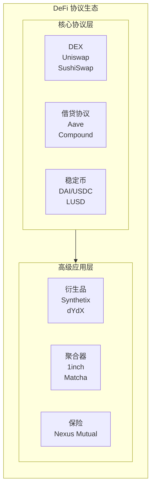
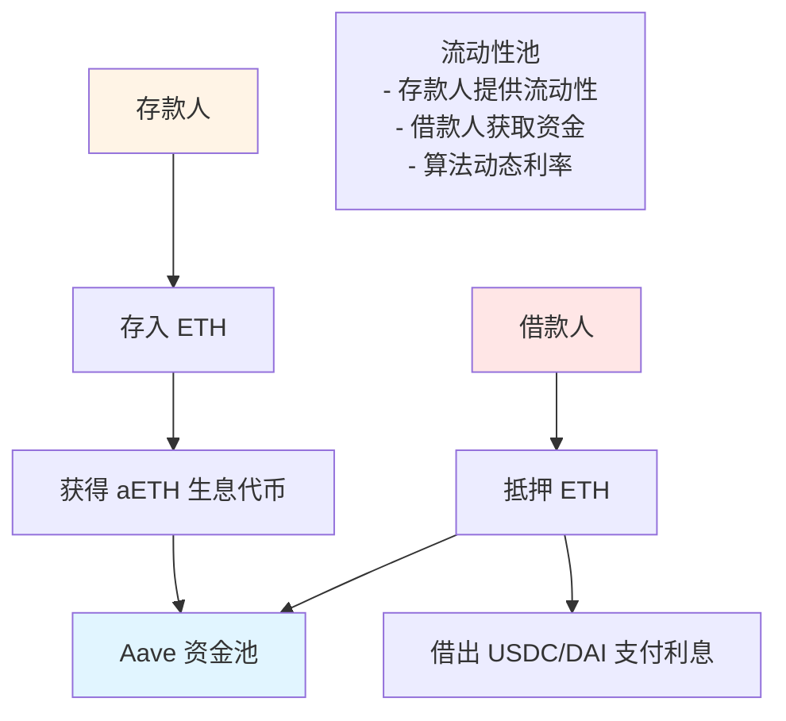
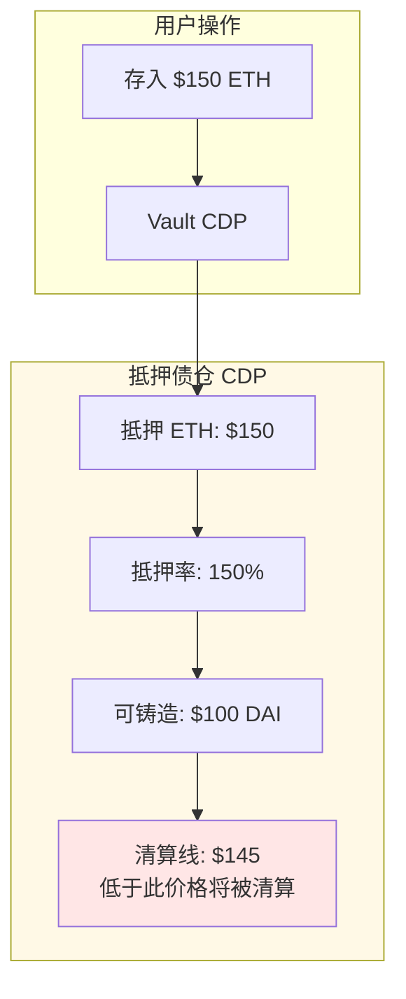
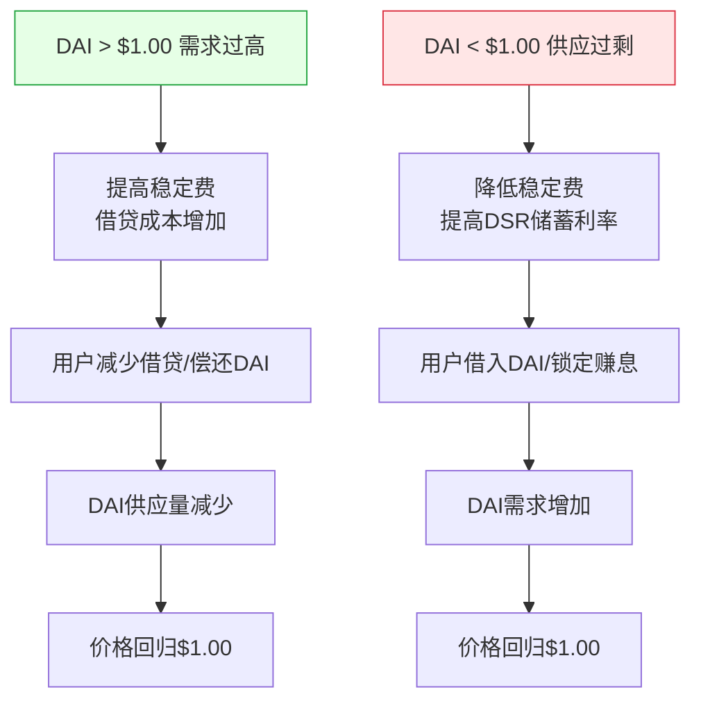

# 第13章 去中心化金融（DeFi）- Web3开发者精简版

> **核心定位**: DeFi是用智能合约重构传统金融服务，包括借贷、交易、衍生品、保险等，实现无需中介的金融系统。

---

## 一、DeFi 核心概念

### DeFi vs 传统金融（CeFi）

| 维度 | 传统金融（CeFi） | 去中心化金融（DeFi） | 优先级 |
|------|----------------|---------------------|--------|
| **中介** | 银行、券商 | 智能合约 | ⭐⭐⭐⭐⭐ |
| **准入门槛** | KYC、审核 | 有钱包即可 | ⭐⭐⭐⭐⭐ |
| **透明度** | 不透明（黑盒） | 完全透明（链上可查） | ⭐⭐⭐⭐⭐ |
| **运营时间** | 工作日9-5 | 7×24小时 | ⭐⭐⭐⭐ |
| **资金控制** | 机构托管 | 用户自托管 | ⭐⭐⭐⭐⭐ |
| **利率确定** | 机构决定 | 算法动态调整 | ⭐⭐⭐⭐ |
| **监管** | 严格监管 | 无监管/自监管 | ⭐⭐⭐ |
| **风险** | 机构倒闭风险 | 智能合约漏洞风险 | ⭐⭐⭐⭐⭐ |

### DeFi 核心协议类型




---

## 二、去中心化交易所（DEX）

### 1. 恒定乘积做市商（AMM）

**Uniswap V2 核心公式**：
```
x * y = k

x = 代币A的数量
y = 代币B的数量
k = 常数（流动性池的总价值）
```

**交易示例**：
```
初始状态：
- ETH: 100
- USDC: 200,000
- k = 100 * 200,000 = 20,000,000

用户用 1 ETH 购买 USDC：
- 新 ETH = 100 + 1 = 101
- 新 USDC = k / 101 = 198,019.8
- 用户获得 = 200,000 - 198,019.8 = 1,980.2 USDC

实际价格：1,980.2 USDC/ETH（略低于市价，因滑点）
```

### 2. Uniswap V2 核心合约

```solidity
// 简化的 UniswapV2Pair
contract UniswapV2Pair {
    IERC20 public token0;
    IERC20 public token1;
    
    uint public reserve0;
    uint public reserve1;
    uint public kLast; // 上一次记录的 k 值
    
    // 添加流动性
    function mint(address to) external returns (uint liquidity) {
        uint balance0 = token0.balanceOf(address(this));
        uint balance1 = token1.balanceOf(address(this));
        
        uint amount0 = balance0 - reserve0;
        uint amount1 = balance1 - reserve1;
        
        // 计算LP代币数量
        if (totalSupply == 0) {
            liquidity = sqrt(amount0 * amount1) - MINIMUM_LIQUIDITY;
        } else {
            liquidity = min(
                amount0 * totalSupply / reserve0,
                amount1 * totalSupply / reserve1
            );
        }
        
        require(liquidity > 0, "Insufficient liquidity");
        _mint(to, liquidity);
        
        reserve0 = balance0;
        reserve1 = balance1;
        kLast = reserve0 * reserve1;
    }
    
    // 兑换（swap）
    function swap(uint amount0Out, uint amount1Out, address to) external {
        require(amount0Out > 0 || amount1Out > 0, "Insufficient output");
        
        uint balance0 = token0.balanceOf(address(this));
        uint balance1 = token1.balanceOf(address(this));
        
        require(balance0 >= reserve0 + amount0Out, "Insufficient balance");
        require(balance1 >= reserve1 + amount1Out, "Insufficient balance");
        
        // 更新储备金
        reserve0 = balance0 - amount0Out;
        reserve1 = balance1 - amount1Out;
        
        // 验证 k 值（确保没有损害流动性提供者）
        require(reserve0 * reserve1 >= kLast, "K");
        
        // 转账给用户
        if (amount0Out > 0) token0.transfer(to, amount0Out);
        if (amount1Out > 0) token1.transfer(to, amount1Out);
    }
    
    // 计算兑换输出量
    function getAmountOut(uint amountIn, uint reserveIn, uint reserveOut) 
        public 
        pure 
        returns (uint amountOut) 
    {
        require(amountIn > 0, "Insufficient input");
        require(reserveIn > 0 && reserveOut > 0, "Insufficient liquidity");
        
        uint amountInWithFee = amountIn * 997; // 0.3% 手续费
        uint numerator = amountInWithFee * reserveOut;
        uint denominator = reserveIn * 1000 + amountInWithFee;
        
        amountOut = numerator / denominator;
    }
}
```

### 3. 前端交易实现

```javascript
import { ethers } from 'ethers';

// Uniswap V2 Router ABI（部分）
const ROUTER_ABI = [
  'function getAmountsOut(uint amountIn, address[] path) view returns (uint[] amounts)',
  'function swapExactTokensForTokens(uint amountIn, uint amountOutMin, address[] path, address to, uint deadline) returns (uint[] amounts)'
];

const ROUTER_ADDRESS = '0x7a250d5630B4cF539739dF2C5dAcb4c659F2488D';

async function swapTokens(
  signer,
  tokenIn,
  tokenOut,
  amountIn,
  slippage = 0.5 // 0.5% 滑点容忍
) {
  const router = new ethers.Contract(ROUTER_ADDRESS, ROUTER_ABI, signer);
  
  // 1. 查询预期输出
  const path = [tokenIn, tokenOut];
  const amounts = await router.getAmountsOut(
    ethers.parseEther(amountIn),
    path
  );
  const expectedOut = amounts[1];
  
  // 2. 计算最小输出（考虑滑点）
  const amountOutMin = expectedOut * (100 - slippage) / 100;
  
  // 3. 设置过期时间（5分钟后）
  const deadline = Math.floor(Date.now() / 1000) + 300;
  
  // 4. 授权 Router 花费代币
  const tokenContract = new ethers.Contract(tokenIn, ERC20_ABI, signer);
  await tokenContract.approve(ROUTER_ADDRESS, ethers.parseEther(amountIn));
  
  // 5. 执行交换
  const tx = await router.swapExactTokensForTokens(
    ethers.parseEther(amountIn),
    amountOutMin,
    path,
    await signer.getAddress(),
    deadline
  );
  
  console.log('交易已发送:', tx.hash);
  const receipt = await tx.wait();
  console.log('交换成功！');
  
  return receipt;
}
```

### 4. 无常损失（Impermanent Loss）

**概念**：当池中两种代币价格比例变化时，流动性提供者相比HODL会遭受损失。

**计算公式**：
```javascript
function calculateImpermanentLoss(priceRatio) {
  // priceRatio = 当前价格 / 初始价格
  const r = Math.sqrt(priceRatio);
  const il = 2 * r / (1 + r) - 1;
  return il * 100; // 转换为百分比
}

// 示例
console.log('价格上涨2倍:', calculateImpermanentLoss(2)); // -5.72%
console.log('价格上涨5倍:', calculateImpermanentLoss(5)); // -25.46%
console.log('价格上涨10倍:', calculateImpermanentLoss(10)); // -41.42%
```

**降低无常损失的方法**：
- 选择价格相关性高的代币对（如 ETH/WBTC、稳定币对）
- 使用集中流动性（Uniswap V3）
- 获取更高的交易手续费补偿

---

## 三、借贷协议

### 1. Aave 借贷机制



### 2. 借贷合约核心逻辑

```solidity
// 简化的借贷合约
contract LendingPool {
    IERC20 public collateralToken;
    IERC20 public borrowToken;
    
    uint public constant LTV = 75; // 75% 贷款价值比
    uint public constant LIQUIDATION_THRESHOLD = 80; // 清算阈值
    
    mapping(address => uint) public collateral;
    mapping(address => uint) public borrows;
    
    // 存款
    function deposit(uint amount) external {
        collateralToken.transferFrom(msg.sender, address(this), amount);
        collateral[msg.sender] += amount;
    }
    
    // 借款
    function borrow(uint amount) external {
        // 计算抵押率
        uint collateralValue = getCollateralValue(collateral[msg.sender]);
        uint borrowValue = getBorrowValue(amount);
        
        require(
            borrowValue * 100 <= collateralValue * LTV,
            "Insufficient collateral"
        );
        
        borrows[msg.sender] += amount;
        borrowToken.transfer(msg.sender, amount);
    }
    
    // 还款
    function repay(uint amount) external {
        require(borrows[msg.sender] >= amount, "Repay too much");
        
        borrowToken.transferFrom(msg.sender, address(this), amount);
        borrows[msg.sender] -= amount;
    }
    
    // 提取抵押品
    function withdraw(uint amount) external {
        require(collateral[msg.sender] >= amount, "Insufficient collateral");
        
        uint newCollateral = collateral[msg.sender] - amount;
        uint collateralValue = getCollateralValue(newCollateral);
        uint borrowValue = getBorrowValue(borrows[msg.sender]);
        
        require(
            borrowValue * 100 <= collateralValue * LTV,
            "Health factor too low"
        );
        
        collateral[msg.sender] = newCollateral;
        collateralToken.transfer(msg.sender, amount);
    }
    
    // 清算（任何人可以清算健康度不足的账户）
    function liquidate(address borrower, uint repayAmount) external {
        uint collateralValue = getCollateralValue(collateral[borrower]);
        uint borrowValue = getBorrowValue(borrows[borrower]);
        
        require(
            borrowValue * 100 > collateralValue * LIQUIDATION_THRESHOLD,
            "Not eligible for liquidation"
        );
        
        // 清算者代为还款
        borrowToken.transferFrom(msg.sender, address(this), repayAmount);
        borrows[borrower] -= repayAmount;
        
        // 清算者获得抵押品（含10%罚金）
        uint collateralToSeize = repayAmount * 110 / 100;
        collateral[borrower] -= collateralToSeize;
        collateralToken.transfer(msg.sender, collateralToSeize);
    }
    
    // 获取抵押品价值（需要预言机）
    function getCollateralValue(uint amount) public view returns (uint) {
        // 实际实现需要调用价格预言机
        return amount * 2000; // 假设 ETH = $2000
    }
    
    function getBorrowValue(uint amount) public view returns (uint) {
        return amount; // 假设借出的是稳定币
    }
}
```

### 3. 健康因子计算

```javascript
function calculateHealthFactor(
  collateralValue,
  borrowValue,
  liquidationThreshold
) {
  // 健康因子 = (抵押品价值 × 清算阈值) / 借贷价值
  const healthFactor = (collateralValue * liquidationThreshold) / borrowValue;
  return healthFactor;
}

// 示例
const collateralValue = 10000; // $10,000
const borrowValue = 6000; // $6,000
const liquidationThreshold = 0.80; // 80%

const healthFactor = calculateHealthFactor(
  collateralValue,
  borrowValue,
  liquidationThreshold
);

console.log('健康因子:', healthFactor); // 1.33

// 健康因子 < 1 时会被清算
if (healthFactor < 1) {
  console.log('⚠️ 账户面临清算风险！');
}
```

---

## 四、稳定币机制

### 1. 稳定币类型对比

| 类型 | 代表 | 抵押方式 | 优势 | 风险 | 优先级 |
|------|------|---------|------|------|--------|
| **法币抵押** | USDC, USDT | 银行储备金 | 稳定性高、流动性好 | 中心化、审查风险 | ⭐⭐⭐⭐⭐ |
| **加密资产抵押** | DAI, LUSD | 超额抵押ETH | 去中心化、透明 | 抵押品价格波动 | ⭐⭐⭐⭐⭐ |
| **算法稳定币** | FRAX（部分） | 算法调节 | 资本效率高 | 死亡螺旋风险 | ⭐⭐⭐ |
| **商品抵押** | PAXG | 黄金储备 | 抗通胀 | 托管风险 | ⭐⭐⭐ |

### 2. MakerDAO DAI 机制



### 3. DAI 稳定机制



---

## 五、DeFi 组合性（Money Legos）

### 什么是组合性？

```
DeFi 协议可以像乐高积木一样组合使用：

Example: 收益最大化策略

Step 1: 在 Aave 存入 ETH 获得 aETH
Step 2: 用 aETH 在 Compound 抵押借出 USDC
Step 3: 用 USDC 在 Uniswap 提供流动性
Step 4: 获得 LP 代币在 Yearn 自动复投

所有协议通过标准化接口（ERC-20）无缝连接！
```

### 实战示例：闪电贷套利

```solidity
// 使用 Aave 闪电贷进行套利
import "@aave/core-v3/contracts/flashloan/base/FlashLoanSimpleReceiverBase.sol";

contract FlashLoanArbitrage is FlashLoanSimpleReceiverBase {
    address public owner;
    
    constructor(address _addressProvider) 
        FlashLoanSimpleReceiverBase(IPoolAddressesProvider(_addressProvider)) 
    {
        owner = msg.sender;
    }
    
    // 执行闪电贷
    function executeFlashLoan(
        address asset,
        uint256 amount
    ) external onlyOwner {
        // 闪电贷无需抵押，但需要在同一个交易中还款
        bytes memory params = "";
        uint16 referralCode = 0;
        
        POOL.flashLoanSimple(
            address(this),
            asset,
            amount,
            params,
            referralCode
        );
    }
    
    // 闪电贷回调函数
    function executeOperation(
        address asset,
        uint256 amount,
        uint256 premium,
        address initiator,
        bytes calldata params
    ) external override returns (bool) {
        // 1. 检查调用者
        require(msg.sender == address(POOL), "Invalid caller");
        
        // 2. 执行套利逻辑
        // - 在 DEX A 用 USDC 购买 ETH
        // - 在 DEX B 用 ETH 换回 USDC
        // - 如果有利可图，继续
        bool success = _executeArbitrage(asset, amount);
        require(success, "Arbitrage failed");
        
        // 3. 还款（本金 + 手续费）
        uint256 amountOwed = amount + premium;
        IERC20(asset).approve(address(POOL), amountOwed);
        
        return true;
    }
    
    function _executeArbitrage(address asset, uint256 amount) 
        internal 
        returns (bool) 
    {
        // 简化的套利逻辑
        // 实际实现需要调用多个 DEX 合约
        
        // 假设：
        // DEX A: 1 ETH = 2000 USDC
        // DEX B: 1 ETH = 2010 USDC
        // 利润: 10 USDC per ETH
        
        return true;
    }
    
    modifier onlyOwner() {
        require(msg.sender == owner, "Not owner");
        _;
    }
}
```

---

## 六、DeFi 安全风险

### 1. 主要风险类型

| 风险类型 | 描述 | 案例 | 损失金额 | 优先级 |
|---------|------|------|---------|--------|
| **智能合约漏洞** | 代码bug被利用 | The DAO攻击 | $60M | ⭐⭐⭐⭐⭐ |
| **闪电贷攻击** | 操纵价格进行套利 | bZx攻击 | $8M | ⭐⭐⭐⭐⭐ |
| **预言机操纵** | 喂价被操纵 | Cream Finance | $18M | ⭐⭐⭐⭐⭐ |
| **治理攻击** | 恶意提案通过 | Beanstalk | $182M | ⭐⭐⭐⭐ |
| **前端攻击** | 钓鱼网站/恶意更新 | Badger DAO | $120M | ⭐⭐⭐⭐ |
| **私钥泄露** | 管理员密钥被盗 | Poly Network | $611M | ⭐⭐⭐⭐⭐ |

### 2. 闪电贷攻击原理

```
攻击步骤：

1. 借入巨额资金（闪电贷，无需抵押）
   ↓
2. 在 DEX A 大量购买代币 X（推高价格）
   ↓
3. 协议使用被操纵的价格作为抵押品估值
   ↓
4. 借出超过实际价值的资金
   ↓
5. 在 DEX B 卖出代币 X（价格回落）
   ↓
6. 归还闪电贷
   ↓
7. 保留利润
```

**防护措施**：
```solidity
✅ 使用 TWAP（时间加权平均价格）
✅ 多预言机验证
✅ 限制单笔交易规模
✅ 设置价格偏差阈值
```

---

## 七、DeFi 开发实战

### 实现简单的流动性挖矿

```solidity
// SPDX-License-Identifier: MIT
pragma solidity ^0.8.20;

import "@openzeppelin/contracts/token/ERC20/IERC20.sol";
import "@openzeppelin/contracts/security/ReentrancyGuard.sol";

contract YieldFarming is ReentrancyGuard {
    IERC20 public stakingToken;
    IERC20 public rewardToken;
    
    uint public rewardRate = 100 * 10 ** 18; // 每天 100 个奖励代币
    uint public lastUpdateTime;
    uint public rewardPerTokenStored;
    
    mapping(address => uint) public userRewardPerTokenPaid;
    mapping(address => uint) public rewards;
    mapping(address => uint) public balanceOf;
    
    uint private _totalSupply;
    
    constructor(address _stakingToken, address _rewardToken) {
        stakingToken = IERC20(_stakingToken);
        rewardToken = IERC20(_rewardToken);
        lastUpdateTime = block.timestamp;
    }
    
    // 质押
    function stake(uint amount) external nonReentrant {
        require(amount > 0, "Amount must be > 0");
        
        _updateReward(msg.sender);
        
        balanceOf[msg.sender] += amount;
        _totalSupply += amount;
        
        stakingToken.transferFrom(msg.sender, address(this), amount);
    }
    
    // 提取
    function withdraw(uint amount) external nonReentrant {
        require(amount > 0, "Amount must be > 0");
        
        _updateReward(msg.sender);
        
        balanceOf[msg.sender] -= amount;
        _totalSupply -= amount;
        
        stakingToken.transfer(msg.sender, amount);
    }
    
    // 领取奖励
    function getReward() external nonReentrant {
        _updateReward(msg.sender);
        
        uint reward = rewards[msg.sender];
        require(reward > 0, "No reward");
        
        rewards[msg.sender] = 0;
        rewardToken.transfer(msg.sender, reward);
    }
    
    // 内部更新函数
    function _updateReward(address account) internal {
        rewardPerTokenStored = rewardPerToken();
        lastUpdateTime = block.timestamp;
        
        if (account != address(0)) {
            rewards[account] = earned(account);
            userRewardPerTokenPaid[account] = rewardPerTokenStored;
        }
    }
    
    function rewardPerToken() public view returns (uint) {
        if (_totalSupply == 0) {
            return rewardPerTokenStored;
        }
        
        return rewardPerTokenStored + 
            ((block.timestamp - lastUpdateTime) * rewardRate * 1e18 / _totalSupply);
    }
    
    function earned(address account) public view returns (uint) {
        return balanceOf[account] * 
            (rewardPerToken() - userRewardPerTokenPaid[account]) / 1e18 + 
            rewards[account];
    }
    
    function totalSupply() external view returns (uint) {
        return _totalSupply;
    }
}
```

---

## 八、自测题

### 题目1：什么是无常损失？如何降低？

**答案**：
- **无常损失**：当AMM池中代币价格比例变化时，LP相比HODL的损失
- **原因**：套利者利用价格差异，导致LP持有的代币比例变化
- **降低方法**：
  1. 选择价格相关性高的代币对（稳定币对、ETH/WBTC）
  2. 使用集中流动性（Uniswap V3）
  3. 获取足够高的手续费补偿
  4. 短期提供流动性

### 题目2：闪电贷攻击的原理是什么？如何防护？

**答案**：
- **原理**：
  1. 借入巨额资金（无需抵押）
  2. 操纵DEX价格
  3. 利用被操纵的价格进行套利
  4. 归还闪电贷，保留利润

- **防护**：
  1. 使用TWAP（时间加权平均价格）
  2. 多预言机数据源验证
  3. 限制单笔交易规模
  4. 设置价格偏差检查

### 题目3：健康因子是什么？如何计算？

**答案**：
```
健康因子 = (抵押品价值 × 清算阈值) / 借贷价值

示例：
- 抵押品: 10 ETH @ $2000 = $20,000
- 借贷: $12,000 USDC
- 清算阈值: 80%

健康因子 = ($20,000 × 0.80) / $12,000 = 1.33

健康因子 < 1 时会被清算
```

---

## 本章总结

### 核心要点

1. **DeFi = 传统金融的链上重构**：借贷、交易、衍生品全部代码化
2. **AMM是DEX核心**：x*y=k 公式实现无需订单簿的交易
3. **借贷需要超额抵押**：LTV通常75%，清算阈值80%
4. **稳定币有不同类型**：法币抵押（USDC）、加密抵押（DAI）、算法
5. **组合性是DeFi最大优势**：协议间可以无缝组合
6. **安全风险极高**：合约漏洞、闪电贷攻击、预言机操纵

### 开发者检查清单

```
DeFi 开发必查：
✅ 使用经过审计的库（OpenZeppelin）
✅ 实现完整的访问控制
✅ 使用 CEI 模式防止重入
✅ 集成可靠的预言机
✅ 检查价格新鲜度和有效性
✅ 设置合理的清算参数
✅ 实现紧急暂停机制
✅ 进行全面的测试和审计
```

### 下一步行动

1. **实战练习**：在测试网部署简单的DEX和借贷合约
2. **研究协议**：深入分析Uniswap、Aave的源代码
3. **学习安全**：研究DeFi攻击案例和防护方法
4. **跟踪发展**：关注DeFi新协议和创新
5. **参与治理**：参与DAO投票，理解去中心化治理

---

**一句话收尾**: DeFi是金融民主化的实验场——它用代码替代中介，用透明替代信任，但同时也带来了前所未有的技术风险；理解其机制、尊重其风险，才能在这个新世界中安全航行。
