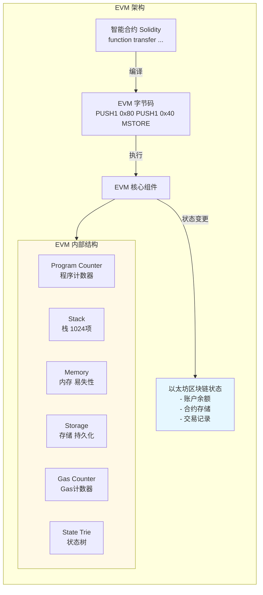
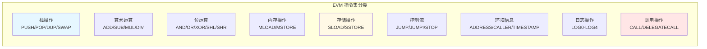

# 第14章 以太坊虚拟机（EVM）- Web3开发者精简版

> **核心定位**: EVM是以太坊的"全球计算机"，负责执行智能合约字节码，管理状态转换，是以太坊的核心引擎。

---

## 一、EVM 架构概览

### EVM 核心组件



### EVM vs 传统虚拟机

| 特性 | EVM | JVM (Java) | V8 (JavaScript) | 优先级 |
|------|-----|-----------|----------------|--------|
| **执行环境** | 去中心化节点网络 | 单台机器 | 浏览器/Node.js | ⭐⭐⭐⭐⭐ |
| **确定性** | 强确定性（所有节点结果一致） | 确定性 | 确定性 | ⭐⭐⭐⭐⭐ |
| **资源限制** | Gas限制 | 内存限制 | 内存限制 | ⭐⭐⭐⭐⭐ |
| **状态持久化** | 区块链存储 | 本地文件系统 | 本地存储 | ⭐⭐⭐⭐⭐ |
| **安全性** | 沙箱隔离（无法访问外部） | 可访问系统资源 | 受限访问 | ⭐⭐⭐⭐⭐ |
| **性能** | 较慢（~20 TPS） | 快 | 快 | ⭐⭐⭐ |

---

## 二、EVM 执行模型详解

### 1. 基于栈的架构

```
EVM 是栈式虚拟机，所有操作都在栈上进行：

示例：计算 a + b * c

Solidity:
  uint result = a + b * c;

EVM 字节码执行过程：

栈操作：
PUSH1 a        → Stack: [a]
PUSH1 b        → Stack: [a, b]
PUSH1 c        → Stack: [a, b, c]
MUL            → Stack: [a, (b*c)]
ADD            → Stack: [(a+b*c)]

最终结果在栈顶
```

**栈的特性**：
- 最大深度：1024层
- 每项：256位（32字节）
- 操作：PUSH（入栈）、POP（出栈）
- Gas消耗：栈操作非常便宜（3 Gas）

### 2. 内存（Memory）

```
内存特性：
- 易失性：每次交易后清零
- 线性地址空间：0 到 2^256-1
- 访问方式：字节寻址
- Gas成本：随使用量线性增长

内存布局：

0x00 ────────────────────────────
     │  空闲区域                  │
     │                           │
     │  动态分配区                │
     │  - 函数参数                │
     │  - 局部变量                │
     │  - 返回值                  │
     └───────────────────────────
```

**内存操作示例**：
```solidity
// Solidity 代码
function testMemory() public pure returns (uint) {
    uint[] memory arr = new uint[](3);
    arr[0] = 1;
    arr[1] = 2;
    arr[2] = 3;
    return arr[0] + arr[1] + arr[2];
}

// 对应的 EVM 操作
MLOAD     // 从内存加载
MSTORE    // 存储到内存
MSIZE     // 获取内存大小
```

### 3. 存储（Storage）

```
存储特性：
- 持久化：交易结束后仍保留
- 键值对：256位键 → 256位值
- 地址空间：2^256 个槽位
- Gas成本：昂贵（读100 Gas，写20000 Gas）

存储布局（状态变量顺序）：

Slot 0: 第一个状态变量
Slot 1: 第二个状态变量
Slot 2: 第三个状态变量
...

合约创建时确定，不可更改
```

**存储 vs 内存对比**：

| 特性 | Storage | Memory | 优先级 |
|------|---------|--------|--------|
| **持久性** | 永久保存 | 交易结束清除 | ⭐⭐⭐⭐⭐ |
| **Gas成本** | 读100，写20000 | 读3，写3 | ⭐⭐⭐⭐⭐ |
| **用途** | 状态变量 | 临时变量、函数参数 | ⭐⭐⭐⭐⭐ |
| **访问速度** | 慢 | 快 | ⭐⭐⭐⭐ |
| **容量** | 2^256 槽位 | 无限制（但Gas限制） | ⭐⭐⭐ |

---

## 三、EVM 指令集（Opcodes）

### 1. 核心指令分类



### 2. Gas 消耗详解

**关键指令 Gas 成本：**

| 操作类型 | Gas 成本 | 说明 |
|---------|---------|------|
| **STOP** | 0 | 停止执行 |
| **ADD, SUB** | 3 | 基础算术 |
| **MUL, DIV** | 5 | 乘除运算 |
| **SLOAD** | 100 (热) / 2100 (冷) | 读取存储 |
| **SSTORE** | 100 (更新) / 20000 (新增) | 写入存储（最贵） |
| **MLOAD, MSTORE** | 3 | 内存操作 |
| **JUMP, JUMPI** | 8 | 跳转指令 |
| **CALL** | 40 + 调用成本 | 外部调用 |
| **LOG0-LOG4** | 375 + 数据成本 | 事件日志 |
| **SHA3** | 30 + 6×字数 | 哈希计算 |
| **CREATE** | 32000 | 创建合约 |
| **SELFDESTRUCT** | 5000 (首次) / 0 (后续) | 自毁合约 |

Gas 优化技巧：
✅ 使用 memory 而非 storage（临时数据）
✅ 批量更新存储（减少 SSTORE 次数）
✅ 使用事件记录日志（比存储便宜10-20倍）
✅ 避免循环中的存储操作
```

---

## 四、合约执行流程

### 1. 交易到执行的完整流程

```
用户发起交易
    ↓
[1] 交易进入内存池（Mempool）
    ↓
[2] 矿工/验证者选择交易
    ↓
[3] 验证交易签名和 nonce
    ↓
[4] 扣除基础 Gas 费用（21000 Gas）
    ↓
[5] EVM 创建执行环境
    ├─ 初始化栈（空）
    ├─ 初始化内存（空）
    ├─ 加载合约存储
    └─ 设置环境信息（msg.sender, msg.value等）
    ↓
[6] 逐条执行字节码指令
    ├─ 从 Program Counter 读取指令
    ├─ 执行指令（可能修改栈/内存/存储）
    ├─ 更新 Gas 计数器
    └─ 如果 Gas 耗尽 → REVERT
    ↓
[7] 执行完成
    ├─ 成功 → 提交状态变更
    └─ 失败 → REVERT（回滚状态，消耗Gas）
    ↓
[8] 计算实际 Gas 消耗
    ├─ 退还剩余 Gas
    └─ 记录交易收据
    ↓
[9] 交易打包进区块
```

### 2. 合约调用类型

```solidity
// 四种调用方式对比

contract Target {
    uint public value;
    
    function setValue(uint _value) public {
        value = _value;
    }
    
    function getValue() public view returns (uint) {
        return value;
    }
}

contract Caller {
    Target public target;
    
    // 1. CALL - 最常用的调用
    function callSetValue(uint _value) public {
        // 修改目标合约状态
        // msg.sender = Caller 合约地址
        // msg.value = 0
        target.setValue(_value);
    }
    
    // 2. DELEGATECALL - 代理模式核心
    function delegateCallSetValue(uint _value) public {
        // 在 Caller 合约上下文中执行 Target 代码
        // 修改的是 Caller 的存储
        // msg.sender = 原始调用者
        // ⚠️ 风险：如果 Target 被恶意替换，可操纵 Caller 存储
    }
    
    // 3. STATICCALL - 只读调用
    function staticCallGetValue() public view returns (uint) {
        // 只能读取，不能修改状态
        // 如果 Target 尝试修改状态，会 REVERT
        return target.getValue();
    }
    
    // 4. CALLCODE (已废弃)
    // 类似 DELEGATECALL，但 msg.sender 不同
    // 不推荐使用
}
```

---

## 五、EVM 状态机

### 以太坊是状态机

```
状态机定义：
当前状态 + 交易 = 新状态

以太坊状态：
├─ 世界状态（World State）
│  ├─ 所有账户的余额
│  ├─ 所有合约的存储
│  └─ 账户 nonce
│
├─ 交易（Transaction）
│  ├─ from, to, value
│  ├─ data（调用合约的输入）
│  └─ gas, gasPrice
│
└─ 新状态
   ├─ 更新余额
   ├─ 更新合约存储
   └─ 递增 nonce

示例：
初始状态:
  Alice: 10 ETH
  Bob: 5 ETH
  合约X: storage[0] = 100

交易: Alice → Bob 转账 2 ETH

新状态:
  Alice: 8 ETH (-2 - gas)
  Bob: 7 ETH (+2)
  合约X: storage[0] = 100 (不变)
```

### 状态树结构

```
以太坊使用 Merkle Patricia Trie 存储状态：

世界状态树（State Trie）
├─ 账户A
│  ├─ nonce
│  ├─ balance
│  ├─ storageRoot → 存储树
│  └─ codeHash → 合约代码
│
├─ 账户B
│  └─ ...
│
└─ 合约C
   ├─ nonce
   ├─ balance
   ├─ storageRoot → 存储树
   │  ├─ slot 0: value
   │  ├─ slot 1: value
   │  └─ ...
   └─ codeHash

每个区块都有状态根哈希（stateRoot）
轻客户端可以通过 Merkle 证明验证账户状态
```

---

## 六、EVM 升级与 EIP

### 1. 重大 EIP 对 EVM 的影响

| EIP | 名称 | 影响 | 激活时间 | 优先级 |
|-----|------|------|---------|--------|
| **EIP-1559** | 费用市场改革 | 引入 baseFee，改进 Gas 定价 | 2021-08 | ⭐⭐⭐⭐⭐ |
| **EIP-2929** | Gas 成本增加 | 提高 SLOAD/CALL 等冷访问成本 | 2020-09 | ⭐⭐⭐⭐ |
| **EIP-3529** | 降低 Gas 退款 | 减少 SELFDESTRUCT 退款，防止存储膨胀 | 2021-08 | ⭐⭐⭐⭐ |
| **EIP-3541** | 新合约前缀 | 0xEF 开头的合约无法部署（为未来升级保留） | 2021-08 | ⭐⭐⭐ |
| **EIP-3860** | 限制初始化代码 | 最大 initcode 49152 字节 | 2023-04 | ⭐⭐⭐⭐ |
| **EIP-4844** | 数据 Blob | 引入 Blob 交易，降低 L2 成本 | 2024-03 | ⭐⭐⭐⭐⭐ |
| **EIP-4788** | Beacon 根 | 在 EVM 中暴露信标链根 | 2024-03 | ⭐⭐⭐ |
| **EIP-7702** | 设置 EOA 代码 | 允许 EOA 临时变成合约 | 2025-Q1 | ⭐⭐⭐⭐⭐ |

### 2. EVM 字节码逆向工程

```
工具：
- ethers.js: `provider.getCode(address)` 获取字节码
- Heimdall-rs: 反编译 EVM 字节码
- Panoramix: 在线反编译器
- Dedaub: 高级反编译和分析

示例：
const bytecode = await provider.getCode('0x...');
console.log(bytecode);
// 输出: 0x60806040526004361061003f5760003560e01c8063...

反编译后：
// SPDX-License-Identifier: MIT
pragma solidity ^0.8.0;

contract Decompiled {
    mapping(address => uint256) public balances;
    
    function deposit() public payable {
        balances[msg.sender] += msg.value;
    }
    
    function withdraw(uint256 amount) public {
        require(balances[msg.sender] >= amount);
        balances[msg.sender] -= amount;
        payable(msg.sender).transfer(amount);
    }
}
```

---

## 七、EVM 兼容性链

### EVM 兼容链对比

| 链 | Gas 费用 | TPS | 兼容性 | 优势 | 风险 |
|---|---------|-----|--------|------|------|
| **Ethereum** | $1-50 | 15-30 | 原生 | 最安全、最去中心化 | Gas贵 |
| **Polygon** | $0.01-0.1 | 7000 | 完全兼容 | 低费用、快速 | 中心化程度高 |
| **BSC** | $0.1-0.5 | 2000 | 完全兼容 | 低费用、生态丰富 | 中心化严重 |
| **Arbitrum** | $0.1-1 | 4000 | 完全兼容 | 安全性继承L1 | 退出延迟 |
| **Optimism** | $0.1-1 | 2000 | 完全兼容 | 安全性继承L1 | 退出延迟 |
| **Avalanche C-Chain** | $0.1-0.5 | 4500 | 完全兼容 | 快速确认 | 生态较小 |

**部署多链的考虑**：
```solidity
// 使用链 ID 进行链特定逻辑
function getChainId() public view returns (uint) {
    uint256 id;
    assembly {
        id := chainid()
    }
    return id;
}

function isMainnet() public view returns (bool) {
    return getChainId() == 1; // Ethereum Mainnet
}

function isPolygon() public view returns (bool) {
    return getChainId() == 137; // Polygon
}
```

---

## 八、自测题

### 题目1：EVM 的存储（Storage）和内存（Memory）有什么区别？

**答案**：
| 维度 | Storage | Memory |
|------|---------|--------|
| **持久性** | 永久保存 | 交易结束清除 |
| **Gas成本** | 读100，写20000 | 读3，写3 |
| **用途** | 状态变量 | 临时变量、函数参数 |
| **容量** | 2^256 槽位 | 无限制 |

### 题目2：CALL 和 DELEGATECALL 的区别是什么？

**答案**：
| 维度 | CALL | DELEGATECALL |
|------|------|--------------|
| **执行上下文** | 目标合约 | 调用者合约 |
| **修改存储** | 目标合约存储 | 调用者合约存储 |
| **msg.sender** | 调用者合约地址 | 原始调用者 |
| **msg.value** | 传递 | 传递 |
| **用途** | 普通调用 | 代理模式、升级合约 |
| **风险** | 低 | 高（需信任目标合约） |

### 题目3：为什么 EVM 需要 Gas 机制？

**答案**：
1. **防止无限循环**：Gas 耗尽自动停止执行
2. **资源定价**：计算、存储、带宽都需要成本
3. **抗 DoS 攻击**：恶意交易需要支付费用
4. **激励矿工**：Gas 费奖励给打包交易的验证者
5. **优先级排序**：高 Gas 价格的交易优先被打包

---

## 本章总结

### 核心要点

1. **EVM 是基于栈的虚拟机**：所有操作在栈上进行，最大1024层
2. **三种存储区域**：Stack（栈）、Memory（内存，易失）、Storage（存储，持久）
3. **Gas 是资源计量单位**：防止滥用，保障网络安全
4. **以太坊是状态机**：交易驱动状态转换
5. **EVM 升级通过 EIP**：持续改进性能和功能
6. **EVM 兼容链众多**：但安全性和去中心化程度不同

### 开发者检查清单

```
EVM 开发必查：
✅ 理解 Gas 成本，优化存储访问
✅ 区分 memory 和 storage 的使用场景
✅ 了解四种调用方式（CALL/DELEGATECALL/STATICCALL/CALLCODE）
✅ 使用最新 Solidity 版本（自动溢出检查）
✅ 测试网充分测试 Gas 消耗
✅ 监控 EIP 升级，及时调整代码
✅ 使用 Hardhat/Foundry 进行本地调试
```

### 下一步行动

1. **深入学习**：阅读黄皮书（Ethereum Yellow Paper）
2. **字节码分析**：使用 Heimdall-rs 反编译合约
3. **Gas 优化**：学习 Gas Golfing 技巧
4. **追踪升级**：关注 EIP 提案和以太坊升级路线
5. **跨链部署**：在多个 EVM 链上测试合约

---

**一句话收尾**: EVM 是以太坊的灵魂——理解其执行模型、存储机制和 Gas 经济学，才能写出高效、安全的智能合约。
