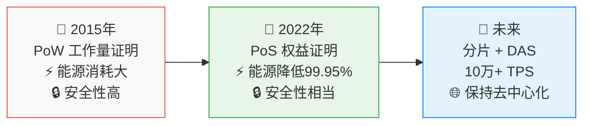
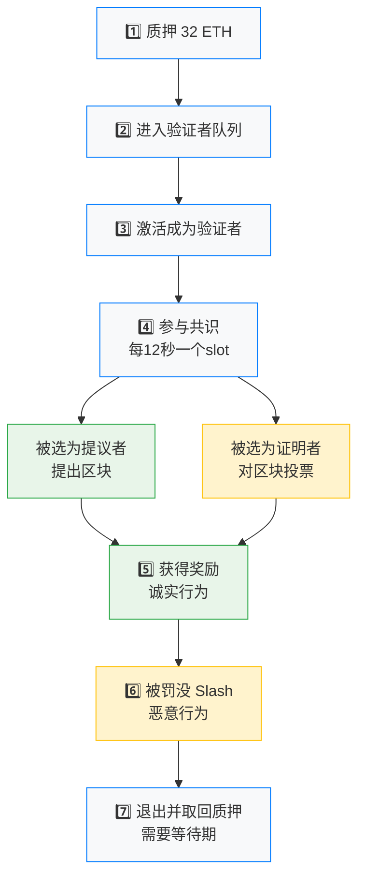
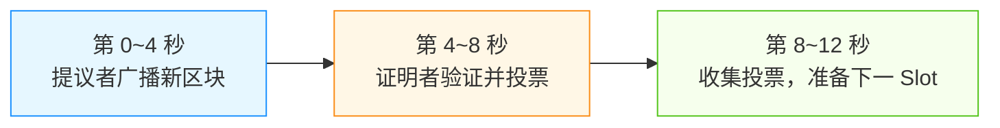
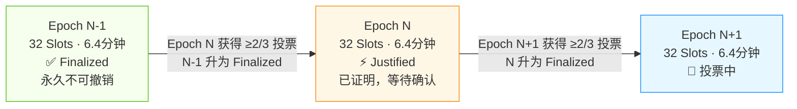
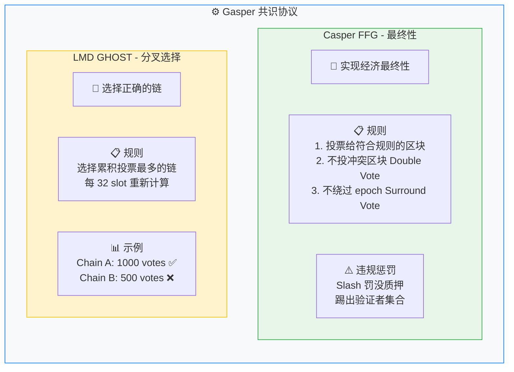
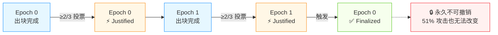
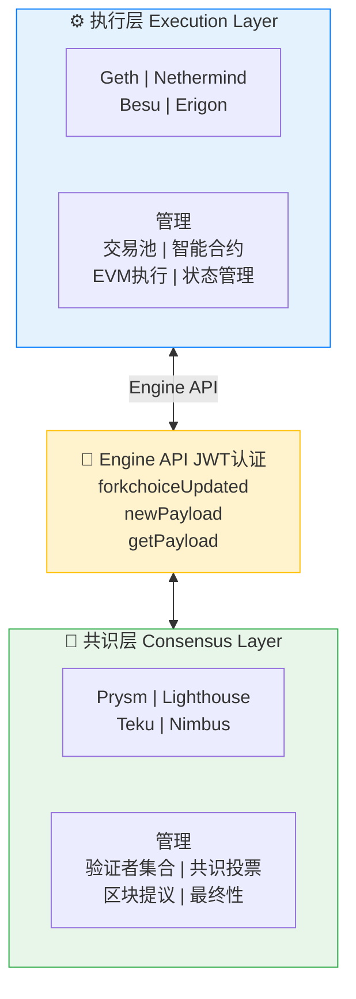

# 第15章 共识机制 - Web3开发者精简版

> **核心定位**: 共识机制是区块链的"民主决策系统"，确保所有节点在无信任环境下就区块链状态达成一致。

---

## 一、共识机制演进

### 以太坊共识升级历程



### PoW vs PoS 核心对比

| 维度 | PoW（工作量证明） | PoS（权益证明） | 优先级 |
|------|----------------|----------------|--------|
| **共识方式** | 算力竞争（挖矿） | 质押代币（验证者） | ⭐⭐⭐⭐⭐ |
| **能源消耗** | 极高（~150 TWh/年） | 极低（~0.01 TWh/年） | ⭐⭐⭐⭐⭐ |
| **硬件要求** | 专用矿机（ASIC） | 普通服务器（32 ETH） | ⭐⭐⭐⭐ |
| **准入门槛** | 资本密集（矿机+电费） | 32 ETH 质押 | ⭐⭐⭐⭐ |
| **安全性** | 51%算力攻击 | 51%质押攻击 | ⭐⭐⭐⭐⭐ |
| **去中心化** | 矿池集中化 | 验证者更分散 | ⭐⭐⭐⭐ |
| **通胀率** | 固定发行 | 动态调整 | ⭐⭐⭐⭐ |
| **最终性** | 概率性（6个区块） | 确定性（~15分钟） | ⭐⭐⭐⭐⭐ |

---

## 二、PoS 共识机制详解

### 1. 验证者（Validator）角色



**验证者、提议者、证明者的区别**

验证者是**身份**，提议者和证明者是验证者在每个 Slot 里被随机分配的**职责**。

| | 提议者 | 证明者 |
|---|---|---|
| 每个 Slot 几个 | 1 个 | 其余所有验证者 |
| 做什么 | 打包交易，提出新区块 | 对提议的区块投票，表示认可 |
| 类比 | 出题人 | 阅卷人 |

一个 Slot（12秒）内的分工：



> 每个验证者每个 Slot 都会被随机分配为提议者或证明者，下一个 Slot 重新分配。

### 2. 时隙（Slot）与纪元（Epoch）

```
时间结构：

Slot（时隙）: 12 秒
  ├─ 每个 slot 有一个提议者（Proposer）
  ├─ 提议者提出一个区块
  └─ 所有验证者对区块投票（Attestation）
  
Epoch（纪元）: 32 slots = 6.4 分钟
  ├─ 每 32 个 slot 组成一个 epoch
  ├─ epoch 结束时进行最终性检查（Finality）
  └─ 更新验证者集合

Finality（最终性）:
  ├─ 需要连续 2 个 epoch 的投票
  ├─ 约 12.8 分钟达到最终性
  └─ 最终确认的区块无法回滚
```

**Epoch 状态流转**：



### 3. 验证者选择算法

```
RANDAO + VDF（可验证延迟函数）

步骤：
1. 每个验证者提交随机数承诺
2. 聚合所有承诺生成随机种子
3. 使用种子 + 验证者余额计算权重
4. 选择提议者和证明者委员会

伪代码：
function selectProposer(epoch, slot) {
  // 获取随机种子
  seed = getRandaoMix(epoch);
  
  // 计算索引
  index = compute_shuffled_index(
    slot % SLOTS_PER_EPOCH,
    slot,
    seed
  );
  
  // 返回验证者
  return validators[index];
}
```

---

## 三、区块提议与证明

### 1. 提议者（Proposer）职责

```solidity
// 简化的区块提议流程
struct BeaconBlock {
    uint64 slot;              // 时隙号
    uint64 proposer_index;    // 提议者索引
    bytes32 parent_root;      // 父区块根哈希
    bytes32 state_root;       // 状态根
    bytes32 body_root;        // 区块体根
    
    BeaconBlockBody body;     // 区块体
}

struct BeaconBlockBody {
    Deposit[] deposits;       // 存款
    Attestation[] attestations; // 证明（投票）
    Transaction[] transactions; // 执行层交易
    // ... 其他字段
}

// 提议者创建区块
function proposeBlock() {
    // 1. 获取父区块
    parent = getHeadBlock();
    
    // 2. 收集交易（从执行层）
    transactions = getPendingTransactions();
    
    // 3. 收集证明（投票）
    attestations = getAttestations();
    
    // 4. 构建区块
    block = BeaconBlock {
        slot: currentSlot(),
        proposer_index: myIndex(),
        parent_root: parent.hash(),
        body: BeaconBlockBody {
            transactions: transactions,
            attestations: attestations,
            // ...
        }
    };
    
    // 5. 签名并广播
    signature = sign(block.hash());
    broadcast(block, signature);
}
```

### 2. 证明者（Attester）职责

```solidity
// 证明者投票
struct AttestationData {
    uint64 slot;              // 投票的 slot
    uint64 index;             // 委员会索引
    bytes32 beacon_block_root; // 区块根
    Checkpoint source;        // 源检查点
    Checkpoint target;        // 目标检查点
}

struct Checkpoint {
    uint64 epoch;             // 纪元号
    bytes32 root;             // 纪元根哈希
}

// 证明者投票
function attest() {
    // 1. 确定被分配的区块
    block = getBlockForSlot(currentSlot());
    
    // 2. 创建投票数据
    data = AttestationData {
        slot: currentSlot(),
        index: myCommitteeIndex(),
        beacon_block_root: block.hash(),
        source: getJustifiedCheckpoint(),
        target: getEpochBoundary()
    };
    
    // 3. 签名
    signature = sign(hash(data));
    
    // 4. 广播
    broadcast(Attestation {
        aggregation_bits: [true, false, ...],
        data: data,
        signature: signature
    });
}
```

---

## 四、Gasper 共识协议

### Casper FFG + LMD GHOST



### 最终性流程



---

## 五、验证者经济学

### 1. 奖励机制

**年化收益率（APR）**

```
APR = (Base Reward + Attestation Reward + Sync Committee Reward) / Balance
```

当前估算（~32M ETH 质押）：

| 状态 | 年化收益 |
|------|---------|
| 在线验证者 | ~3.5-5% APR |
| 离线验证者 | 0-2%（可能为负）|

影响因素：质押越多收益越低；离线减少奖励；及时投票获得全额奖励。

**证明奖励明细（Attestation Reward）**

| 组件 | 奖励 | 条件 |
|------|------|------|
| 及时性奖励 | ~0.0001 ETH | 在 Slot 开始 4 秒内投票 |
| 目标正确性奖励 | ~0.0001 ETH | 投票给正确的 Epoch 边界 |
| 源正确性奖励 | ~0.0001 ETH | 投票给正确的 Justified Checkpoint |
| 头区块正确性奖励 | ~0.00005 ETH | 投票给正确的区块 |

**提议奖励（Block Proposal Reward）**

| 来源 | 金额 |
|------|------|
| 区块提议奖励 | ~0.01 ETH |
| 交易小费（Tips）| 变动，通常 0.01-0.1 ETH |
| MEV（最大可提取价值）| 变动，可能很高 |

---

### 2. 罚没机制（Slashing）

**严重违规**

| 违规行为 | 惩罚 | 说明 |
|---------|------|------|
| Double Vote | 1/32 质押 + 强制退出 | 在同一 Slot 投票两次 |
| Surround Vote | 1/32 质押 + 强制退出 | 投票绕过中间 Epoch |
| Proposer Slash | 1/32 质押 + 强制退出 | 提议冲突的区块 |
| Inactivity Leak | 渐进式扣除 | 长时间离线 |

罚没计算：

```
Slashing Penalty = max(3 × whistleblower_reward, effective_balance / 32)

示例：32 ETH 质押 → 罚没约 1 ETH
```

**Inactivity Leak（不活跃泄漏）**

网络长时间无法达到最终性时触发：离线验证者余额逐渐减少，直到低于 16 ETH 自动退出；在线验证者获得补偿。目的是逼迫离线节点退出，恢复网络最终性。

---

## 六、双客户端架构

### 执行层（EL）+ 共识层（CL）



### Engine API 通信

```
共识层 → 执行层：

1. newPayload (新区块)
   CL: "执行层，这是新区块的交易，请验证并执行"
   EL: "验证通过，状态根是 0x..."

2. forkchoiceUpdated (分叉选择更新)
   CL: "执行层，这是最新的区块头，请更新你的链"
   EL: "已更新，当前头区块是 0x..."

3. getPayload (获取区块体)
   CL: "执行层，请给我 slot 12345 的区块体"
   EL: "这是区块体，包含 150 笔交易"

执行层 → 共识层：

1. 返回执行结果
2. 提供状态根
3. 返回交易收据
```

**JWT 认证配置**：
```bash
# 生成 JWT secret
openssl rand -hex 32 > /path/to/jwtsecret

# Geth 启动
geth --authrpc.jwtsecret /path/to/jwtsecret \
     --authrpc.addr 127.0.0.1 \
     --authrpc.port 8551

# Prysm 启动
prysm --execution-endpoint=http://127.0.0.1:8551 \
      --jwt-secret=/path/to/jwtsecret
```

---

## 七、共识攻击与防护

### 1. 攻击类型

| 攻击类型 | 描述 | 需要条件 | 防护机制 | 优先级 |
|---------|------|---------|---------|--------|
| **51% 攻击** | 控制 ≥2/3 质押 | 控制大量 ETH | 经济惩罚、社区协调 | ⭐⭐⭐⭐⭐ |
| **长程攻击** | 从创世区块重建链 | 历史私钥 | 弱主观检查点 | ⭐⭐⭐⭐ |
| **Nothing-at-Stake** | 在多个分叉投票 | 无成本投票 | Casper 罚没机制 | ⭐⭐⭐⭐⭐ |
| **审查攻击** | 拒绝打包某些交易 | 多数验证者合谋 | 强制包含列表（未来） | ⭐⭐⭐⭐ |
| **MEV 中心化** | 单个构建者主导 | 市场集中 | PBS、MEV-Boost 优化 | ⭐⭐⭐⭐ |

### 2. 51% 攻击成本估算

```
假设：
- 总质押量：32,000,000 ETH
- ETH 价格：$2,000
- 攻击需要：2/3 质押 = 21,333,333 ETH

攻击成本：
21,333,333 × $2,000 = $42.6 Billion

即使攻击成功：
- 罚没全部质押：$42.6B 损失
- ETH 价格暴跌：进一步损失
- 社区可能硬分叉回滚

结论：经济上不可行！
```

### 3. 弱主观检查点（Weak Subjectivity）

```
问题：
新节点如何知道哪个链是正确的？
如果从创世区块同步，可能被长程攻击欺骗。

解决方案：
- 新节点从可信来源获取最近的检查点
- 检查点包含区块高度和哈希
- 从检查点开始同步，而非创世区块

实现：
# 从检查点同步
geth --checkpoint "15537394:0x1111..." 

# 或使用远程检查点服务
geth --checkpoint-sync-url "https://sync-mainnet.beaconcha.in"
```

---

## 八、自测题

### 题目1：PoS 相比 PoW 有哪些优势？

**答案**：
1. **能源效率**：降低 99.95% 能耗
2. **准入门槛**：32 ETH 即可参与，无需矿机
3. **最终性**：~15 分钟确定性最终确认（vs PoW 概率性）
4. **安全性**：攻击成本更高（需控制 2/3 质押）
5. **去中心化**：验证者分布更均匀

### 题目2：什么是 Inactivity Leak？

**答案**：
- **定义**：当网络长时间无法达成最终性时，对离线验证者的渐进式惩罚
- **目的**：激励验证者保持在线，恢复网络运行
- **机制**：
  - 离线验证者余额逐渐减少
  - 在线验证者获得补偿
  - 余额低于 16 ETH 时自动退出
- **触发条件**：超过 4 个 epoch（~25 分钟）未达成最终性

### 题目3：验证者被罚没（Slash）的条件是什么？

**答案**：
1. **Double Vote**：在同一 slot 投票给两个不同区块
2. **Surround Vote**：投票绕过中间 epoch
3. **Proposer Slash**：提议两个冲突的区块

**惩罚**：
- 扣除 1/32 质押（最少 1 ETH）
- 强制退出验证者集合
- 严重情况可能扣除全部质押

---

## 本章总结

### 核心要点

1. **PoS 是以太坊的未来**：2022年完成合并，能源降低 99.95%
2. **验证者是核心角色**：质押 32 ETH，参与区块提议和投票
3. **Gasper 协议**：结合 Casper FFG（最终性）和 LMD GHOST（分叉选择）
4. **双客户端架构**：执行层（Geth）+ 共识层（Prysm）通过 Engine API 通信
5. **经济学保障安全**：攻击成本极高，罚没机制威慑作恶
6. **最终性是关键**：~15 分钟达到确定性最终确认

### 开发者检查清单

```
共识机制必知：
✅ 理解 PoS 基本原理和验证者角色
✅ 了解区块提议和证明流程
✅ 掌握 Gasper 协议工作机制
✅ 熟悉验证者经济学（奖励/惩罚）
✅ 知道双客户端架构和 Engine API
✅ 理解共识攻击类型和防护
✅ 跟踪以太坊升级路线（分片、DAS）
```

### 下一步行动

1. **运行节点**：在测试网运行验证者节点
2. **研究协议**：深入阅读 Casper FFG 和 LMD GHOST 论文
3. **监控工具**：使用 beaconcha.in 监控验证者状态
4. **参与社区**：加入以太坊研究论坛（ethresear.ch）
5. **关注升级**：跟踪 Proto-Danksharding（EIP-4844）进展

---

**一句话收尾**: 共识机制是区块链的"民主之魂"——PoS 通过经济激励和密码学保证，让去中心化网络在没有中央权威的情况下安全运行，这是人类历史上最精妙的协调机制之一。
