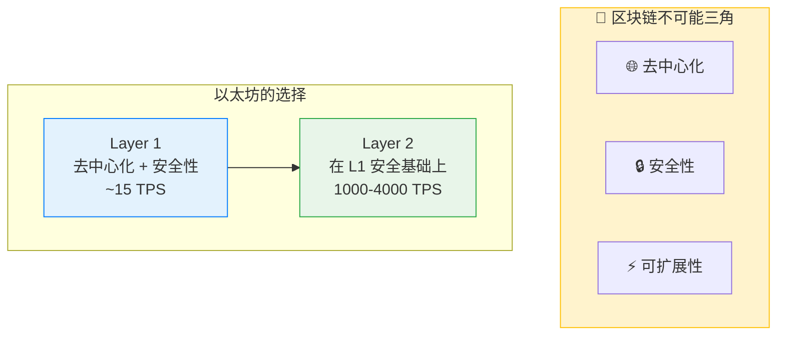
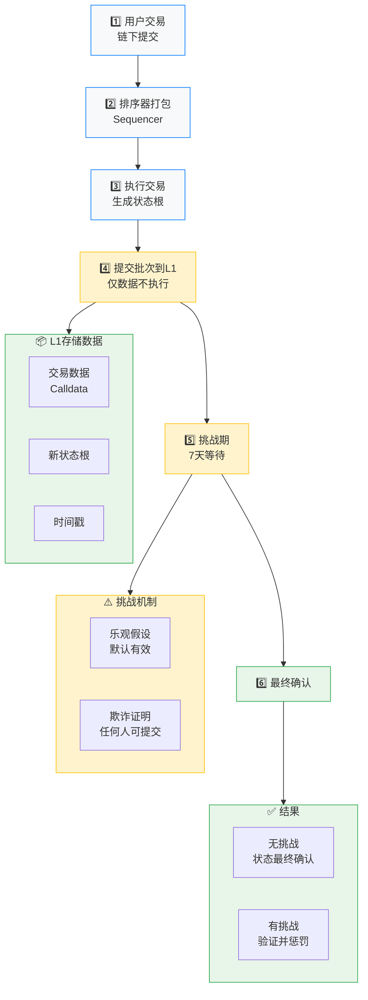
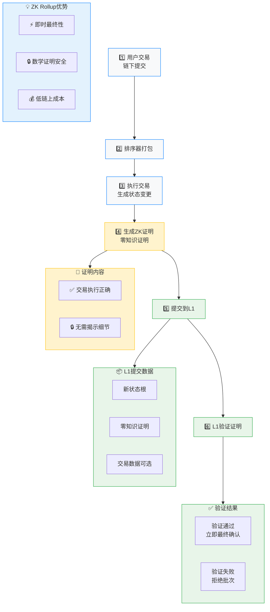
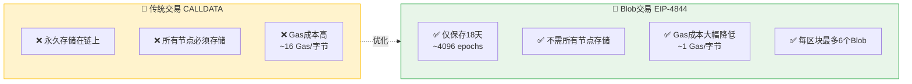
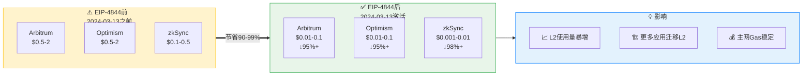
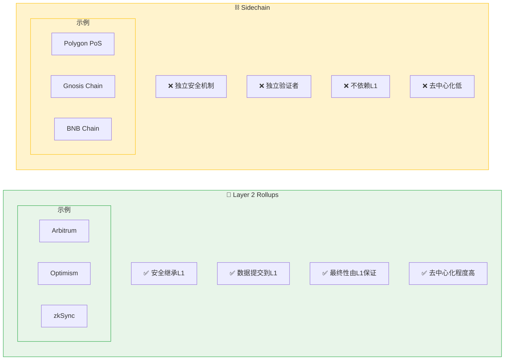
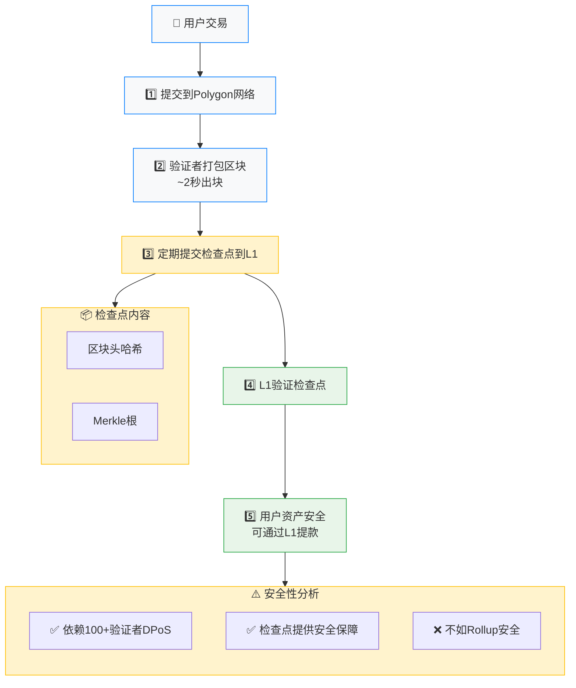
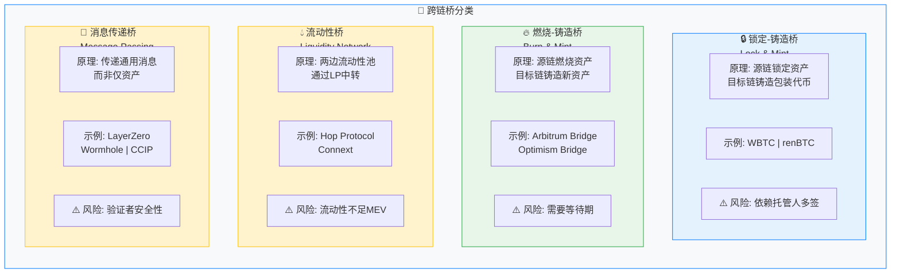

# 第16章 以太坊扩容 - Web3开发者精简版

> **核心定位**: 扩容方案解决以太坊"不可能三角"（去中心化、安全、可扩展性），通过 Layer 2 和数据分片提升 TPS。

---

## 一、扩容挑战与方案

### 区块链不可能三角

### 区块链不可能三角



### 扩容方案分类

### 扩容方案分类

```mermaid
graph TB
    subgraph Scaling["📈 以太坊扩容路线图"]
        direction TB
        
        subgraph L1["Layer 1 扩容"]
            DataSharding["数据分片 Data Sharding"]
            StateSharding["状态分片 State Sharding ❌已放弃"]
        end
        
        subgraph L2["Layer 2 扩容 主流方案"]
            direction TB
            Rollups["Rollups"]
            subgraph RollupTypes[""]
                Optimistic["Optimistic<br/>Arbitrum | Optimism"]
                ZK["ZK Rollup<br/>zkSync | Starknet | Polygon zkEVM"]
            end
            StateChannels["状态通道<br/>Lightning | Raiden"]
            Sidechains["侧链<br/>Polygon PoS | Gnosis"]
            Plasma["Plasma ❌已淘汰"]
        end
        
        subgraph DA["数据可用性层"]
            EIP4844["EIP-4844 Proto-Danksharding ✅2024"]
            Danksharding["Danksharding 未来"]
        end
    end
    
    style L1 fill:#e3f2fd,stroke:#007bff,color:#333
    style L2 fill:#e8f5e9,stroke:#28a745,color:#333
    style DA fill:#fff3cd,stroke:#ffc107,color:#333
```

### 扩容方案对比

| 方案 | TPS | 安全性 | 去中心化 | Gas 费用 | 复杂度 | 优先级 |
|------|-----|--------|---------|---------|--------|--------|
| **Optimistic Rollup** | 2000-4000 | 继承 L1 | 高 | $0.1-1 | 中 | ⭐⭐⭐⭐⭐ |
| **ZK Rollup** | 2000-10000 | 继承 L1 | 中高 | $0.01-0.1 | 高 | ⭐⭐⭐⭐⭐ |
| **Sidechain** | 7000+ | 独立安全 | 中低 | $0.01-0.1 | 低 | ⭐⭐⭐⭐ |
| **State Channel** | 100万+ | 继承 L1 | 高 | 极低（链下） | 高 | ⭐⭐⭐ |
| **Plasma** | 已淘汰 | - | - | - | - | ❌ |

---

## 二、Optimistic Rollup 详解

### 1. 工作原理



### 2. 核心合约结构

```solidity
// 简化的 Optimistic Rollup 合约
contract OptimisticRollup {
    bytes32 public stateRoot;
    uint256 public challengePeriod = 7 days;
    
    struct Batch {
        bytes32 stateRoot;
        uint256 timestamp;
        bool finalized;
    }
    
    mapping(uint256 => Batch) public batches;
    uint256 public batchCount;
    
    // 排序器提交批次
    function submitBatch(
        bytes calldata transactions,
        bytes32 newStateRoot
    ) external {
        require(msg.sender == sequencer, "Not sequencer");
        
        batchCount++;
        batches[batchCount] = Batch({
            stateRoot: newStateRoot,
            timestamp: block.timestamp,
            finalized: false
        });
        
        // 存储交易数据到 L1（calldata 最便宜）
        emit BatchSubmitted(batchCount, transactions);
    }
    
    // 提交欺诈证明
    function submitFraudProof(
        uint256 batchId,
        bytes calldata invalidTx,
        bytes calldata proof
    ) external {
        Batch storage batch = batches[batchId];
        
        // 检查挑战期
        require(
            block.timestamp < batch.timestamp + challengePeriod,
            "Challenge period ended"
        );
        
        // 验证欺诈证明
        require(verifyFraudProof(invalidTx, proof), "Invalid proof");
        
        // 回滚状态
        batch.finalized = true;
        stateRoot = batches[batchId - 1].stateRoot;
        
        // 惩罚作恶者
        slashSequencer();
    }
    
    // 最终确认（挑战期结束后）
    function finalizeBatch(uint256 batchId) external {
        Batch storage batch = batches[batchId];
        
        require(
            block.timestamp >= batch.timestamp + challengePeriod,
            "Challenge period not ended"
        );
        
        require(!batch.finalized, "Already finalized");
        
        batch.finalized = true;
        stateRoot = batch.stateRoot;
    }
    
    function verifyFraudProof(bytes calldata tx, bytes calldata proof) 
        internal 
        pure 
        returns (bool) 
    {
        // 实际实现需要完整的 EVM 验证
        return true;
    }
    
    function slashSequencer() internal {
        // 扣除排序器质押
    }
}
```

### 3. 用户交互（跨链桥）

```javascript
import { ethers } from 'ethers';

// Arbitrum 跨链桥合约
const L1_BRIDGE_ADDRESS = '0x8315177aB297bA92A06054cE80a67Ed4DBd7ed3a';
const L2_RPC = 'https://arb1.arbitrum.io/rpc';

// L1 → L2 存款
async function depositToL2(signer, amount) {
  const l1Bridge = new ethers.Contract(
    L1_BRIDGE_ADDRESS,
    L1_BRIDGE_ABI,
    signer
  );
  
  // 调用存款函数
  const tx = await l1Bridge.depositETH{ value: amount }();
  const receipt = await tx.wait();
  
  console.log('L1 交易已确认:', receipt.transactionHash);
  
  // 等待 L2 状态更新（通常 ~15 分钟）
  const l2Provider = new ethers.JsonRpcProvider(L2_RPC);
  
  // 轮询 L2 余额
  while (true) {
    const balance = await l2Provider.getBalance(await signer.getAddress());
    if (balance >= expectedBalance) {
      console.log('资金已到达 L2！');
      break;
    }
    await sleep(60000); // 每分钟检查一次
  }
}

// L2 → L1 提款（需要等待挑战期）
async function withdrawToL1(l2Signer, amount) {
  // 1. 在 L2 发起提款
  const l2Bridge = new ethers.Contract(
    L2_BRIDGE_ADDRESS,
    L2_BRIDGE_ABI,
    l2Signer
  );
  
  const tx = await l2Bridge.withdrawETH(amount);
  const receipt = await tx.wait();
  
  console.log('L2 提款已发起:', receipt.transactionHash);
  
  // 2. 等待挑战期（7 天）
  console.log('请等待 7 天挑战期...');
  
  // 3. 挑战期结束后，在 L1 执行提款
  // （实际项目会提供工具自动执行）
}
```

### 4. 主流 Optimistic Rollup 对比

| 特性 | Arbitrum | Optimism | Base | 优先级 |
|------|---------|----------|------|--------|
| **EVM 兼容性** | Arbitrum Nitro（完全兼容） | OVM（完全兼容） | OP Stack（完全兼容） | ⭐⭐⭐⭐⭐ |
| **排序器** | 中心化（计划去中心化） | 中心化（计划去中心化） | Coinbase（中心化） | ⭐⭐⭐⭐ |
| **挑战期** | 7 天 | 7 天 | 7 天 | ⭐⭐⭐⭐⭐ |
| **TVL** | ~$10B | ~$2B | ~$1B | ⭐⭐⭐⭐ |
| **开发工具** | 完善 | 完善 | 完善 | ⭐⭐⭐⭐⭐ |
| **特色** | 最成熟、生态最大 | OP Stack 开源 | Coinbase 背书 | ⭐⭐⭐⭐ |

---

## 三、ZK Rollup 详解

### 1. 工作原理



### 2. ZK Rollup vs Optimistic Rollup

| 维度 | ZK Rollup | Optimistic Rollup | 优先级 |
|------|----------|-------------------|--------|
| **最终性** | 即时（~10 分钟） | 7 天挑战期 | ⭐⭐⭐⭐⭐ |
| **安全性** | 数学证明（更强） | 经济博弈 | ⭐⭐⭐⭐⭐ |
| **EVM 兼容性** | 发展中（zkEVM） | 完全兼容 | ⭐⭐⭐⭐ |
| **证明生成时间** | 长（需要专用硬件） | 无需证明 | ⭐⭐⭐⭐ |
| **Gas 成本** | 验证证明较贵 | 提交数据便宜 | ⭐⭐⭐⭐ |
| **去中心化程度** | 证明者集中 | 排序器集中 | ⭐⭐⭐⭐ |
| **资金提取** | 快速（~10 分钟） | 慢（7 天） | ⭐⭐⭐⭐⭐ |

### 3. 主流 ZK Rollup 对比

| 项目 | 技术栈 | EVM 兼容 | TPS | TVL | 特点 |
|------|--------|---------|-----|-----|------|
| **zkSync Era** | zkEVM | 完全兼容 | 2000+ | ~$500M | Matter Labs 开发 |
| **Starknet** | Cairo（自研语言） | 部分兼容 | 10000+ | ~$200M | 最高性能 |
| **Polygon zkEVM** | zkEVM | 完全兼容 | 2000+ | ~$100M | Polygon 生态 |
| **Scroll** | zkEVM | 完全兼容 | 1000+ | ~$100M | 字节码级兼容 |
| **Linea** | zkEVM | 完全兼容 | 2000+ | ~$200M | ConsenSys 开发 |

---

## 四、EIP-4844（Proto-Danksharding）

### 1. 核心创新：Blob 交易



### 2. Blob 数据结构

```solidity
// Blob 交易结构
struct BlobTransaction {
    uint64 chain_id;
    uint64 nonce;
    uint256 max_priority_fee_per_gas;
    uint256 max_fee_per_gas;
    uint64 gas;
    address to;
    uint256 value;
    bytes data;
    AccessList access_list;
    uint256 max_fee_per_blob_gas;  // 新增：Blob 费用上限
    bytes32[] blob_versioned_hashes;  // 新增：Blob 哈希列表
    // 签名: v, r, s
}

// Blob 大小：
// - 每个 Blob: 128 KB
// - 每区块最多: 6 Blobs = 768 KB
// - 保存时间: 18 天
```

### 3. Gas 费用计算

```javascript
// Blob Gas 费用计算
function calculateBlobGasFee(
  blobGasUsed,
  excessBlobGas,
  targetBlobGasPerBlock
) {
  // 动态调整 blob base fee
  const blobBaseFee = calculateBlobBaseFee(excessBlobGas, targetBlobGasPerBlock);
  
  // 总费用 = blob gas 使用量 × blob base fee
  return blobGasUsed * blobBaseFee;
}

// 实际示例（主网）：
// - 正常情况: ~1 wei/blob gas
// - 高峰情况: ~100 wei/blob gas
// - 一次 L2 批次提交成本: $1-10（vs 之前 $100-1000）

// 节省对比：
传统 L2 批次提交: ~$100-500
EIP-4844 后:      ~$1-10
节省:             90-99%
```

### 4. 对 L2 的影响



---

## 五、侧链（Sidechain）

### 1. 侧链 vs Layer 2



### 2. Polygon PoS 架构



---

## 六、跨链互操作

### 1. 跨链桥类型



### 2. 跨链桥安全风险

| 攻击事件 | 时间 | 损失 | 原因 | 优先级 |
|---------|------|------|------|--------|
| **Ronin Bridge** | 2022-03 | $625M | 私钥泄露（5/9 签名者） | ⭐⭐⭐⭐⭐ |
| **Wormhole** | 2022-02 | $326M | 签名验证漏洞 | ⭐⭐⭐⭐⭐ |
| **Poly Network** | 2021-08 | $611M | 合约逻辑漏洞 | ⭐⭐⭐⭐⭐ |
| **Nomad Bridge** | 2022-08 | $190M | 错误配置导致信任攻击 | ⭐⭐⭐⭐⭐ |

**安全教训**：
```
跨链桥是 DeFi 最脆弱的环节：
✅ 使用经过审计的桥（官方桥优先）
✅ 避免大额资金跨链
✅ 分散使用多个桥
✅ 监控桥合约安全
✅ 优先使用消息传递桥（LayerZero、CCIP）
```

### 3. Chainlink CCIP（跨链互操作协议）

```solidity
// 使用 Chainlink CCIP 跨链转账
import "@chainlink/contracts-ccip/src/v0.8/ccip/interfaces/IRouterClient.sol";
import "@chainlink/contracts-ccip/src/v0.8/ccip/applications/CCIPReceiver.sol";

contract CrossChainApp is CCIPReceiver {
    IRouterClient router;
    
    constructor(address routerAddress) CCIPReceiver(routerAddress) {
        router = IRouterClient(routerAddress);
    }
    
    // 发送跨链消息
    function sendMessage(
        uint64 destinationChainSelector,
        address receiver,
        string memory message
    ) external payable {
        Client.EVM2AnyMessage memory evm2AnyMessage = buildOutboundMessage(
            destinationChainSelector,
            receiver,
            message
        );
        
        // 获取费用
        uint256 fees = router.getFee(
            destinationChainSelector,
            evm2AnyMessage
        );
        
        // 发送消息（支付 LINK 或原生代币）
        router.ccipSend{ value: fees }(
            destinationChainSelector,
            evm2AnyMessage
        );
    }
    
    // 接收跨链消息
    function _ccipReceive(
        Client.Any2EVMMessage memory message
    ) internal override {
        // 处理接收到的消息
        string memory payload = abi.decode(message.data, (string));
        _processMessage(payload);
    }
}
```

---

## 七、自测题

### 题目1：Optimistic Rollup 和 ZK Rollup 的主要区别是什么？

**答案**：
| 维度 | Optimistic Rollup | ZK Rollup |
|------|------------------|----------|
| **验证方式** | 欺诈证明（挑战期） | 零知识证明（即时） |
| **最终性** | 7 天 | ~10 分钟 |
| **EVM 兼容性** | 完全兼容 | 发展中 |
| **安全性** | 经济博弈 | 数学证明 |
| **资金提取** | 慢（7 天） | 快（~10 分钟） |

### 题目2：EIP-4844 如何降低 L2 费用？

**答案**：
1. **引入 Blob 交易类型**：专门用于存储 L2 数据
2. **临时存储**：Blob 数据只保存 18 天（vs CALLDATA 永久）
3. **更便宜的费用**：~1 Gas/字节（vs 16 Gas/字节）
4. **批量提交**：每个区块最多 6 个 Blob（768 KB）
5. **实际效果**：L2 费用降低 90-99%

### 题目3：为什么跨链桥如此危险？

**答案**：
1. **复杂性高**：涉及多条链、多重签名、消息验证
2. **攻击面广**：锁定合约、消息传递、验证者都可能被攻击
3. **资金集中**：桥合约托管大量资产，成为黑客目标
4. **历史教训**：已发生多起数亿美元级别的攻击
5. **防护建议**：使用官方桥、分散风险、监控安全

---

## 本章总结

### 核心要点

1. **Layer 2 是扩容主流**：Rollup 方案将计算移到链下，数据留在链上
2. **Optimistic Rollup**：成熟、兼容性好，但需要 7 天挑战期
3. **ZK Rollup**：安全性更高、即时最终性，但 EVM 兼容性发展中
4. **EIP-4844**：Blob 交易大幅降低 L2 成本（90-99%）
5. **侧链 vs L2**：侧链独立安全，L2 继承 L1 安全
6. **跨链桥风险高**：是 DeFi 最脆弱环节，需谨慎使用

### 开发者检查清单

```
扩容方案选择：
✅ 高安全性需求 → ZK Rollup（zkSync、Starknet）
✅ EVM 完全兼容 → Optimistic Rollup（Arbitrum、Optimism）
✅ 低成本优先 → 侧链（Polygon PoS）
✅ 跨链需求 → Chainlink CCIP、LayerZero
✅ 监控 Gas 费用 → 使用 L2Beat、DefiLlama
✅ 安全优先 → 使用官方桥，避免第三方桥
```

### 下一步行动

1. **部署 L2**：在 Arbitrum/Optimism 测试网部署合约
2. **学习 ZK**：研究 zkSync 和 Starknet 开发
3. **监控工具**：使用 L2Beat 监控 L2 安全
4. **跨链开发**：学习 LayerZero 或 CCIP
5. **关注升级**：跟踪 Danksharding 进展

---

**一句话收尾**: 扩容是以太坊走向大规模采用的关键——Layer 2 通过 Rollup 技术实现"鱼与熊掌兼得"，在保持 L1 安全性的同时，将 TPS 提升数百倍，让去中心化应用真正具备与 Web2 竞争的能力。
