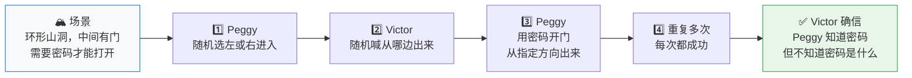
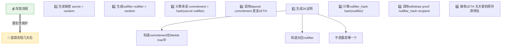
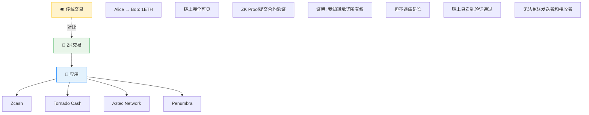
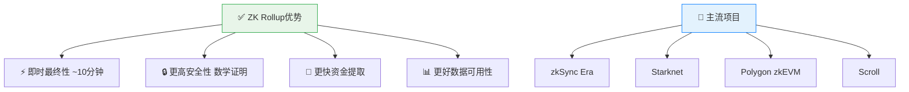
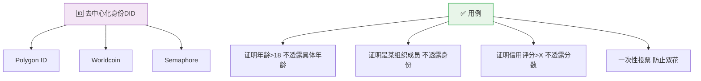

# 第17章 零知识证明（ZKP）- Web3开发者精简版

> **核心定位**: 零知识证明（ZKP，Zero-Knowledge Proof）允许一方（证明者）向另一方（验证者）证明某个陈述为真，而无需透露任何额外信息。是隐私保护和扩容的核心技术。

---

## 一、零知识证明核心概念

### 什么是零知识证明？

**一句话：我能向你证明"我知道某个秘密"，但不告诉你秘密是什么。**

用山洞场景理解：Peggy 想证明她知道密码，但不想说出密码本身。于是用行动证明——Victor 随机喊一个出口方向，Peggy 每次都能从那个方向出来（必须穿过中间的门）。重复 10 次全部成功，Victor 就相信了。

> 如果 Peggy 不知道密码，靠猜每次正确概率是 1/2，10 次全对的概率只有 1/1024，几乎不可能。



**放到区块链上：**

| 山洞场景 | 区块链场景 |
|---------|---------|
| "我知道密码" | "我的余额 > 1000 ETH" |
| "不说出密码" | "不暴露具体余额" |
| "行动证明" | "生成一个数学证明" |

验证者只需验证这个数学证明，就能确认陈述为真，但完全学不到任何额外信息。

### ZKP 在区块链的应用

| 方向 | 代表项目 |
|------|---------|
| 🕵️ 隐私保护 | Zcash、Tornado Cash、Aztec、Worldcoin、Polygon ID |
| 🚀 扩容 Rollups | zkSync、Starknet、Polygon zkEVM |

---

## 二、ZKP 技术分类

### 1. 主要 ZKP 方案对比

| 方案 | 全称 | 证明大小 | 验证时间 | 设置 | 特点 | 优先级 |
|------|------|---------|---------|------|------|--------|
| **zk-SNARK** | 零知识简洁非交互式知识论证 | ~288 字节 | ~5ms | 需要可信设置 | 成熟、广泛应用 | ⭐⭐⭐⭐⭐ |
| **zk-STARK** | 零知识可扩展透明知识论证 | ~45 KB | ~50ms | 无需可信设置 | 后量子安全 | ⭐⭐⭐⭐ |
| **PLONK** | 置换论证的简洁知识 | ~400 字节 | ~10ms | 通用可信设置 | 灵活、可编程 | ⭐⭐⭐⭐⭐ |
| **Groth16** | 特定电路的 SNARK | ~192 字节 | ~3ms | 每电路需设置 | 最小证明 | ⭐⭐⭐⭐ |
| **Halo2** | 基于 KZG 的 ZKP | ~200 字节 | ~5ms | 无需可信设置 | Zcash 使用 | ⭐⭐⭐⭐ |

### 2. zk-SNARK vs zk-STARK

| | 🔑 zk-SNARK | 🌟 zk-STARK |
|---|---|---|
| 证明大小 | ✅ ~288 字节（小） | ❌ ~45 KB（大）|
| 验证速度 | ✅ ~5ms（快） | ❌ ~50ms（慢）|
| 可信设置 | ❌ 需要 | ✅ 无需 |
| 量子安全 | ❌ 不安全 | ✅ 后量子安全 |

---

## 三、zk-SNARK 深入理解

### 1. 工作流程

| 阶段 | 做什么 | 关键点 |
|------|--------|--------|
| 🎭 1. 可信设置 | 生成公共参数 CRS | 多方参与 MPC，随机数必须销毁 |
| ⚙️ 2. 电路设计 | 计算逻辑转算术电路 | 电路 = 约束系统 R1CS，如 a × b = c |
| 📝 3. 证明生成 | 证明者用私钥（witness）生成证明 π | 计算密集，数秒到数分钟 |
| ✅ 4. 证明验证 | 验证者用公钥验证证明 | `verify(proof, public_inputs)`，仅需 ~5ms |

### 2. 算术电路示例

```
目标：证明我知道 x，使得 x³ + x + 5 = 35

步骤 1: 分解为基本运算
y = x × x        (y = x²)
z = y × x        (z = x³)
w = z + x        (w = x³ + x)
result = w + 5   (result = x³ + x + 5)
assert result == 35

步骤 2: 转换为 R1CS（秩 1 约束系统）
约束 1: x × x - y = 0
约束 2: y × x - z = 0
约束 3: z + x - w = 0
约束 4: w + 5 - 35 = 0

步骤 3: 证明者提供 witness
private: x = 3
public:  35

验证者验证：
- 不看到 x = 3
- 只看到 proof 和 public input 35
- 验证 proof 有效 → 证明者确实知道满足方程的 x
```

### 3. Circom 电路语言实战

```javascript
// Circom 电路：证明知道一个数的平方根
// 即：证明知道 x，使得 x² = public_input

pragma circom 2.0.0;

template SquareRoot() {
    signal input x;      // 私有输入（秘密）
    signal input y;      // 公共输入（公开）
    
    // 约束：x² = y
    x * x === y;
}

// 主组件
component main {public [y]} = SquareRoot();

// 编译电路
// circom circuit.circom --r1cs --wasm --sym

// 生成 witness
// node circuit_js/generate_witness.js circuit.wasm input.json witness.wtns
// input.json: {"x": "5", "y": "25"}

// 生成证明（使用 snarkjs）
// snarkjs groth16 prove circuit.zkey witness.wtns proof.json public.json
```

### 4. Solidity 验证合约

```solidity
// SPDX-License-Identifier: MIT
pragma solidity ^0.8.20;

import "./verifier.sol"; // snarkjs 生成的验证器

contract ZKVerifier {
    using Pairing for *;
    
    // 验证密钥（由可信设置生成）
    VerifyingKey public vk;
    
    // 记录已使用的 nullifier（防止双花）
    mapping(bytes32 => bool) public nullifierHashes;
    
    constructor() {
        // 初始验证密钥
        vk = loadVerifyingKey();
    }
    
    /**
     * 验证 ZK 证明
     * @param proof zk-SNARK 证明
     * @param input 公共输入
     */
    function verifyProof(
        uint[2] memory a,
        uint[2][2] memory b,
        uint[2] memory c,
        uint[1] memory input
    ) public returns (bool) {
        // 验证证明
        bool isValid = Verifier.verifyProof(a, b, c, input);
        require(isValid, "Invalid proof");
        
        return true;
    }
    
    /**
     * 隐私转账（类似 Tornado Cash）
     */
    function withdraw(
        uint[2] memory a,
        uint[2][2] memory b,
        uint[2] memory c,
        uint[1] memory input,
        address payable recipient
    ) public {
        // 验证证明
        verifyProof(a, b, c, input);
        
        // input[0] = nullifier_hash
        bytes32 nullifierHash = bytes32(input[0]);
        
        // 防止双花
        require(!nullifierHashes[nullifierHash], "Already withdrawn");
        nullifierHashes[nullifierHash] = true;
        
        // 转账
        recipient.transfer(1 ether);
    }
}
```

---

## 四、PLONK 证明系统

### 为什么 PLONK 更好？

**传统 SNARK 问题 vs PLONK 优势**

| | 传统 SNARK | PLONK |
|---|---|---|
| 可信设置 | ❌ 每个电路独立设置，修改后需重新设置 | ✅ 一次设置适用所有电路 |
| 灵活性 | ❌ 固定门电路 | ✅ 支持自定义门、可查找表 |
| 安全性 | 基础安全 | ✅ 支持 KZG 承诺、后量子安全变体 |

**实际应用**：Aztec Network、Scroll zkEVM、zkSync

### PLONK 工作流程

```solidity
// 使用 PLONK 的示例（伪代码）

// 1. 通用设置（只需一次）
const setup = await plonk.setup(maxCircuitSize);

// 2. 编译电路
const circuit = compileCircuit(`
  // 证明知道 x 和 y，使得 x + y = 10
  constraint x + y === 10;
`);

// 3. 生成证明
const witness = { x: 3, y: 7 };
const proof = await plonk.prove(circuit, witness, setup);

// 4. 验证证明
const publicInputs = [10]; // x + y 的结果
const isValid = await plonk.verify(proof, publicInputs, setup);

console.log("Proof valid:", isValid); // true
```

---

## 五、ZK 应用实战

### 1. 隐私支付（类似 Tornado Cash）

```solidity
// 简化的隐私混币器
contract ZKMixer {
    mapping(bytes32 => bool) public commitments;
    mapping(bytes32 => bool) public nullifiers;
    
    uint256 public constant DEPOSIT_AMOUNT = 1 ether;
    
    // 存款
    function deposit(bytes32 commitment) external payable {
        require(msg.value == DEPOSIT_AMOUNT, "Wrong amount");
        require(!commitments[commitment], "Commitment exists");
        
        commitments[commitment] = true;
        
        // commitment = hash(secret, nullifier)
        // 只有存款者知道 secret 和 nullifier
    }
    
    // 提款（使用 ZK 证明）
    function withdraw(
        uint[2] calldata a,
        uint[2][2] calldata b,
        uint[2] calldata c,
        uint[4] calldata input,
        address payable recipient
    ) external {
        // 验证 ZK 证明
        require(verifyProof(a, b, c, input), "Invalid proof");
        
        // input[0] = root (Merkle tree root)
        // input[1] = nullifier_hash
        // input[2] = recipient
        // input[3] = fee
        
        bytes32 nullifierHash = bytes32(input[1]);
        require(!nullifiers[nullifierHash], "Already withdrawn");
        
        // 标记为已使用
        nullifiers[nullifierHash] = true;
        
        // 转账（扣除手续费）
        uint256 fee = uint256(input[3]);
        recipient.transfer(DEPOSIT_AMOUNT - fee);
    }
    
    function verifyProof(
        uint[2] calldata a,
        uint[2][2] calldata b,
        uint[2] calldata c,
        uint[4] calldata input
    ) internal view returns (bool) {
        // 调用 SNARK 验证器
        return true; // 简化
    }
}
```

**用户操作流程**：



### 2. 隐私身份验证

```solidity
// 使用 ZKP 证明年龄 > 18，不透露具体年龄
contract AgeVerifier {
    mapping(bytes32 => bool) public verifiedUsers;
    
    function verifyAge(
        uint[2] calldata a,
        uint[2][2] calldata b,
        uint[2] calldata c,
        uint[2] calldata input
    ) external {
        // 验证证明
        require(verifyAgeProof(a, b, c, input), "Invalid proof");
        
        // input[0] = age_commitment
        // input[1] = nullifier
        
        bytes32 nullifier = bytes32(input[1]);
        require(!verifiedUsers[nullifier], "Already verified");
        
        verifiedUsers[nullifier] = true;
        
        // 允许访问受限功能
        emit AgeVerified(msg.sender);
    }
}

// 电路逻辑（Circom）：
// 证明：
// 1. age >= 18
// 2. age <= 150
// 3. 知道 age 的承诺
// 不透露：age 的具体值
```

### 3. 可验证计算

```solidity
// 链下计算，链上验证
contract VerifiableComputation {
    struct Task {
        address user;
        bytes32 taskHash;
        bool completed;
        uint256 reward;
    }
    
    mapping(bytes32 => Task) public tasks;
    
    // 提交计算任务
    function submitTask(
        bytes32 taskHash,
        uint256 reward
    ) external payable {
        require(msg.value == reward, "Wrong reward");
        
        tasks[taskHash] = Task({
            user: msg.sender,
            taskHash: taskHash,
            completed: false,
            reward: reward
        });
    }
    
    // 提交计算结果（带 ZK 证明）
    function submitResult(
        bytes32 taskHash,
        uint256 result,
        uint[2] calldata a,
        uint[2][2] calldata b,
        uint[2] calldata c,
        uint[1] calldata input
    ) external {
        Task storage task = tasks[taskHash];
        require(!task.completed, "Already completed");
        
        // 验证计算正确性
        require(
            verifyComputation(a, b, c, input, result),
            "Invalid computation"
        );
        
        task.completed = true;
        
        // 支付奖励
        payable(task.user).transfer(task.reward);
        
        emit TaskCompleted(taskHash, result);
    }
}

// 应用场景：
// - 机器学习模型推理
// - 复杂数学计算
// - 数据分析
// 链下计算（便宜），链上验证（快速、便宜）
```

---

## 六、ZK 开发工具链

### 主流 ZK 框架对比

| 框架 | 语言 | 类型 | 学习曲线 | 生态 | 适用场景 |
|------|------|------|---------|------|---------|
| **Circom** | DSL | zk-SNARK | 中 | 大 | 通用 ZK 电路 |
| **Cairo** | Rust-like | zk-STARK | 高 | 中 | Starknet 开发 |
| **Noir** | Rust-like | 后端无关 | 低 | 发展中 | 易用性优先 |
| **Halo2** | Rust | zk-SNARK | 高 | 小 | 高级开发者 |
| **snarkJS** | JavaScript | zk-SNARK | 低 | 大 | 快速原型 |
| **ZoKrates** | Python-like | zk-SNARK | 低 | 中 | 初学者 |

### Circom 开发流程

```bash
# 1. 安装工具
npm install -g circom snarkjs
npm install websnark

# 2. 编写电路（circuit.circom）
pragma circom 2.0.0;

template Multiplier3() {
    signal input a;
    signal input b;
    signal input c;
    signal output out;
    
    out <== a * b * c;
}

component main = Multiplier3();

# 3. 编译电路
circom circuit.circom --r1cs --wasm --sym

# 4. 生成可信设置（幂等）
snarkjs powersoftau new bn128 12 pot12_0000.ptau -v
snarkjs powersoftau contribute pot12_0000.ptau pot12_0001.ptau -v
snarkjs powersoftau prepare phase2 pot12_0001.ptau pot12_final.ptau -v

# 5. 生成电路特定密钥
snarkjs groth16 setup circuit.r1cs pot12_final.ptau circuit_0000.zkey
snarkjs zkey contribute circuit_0000.zkey circuit_final.zkey -v

# 6. 导出验证密钥
snarkjs zkey export verificationkey circuit_final.zkey verification_key.json

# 7. 生成 witness
node circuit_js/generate_witness.js circuit.wasm input.json witness.wtns

# 8. 生成证明
snarkjs groth16 prove circuit_final.zkey witness.wtns proof.json public.json

# 9. 验证证明
snarkjs groth16 verify verification_key.json public.json proof.json
```

---

## 七、ZK 应用场景总结

### 1. 隐私保护



### 2. 扩容（ZK Rollups）



### 3. 身份与认证



---

## 八、自测题

### 题目1：zk-SNARK 和 zk-STARK 的主要区别是什么？

**答案**：
| 维度 | zk-SNARK | zk-STARK |
|------|---------|---------|
| **可信设置** | 需要 | 不需要 |
| **证明大小** | ~288 字节 | ~45 KB |
| **验证时间** | ~5ms | ~50ms |
| **量子安全** | 否 | 是 |
| **成熟度** | 高 | 中 |

### 题目2：什么是"可信设置"？为什么重要？

**答案**：
- **定义**：生成公共参数（CRS）的过程，需要随机数
- **风险**：如果随机数泄露，可以伪造证明
- **解决方案**：
  1. 多方计算（MPC）：多人参与，任何一人销毁随机数即可
  2. "毒化仪式"：参与者必须公开销毁随机数证据
  3. 通用设置：PLONK 等方案只需一次设置
- **著名仪式**：Powers of Tau（以太坊社区参与）

### 题目3：ZK Rollup 相比 Optimistic Rollup 有什么优势？

**答案**：
1. **即时最终性**：~10 分钟 vs 7 天
2. **更高安全性**：数学证明 vs 经济博弈
3. **更快提款**：无需等待挑战期
4. **更好数据可用性**：链上验证保证正确性
5. **劣势**：EVM 兼容性发展中，证明生成较慢

---

## 本章总结

### 核心要点

1. **ZKP 是密码学突破**：允许证明而不透露信息
2. **zk-SNARK 成熟**：证明小、验证快，但需要可信设置
3. **zk-STARK 未来**：无需可信设置，后量子安全
4. **PLONK 是趋势**：通用可信设置，更灵活
5. **应用广泛**：隐私保护、扩容、身份认证、可验证计算
6. **开发工具完善**：Circom、snarkJS、Cairo 等

### 开发者检查清单

```
ZK 开发必知：
✅ 理解 ZKP 基本原理（完整性、可靠性、零知识性）
✅ 掌握 Circom 电路编写
✅ 了解 SNARK vs STARK 取舍
✅ 熟悉可信设置流程
✅ 学习 ZK Rollup 架构
✅ 关注隐私合规（Tornado Cash 案例）
✅ 使用成熟框架（避免重复造轮子）
```

### 下一步行动

1. **学习基础**：阅读《Proofs, Arguments, and Zero-Knowledge》
2. **动手实践**：用 Circom 编写简单电路
3. **部署合约**：在测试网部署 ZK 验证合约
4. **研究项目**：分析 zkSync、Starknet 架构
5. **关注发展**：跟踪 ZK 生态新工具和新方案

---

**一句话收尾**: 零知识证明是密码学的"圣杯"——它让"信任但验证"变成"无需信任即可验证"，在保护隐私的同时保证安全，是 Web3 迈向大规模采用的核心技术之一。
