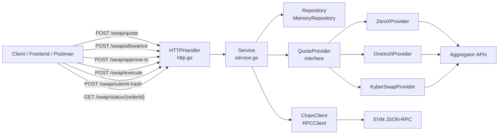

# 整体架构图

这张图展示 swap 模块的主要代码边界。HTTP 层只负责解析请求和写响应，核心流程都在 `Service` 中编排。

## 当前实现要点

- `HTTPHandler` 不做业务判断，只把 JSON 请求交给 `Service`。
- `Service` 负责编排 quote、allowance、approve、execute、submit-hash、status。
- `Repository` 当前使用 `MemoryRepository`，服务重启后 quote/order/event 都会丢失。
- `ChainClient` 当前由 `RPCClient` 实现，用于 `eth_call` 查询 allowance 等链上数据。
- 0x、1inch、KyberSwap 都通过 `QuoteProvider` 接口接入。

## 对应代码入口

- `src/swap/internal/swap/http.go`
- `src/swap/internal/swap/service.go`
- `src/swap/internal/swap/types.go`
- `src/swap/internal/swap/repository.go`
- `src/swap/internal/swap/rpc.go`

