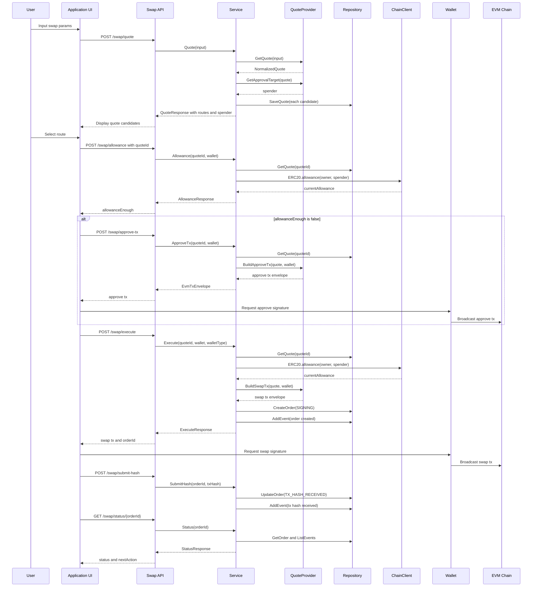

# Swap 主流程时序图

这张图展示前端按当前实现调用 swap 接口的主流程。用户选择某个候选 route 后，后续接口都使用该候选自己的 `quoteId`。

## 当前实现要点

- `/swap/quote` 返回所有成功 provider 候选，默认推荐是 `routes[0]`。
- `spender` 在 quote 阶段解析并保存到 `NormalizedQuote`。
- `/swap/allowance` 不接收 spender，只通过 `quoteId` 读取保存的 quote。
- `/swap/approve-tx` 只构造 approve 交易，不签名、不广播、不创建订单。
- `/swap/execute` 创建 `StoredOrder`，初始状态是 `SIGNING`。
- `/swap/submit-hash` 适用于外部钱包广播后提交 txHash。

## 对应代码入口

- `src/swap/internal/swap/http.go`
- `src/swap/internal/swap/service.go`
- `src/swap/internal/swap/provider_0x.go`
- `src/swap/internal/swap/provider_1inch.go`
- `src/swap/internal/swap/provider_kyberswap.go`

