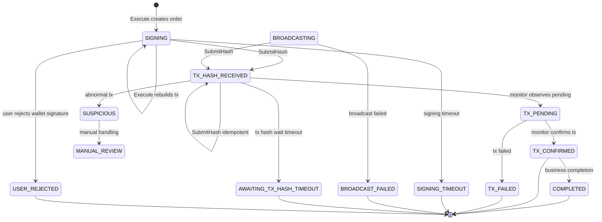

# 订单状态流转图

这张图展示 `StoredOrder.Status` 的主要流转。当前代码中，`Execute` 创建订单时状态为 `SIGNING`，`SubmitHash` 会推进到 `TX_HASH_RECEIVED`。

## 当前实现要点

- `Execute` 使用 `quoteId` 做幂等控制，同一个 quote 只能创建一个订单。
- 如果已有订单是 `SIGNING`，再次 `Execute` 会重建交易体并复用原 `orderId`。
- 如果已有订单是链上流转中状态，会返回冲突。
- 如果已有订单已经失败或完成，需要重新 quote，不能复用旧 `quoteId`。
- `SubmitHash` 只允许外部钱包订单提交 txHash。
- `Status` 根据状态返回 `nextAction`，例如 `wait`、`retry_quote`、`manual_review`。

## 对应代码入口

- `src/swap/internal/swap/types.go`
- `src/swap/internal/swap/service.go`
- `src/swap/internal/swap/repository.go`

