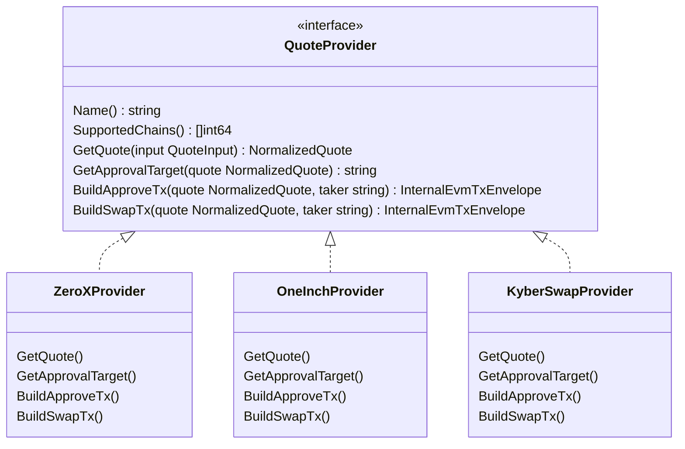
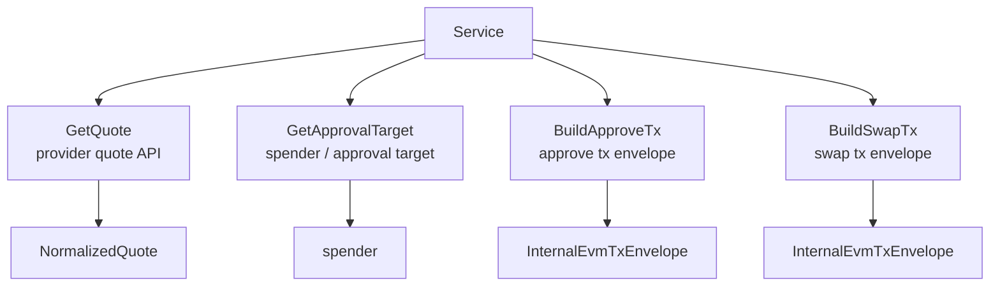

# Provider 适配图

这张图展示聚合器 provider 的统一接口。新增聚合器时，核心是实现 `QuoteProvider` 的四个业务方法。

## 当前实现要点

- 0x 和 KyberSwap 的 approve tx 当前由本地编码 ERC20 `approve(spender, amountIn)`。
- 1inch 的 approve tx 当前调用 1inch `/approve/transaction`。
- quote 阶段会解析 `spender`，并保存到 `NormalizedQuote`。
- 后续 allowance、approve、execute 仍通过 `quoteId` 读取保存的 quote，不信任前端传 spender。

## 对应代码入口

- `src/swap/internal/swap/types.go`
- `src/swap/internal/swap/provider_0x.go`
- `src/swap/internal/swap/provider_1inch.go`
- `src/swap/internal/swap/provider_kyberswap.go`
- `src/swap/internal/swap/service.go`

