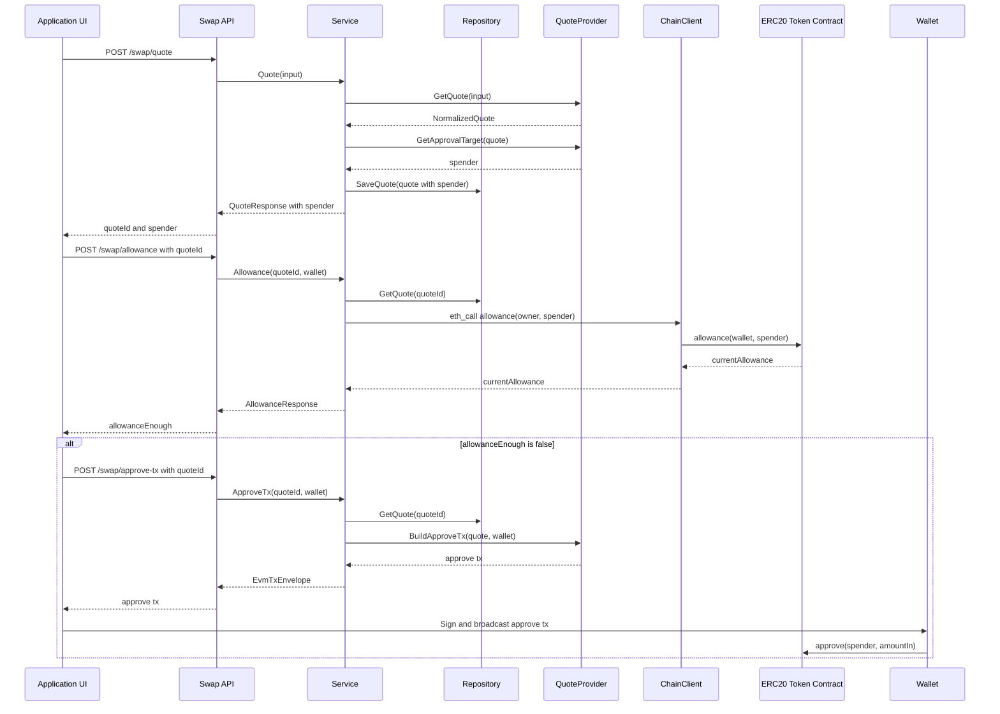
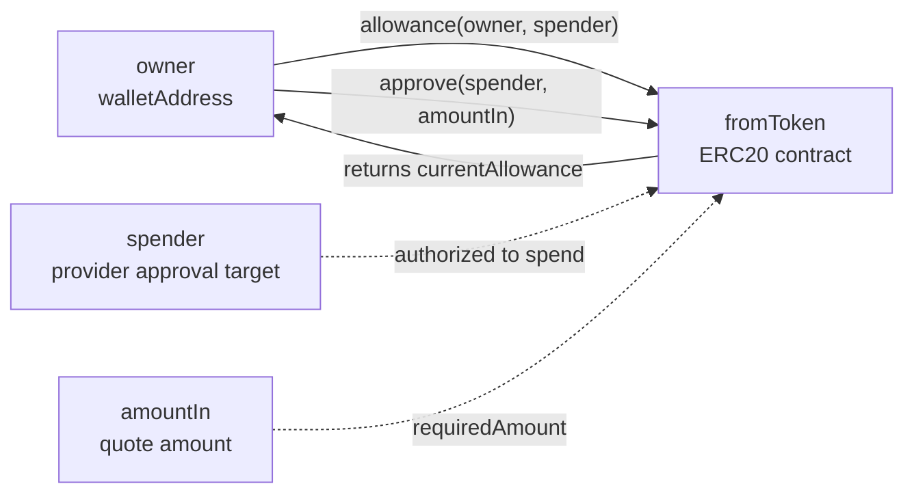

# Allowance / Approve 授权图

这张图展示 ERC20 授权相关的核心关系。`spender` 是 provider 决定的 approval target，前端不传，后端通过 `quoteId` 读取。

## 当前实现要点

- native token 不需要 ERC20 approve。
- `/swap/allowance` 查询的是 `ERC20.allowance(walletAddress, quote.Spender)`。
- `/swap/approve-tx` 构造的是 `ERC20.approve(quote.Spender, quote.AmountIn)`。
- `/swap/approve-tx` 不检查 allowance 是否足够，也不广播交易。
- approve 金额当前使用本次 quote 的精确 `amountIn`，不是无限授权。

## 对应代码入口

- `src/swap/internal/swap/service.go`
- `src/swap/internal/swap/rpc.go`
- `src/swap/internal/swap/util.go`
- `src/swap/internal/swap/provider_0x.go`
- `src/swap/internal/swap/provider_1inch.go`
- `src/swap/internal/swap/provider_kyberswap.go`

