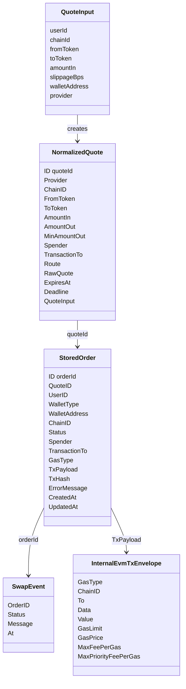
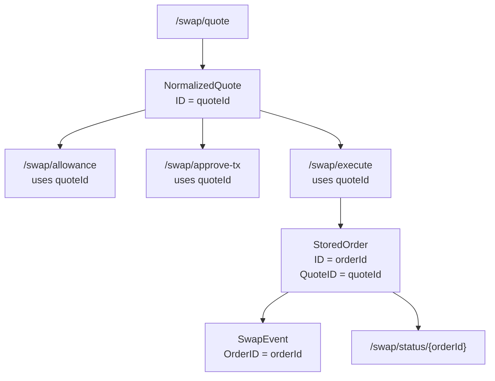

# 数据模型关系图

这张图展示 swap 核心数据模型之间的关系。当前存储实现是 `MemoryRepository`，数据只存在进程内存中。

## 当前实现要点

- 每个成功 provider 候选都会保存为一个 `NormalizedQuote`。
- 前端选择某个候选后，后续接口传该候选的 `quoteId`。
- `StoredOrder.QuoteID` 关联被执行的 quote。
- `SwapEvent.OrderID` 关联订单事件。
- `Execute` 创建订单时会保存 `TxPayload`，状态为 `SIGNING`。
- 当前 `MemoryRepository` 用 map 保存 quote、order、event，服务重启后数据失效。

## 对应代码入口

- `src/swap/internal/swap/types.go`
- `src/swap/internal/swap/repository.go`
- `src/swap/internal/swap/service.go`

